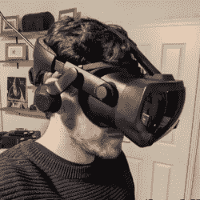

# 虚拟现实中的魔法取决于你的实际精神状态

> 原文：<https://hackaday.com/2021/11/21/magic-in-vr-that-depends-on-your-actual-state-of-mind/>

[坎加]的兴奋之情溢于言表，他为 sky rim VR 发布了一个可工作的脑机接口(BCI)模型，其中游戏中的魔法系统被修改，以便当玩家处于专注的精神状态时，法术效果显著提高。[坎加]也不只是乱搞。他是一名神经科学家，研究重点是评估任务执行过程中的精神状态。幸运的是，他也是一个热情的虚拟现实游戏玩家，他的这个项目有几个有趣的方面，他很乐意在几个视频中展示。

The Muse 2 fits under the VR headset easily.

这一切都始于玩家佩戴[缪斯 2](https://choosemuse.com/) 冥想装置；一种无源、现成的脑电图(EEG)装置，主要目的是引导用户更好地放松和集中注意力。[坎加尔]使用 [Brainflow](https://brainflow.org/) 库读取数据，并将其处理成“未聚焦”和“聚焦”之间范围内的最终值。[坎加]强调指出，他的系统最终的目标是模拟玩家的精神状态，这不同于仅仅模拟大脑活动。因此，也考虑运动数据，并且保持仍然给该过程带来一点好处。

这个数据在游戏中实际是如何使用的？在 VR 中，这个“专注”值显示为玩家手腕上的一个小条，法术效果(例如，攻击法术的伤害)随着条的大小而缩放。当酒吧满了，玩家会变得非常强大，法术会造成双倍的伤害。如果酒吧是空的，法术将很少或没有伤害。

[坎加尔]在两个视频中演示了 mod(都嵌入在下面)，但你不会看到他用火球爆破敌人。据推测，虚拟现实游戏玩家已经知道那看起来像什么，所以他所做的是[解释该系统如何看起来和工作(第一个视频，提示到 4:12)](https://youtu.be/5WlQyKKgxxI?t=249) ，在第二个视频中，[演示了聚焦计如何根据他的活动和精神状态而变化](https://www.youtube.com/watch?v=1Q2uhawGRas)。

结果看起来令人兴奋，像这样的系统的潜在用途是非常有趣的。在发动魔法攻击之前深呼吸几次，让自己的身心平静下来，会在这个世界上产生切实的效果，而且因为事情很少按照计划进行，所以在压力下学会专注也有明显的生存好处。但是如果你不喜欢大脑监测器，也许可以考虑通过 Skyrim 悠闲地骑自行车。

 [https://www.youtube.com/embed/5WlQyKKgxxI?version=3&rel=1&showsearch=0&showinfo=1&iv_load_policy=1&fs=1&hl=en-US&autohide=2&wmode=transparent](https://www.youtube.com/embed/5WlQyKKgxxI?version=3&rel=1&showsearch=0&showinfo=1&iv_load_policy=1&fs=1&hl=en-US&autohide=2&wmode=transparent)

 [https://www.youtube.com/embed/1Q2uhawGRas?version=3&rel=1&showsearch=0&showinfo=1&iv_load_policy=1&fs=1&hl=en-US&autohide=2&wmode=transparent](https://www.youtube.com/embed/1Q2uhawGRas?version=3&rel=1&showsearch=0&showinfo=1&iv_load_policy=1&fs=1&hl=en-US&autohide=2&wmode=transparent)

