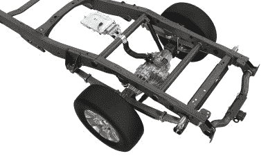
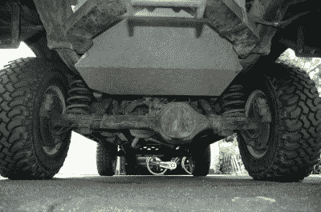
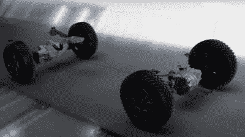
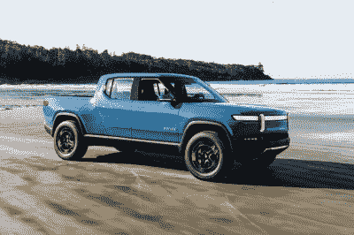

# 麦格纳宣布电动皮卡的简单驱动解决方案

> 原文：<https://hackaday.com/2021/04/14/magna-announces-simple-drive-solution-for-electric-pickup-trucks/>

迄今为止，销售的大多数电动汽车都是针对通勤者的，适合市场上的轿车和 SUV 细分市场。展望未来，整个汽车领域都非常需要电气化，包括像皮卡这样的工作车辆。一家名为 Magna 的公司最近在这一领域投入了他们的帽子，开发了一种简单的动力传动系统，无需重大修改即可安装在皮卡上。

## 这完全取决于外形

The eBeam motor slots into the chassis in place of a traditional rear differential, requiring no special adaptation to the suspension or braking systems.

麦格纳的电子束技术旨在使电动皮卡和其他相关工作车辆的制造更容易。基本概念是一个电机驱动单元，内置于模仿传统梁轴的外形中，通常用于大多数皮卡的钢板弹簧悬架设计。这有可能成为各种卡车的嵌入式电机解决方案，其中大多数使用大致相似的后悬架设置。通过简单地改变车轴和弹簧座来适应，麦格纳的电子束电机几乎可以安装到任何皮卡上。eBeam 设置旨在与 OEM 制动和悬挂系统一起工作，尽管再生制动辅助也是可能的。

Beam axles are common on pickup trucks and other load-carrying vehicles. Magna’s eBeam motor system is aimed at these applications.

当然，电子束只是一种后驱动解决方案，尽管它不需要仅限于两轮驱动卡车。麦格纳已经开发了一系列电力驱动解决方案，可用于前端，以处理四轮驱动，这通常被认为是卡车市场的必需品。这显然需要第二个电机和相关的控制硬件，但避免了传统四轮驱动系统中典型的差速器、分动箱和传动轴的麻烦。

电子束电机驱动器系列有三种不同的组合。单电机驱动、具有双速传动装置的单电机驱动和具有扭矩矢量的双电机驱动。功率范围预计从 120 千瓦(160 马力)到 250 千瓦(335 马力)。这与大多数中低端市场皮卡的现有发动机选择大致相当，但与目前市场上最强大的卡车发动机(超过 400 马力(~300 千瓦))相比有所不足。与此相反，电动马达具有从零转/分钟就能提供最大扭矩的优势，这在拉动重负载时是一个主要优势。对于许多工作来说，峰值功率略低的电动动力系统可能仍然会比汽油或柴油竞争对手表现得更好。

目前，麦格纳正在向汽车制造商推销电子束车轴，希望在尚未成为主流的电动皮卡市场中分得一杯羹。尽管如此，自制改装的场景还是很活跃，爱好者们利用任何可用的部件来创造他们自己的电动游乐设施。很容易想象，为广受欢迎的老式卡车，如福特的 F 系列和老式公羊和 Silverados，销售这种转换部件会有一个健康的市场。

This cutaway shows the eBeam rear axle and one of Magna’s existing front-drive motor solutions.

然而，不管目标车辆是什么，Magna eBeam 都不是一个一体化的解决方案。虽然它解决了如何用电动机驱动后轮的问题，但也仅此而已。找出电池解决方案、充电和其他类似的问题留给了买家。

对于专用齿轮头，黑客在一些抢救部分从崩溃的电动汽车可能会得到一个大部分的方式。然而，对于汽车制造商来说，仍然需要大量的设计工作来采用最初为油箱和大型内燃机设计的平台，并对一切进行调整，直到它适合为止。

更有可能的是，出于安全、包装和性能方面的考虑，我们将看到围绕电池组从头开始设计的电动皮卡。市场非常关注电动汽车的范围，这取决于电池的大小和性能。虽然 eBeam 的设计有助于采用后驱动解决方案，但希望在市场上竞争的车辆仍需要集成良好的电池解决方案，才能说服买家采用。

With electric pickups like the Rivian R1T and Tesla Cybertruck reportedly just around the corner, the electric pickup battle is about to begin.

总的来说，电子束是一个有趣的产品，虽然它似乎更适合饥渴的转换市场，而不是成熟的汽车制造商。虽然人们可以欣赏集成后驱动电机解决方案，但它完全在任何前 20 名汽车制造商的设计能力范围内，所以我们不知道他们为什么从外部购买它。真正的挑战在于电力驱动系统与车辆其余部分的集成，这是梁轴电机无法解决的问题。

麦格纳的硬件是否在行业中起飞取决于汽车制造商自己闭门造车开发的东西，人们可能会认为他们很久以前就开始研发电机了。一如既往，时间会证明一切。