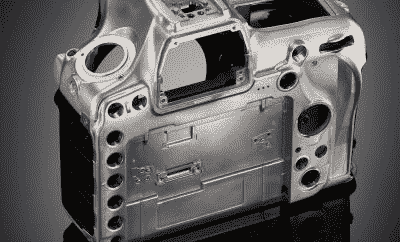
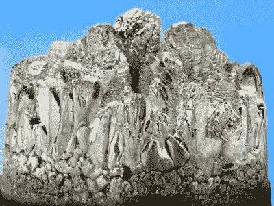
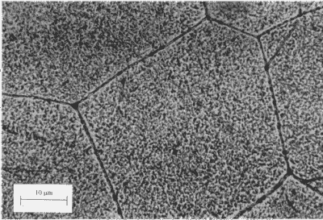

# 镁:它从哪里来，为什么我们会耗尽

> 原文：<https://hackaday.com/2021/11/01/magnesium-where-it-comes-from-and-why-were-running-out/>

好吧，我们没有跑出去。事实上我们有很多这种东西。但是现在有一场全球供应链危机。世界上大部分的镁都是在中国加工的，几个月前，他们就……停止了。为了达到能源消耗限额，玉林市(全国大部分镁的生产地)[政府下令 70%的冶炼厂完全关闭，其余的削减 50%的产量](https://news-primer.com/chinas-magnesium-shortage-threatens-the-global-auto-industry/)。因此，虽然镁仍然是地球上最丰富的元素之一，但我们很快就会用完可用于制造业的加工金属。

The magnesium-alloy body of a Nikon d850\. Courtesy of [Nikon](https://www.nikonusa.com/en/nikon-products/d850-technical.page)

但是，我们究竟如何在制造业中使用镁呢？嗯，有些东西就是用它做的。它可以与其他元素混合制成强度高、重量轻的合金，易于加工和铸造。这些合金构成了各种各样的材料，从赛车车轮到相机机身(还有我正在打这篇文章的笔记本电脑的底盘)。除了这些更直接的用途，镁还有另一个更大的用途，那就是铝的生产。

但是等等，铝和镁一样是一种元素。那么我们为什么需要镁来制造它呢？请放心，这不涉及炼金术，只是合金。与镁非常相似，铝很少以其原始形式使用——它与其他元素混合以赋予其所需的属性，如高强度、延展性、韧性等。而且，你可能已经猜到了，大多数这些合金都需要镁。现在我们开始描绘一幅更大、更可怕的画面(我们刚刚错过了万圣节！)——全球铝供应的中断。

## 镁从何而来

A nice chunk of crystalized magnesium. Courtesy of CSIRO, [CC BY 3.0](https://creativecommons.org/licenses/by/3.0), via Wikimedia Commons

在我们陷入所有的悲观和厄运之前，让我们先来看看镁到底是从哪里来的。我们已经确定，我们不能只是把它从地下取出一大块，扔在 CNC 上，但是在它从泥土到我的相机机身的旅程中发生了什么呢？

首先，它的旅程并不总是从泥土中开始。其中一些来自海洋。原来海盐卤水是氯化镁的一大来源。为了提取镁，水被蒸发形成无水氯化镁，正如你可能已经猜到的，这只是干氯化镁的一个花哨的术语。然后加热至熔化，电流通过熔盐，将镁离子和氯离子分开。我认为我们需要在这里暂停一下，考虑一下这听起来有多金属——电击熔岩，将其分解为金属镁和气态氯！

镁也可以从菱镁矿(主要在俄罗斯、朝鲜和中国)和白云石(世界各地都有，通常在美国、加拿大和瑞士等国开采)矿石中提取。矿石被开采出来，然后碾碎成粉末并加热，然后与海水混合。这将氢氧化镁从剩余的岩石碎片中分离出来。氢氧化镁可以与一些氯一起加热，生成氯化镁，氯化镁可以用上述海水法处理。

我们将讨论的最后一种方法效率最低，讽刺的是，却是最常用的。被称为[皮金法](https://link.springer.com/chapter/10.1007/978-981-16-2171-0_2)并以其发明者劳埃德·皮金博士的名字命名，这种方法消耗更多的能量，需要更多的体力劳动来生产与其他方法相同质量的镁。这是中国生产镁的主要工艺，因为中国的能源和劳动力都很便宜。它包括在真空下的熔炉中还原煅烧白云石颗粒(回想化学课上的氧化还原反应的时间)。最终，金属镁开始结晶，随后可以熔化成锭。该过程通常需要工人在每个循环(持续大约 11 个小时)结束时手动清空和重新填充镁罐。

## 金属混合物

现在我们已经得到了滚烫的镁锭，让我们花点时间更深入地讨论一下合金。合金是不同元素的溶液，通常在熔化时混合在一起，冷却成我们熟悉和喜爱的金属条。我们在工程中使用的几乎所有金属都是合金；使用纯元素形态的非常罕见。我立即想到的仅有的两个例子是铜(有时以其元素形式用于电导体和热导体)和钛，钛可以作为“CP”或商业纯的片和棒出售和使用。然而，在大多数情况下，我们想要添加一些特殊的东西来帮助赋予金属所期望的特性。

A micrograph of precipitates (dark regions) in an aluminum-copper alloy. Courtesy of [University of Cambridge](http://www.phase-trans.msm.cam.ac.uk/abstracts/M24.html)

镁合金有很多，我不会一一列举出来让你感到厌烦，但我们至少可以谈谈形成镁合金的几种常见金属(称为合金元素)。铝、锆、锌和钍是常见的混合元素。它们允许合金沉淀硬化——这是一种热处理过程，形成称为沉淀物的微观区域，阻止金属颗粒的运动，有效地使整块金属变得更硬。其他常见的合金元素是锡(这使得镁更容易铸造)和锰(这可以提高耐腐蚀性，这是镁非常容易受到影响的)。

当铝中加入镁时，可以提高材料的强度。这使得工程师能够设计出轻质、高强度的零件。事实上，几乎所有常见的铝合金都含有镁——这是汽车和航空业青睐的合金所必需的。

## 供应链困境

我们已经确定了我们需要多少镁，那么当我们得不到镁时会发生什么呢？如果中国的工厂关闭更长时间，这就是我们可能面临的现实。汽车制造商将尽其所能获得合适的铝，但可能不够用，一些专家认为，这可能导致汽车装配线陷入停顿，直到上游供应链恢复正常。

供应短缺的不仅仅是汽车。消费电子产品生产也会受到影响(好像全球芯片短缺还不够)。影响将是深远的，即使你明年不打算买新车或笔记本电脑，你也可能会感觉到。[镁和铝的价格一直在上涨](https://www.bloomberg.com/news/articles/2021-10-14/aluminum-makers-sound-the-alarm-about-u-s-magnesium-shortage)，甚至更小的加工车间也开始储备材料，他们担心这些材料在几个月后就无法供应了。这可能是一个很好的时间来考虑你要为你的最新项目设计的机加工铝外壳的替代品。