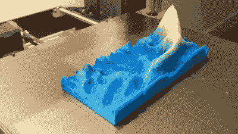

# 制作自己的颜色渐变 3D 打印细丝

> 原文：<https://hackaday.com/2022/09/30/make-your-own-color-gradient-3d-printing-filament/>

颜色渐变灯丝是一种有趣的玩法。它可以让您制作沿 Z 轴从一种颜色慢慢淡化到另一种颜色的 3D 打印。【大卫·戈扎德】想做一些具有这种效果的印刷，并学会了如何自己制作灯丝来完成这项工作。

[David]打算 3D 打印重力波的光谱图，并希望图表从蓝色变为黄色。只有一台单色打印机，他需要变色灯丝，但在网上找不到任何蓝变黄灯丝。

The resulting color-shifting print looks great, demonstrating the value of the technique.

因此，他选择自己创造它。他首先在 Fusion 360 中创建了一个螺旋模型，横截面为六边形，慢慢变细为一个点。将它切成薄片并打印成蓝色，会产生一条慢慢变淡的细丝。相反的形状可以用黄色打印出来，从一个点逐渐变细到一根完整的细丝。诀窍是打印一种形状，然后打印另一种形状，方法是将 g 代码混合在一起，并在此过程中将灯丝从蓝色变为黄色。结果是蓝色和黄色的塑料被一起印刷成一根细丝，逐渐从一根变成另一根。

值得注意的是，该灯丝比用于创建它的原始灯丝小，因此在使用它时有必要运行稍微不同的设置。[David]在 Thingiverse 上分享了这些模型，供那些渴望在家重现这一技术的人使用。他得到的重力波印记令人印象深刻，证明这种技术效果很好！

在之前，我们也看到过类似的不同技术[用于创造多色灯丝。休息后的视频。](https://hackaday.com/2022/07/06/3d-print-your-own-multi-color-filament/)

 [https://www.youtube.com/embed/3AAUj9pV3rM?version=3&rel=1&showsearch=0&showinfo=1&iv_load_policy=1&fs=1&hl=en-US&autohide=2&wmode=transparent](https://www.youtube.com/embed/3AAUj9pV3rM?version=3&rel=1&showsearch=0&showinfo=1&iv_load_policy=1&fs=1&hl=en-US&autohide=2&wmode=transparent)

