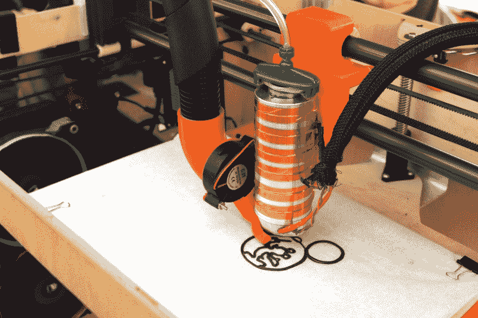
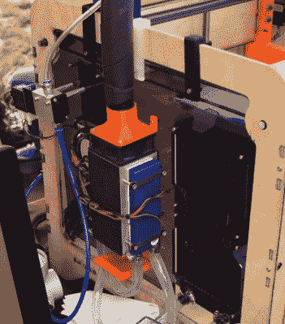

# 纽约制造商博览会:可可压榨机巧克力打印机

> 原文：<https://hackaday.com/2018/09/29/maker-faire-ny-cocoa-press-chocolate-printer/>

如果你现在还不明白，对桌面灯丝打印机的大肆宣传已经基本结束了。但这并不意味着没有值得探索的使用基本 FDM 打印机技术的新途径。如果有什么不同的话，3D 打印机零件和套件的低成本和高可用性使其更容易进入新的领域。例如，用其他材料做实验，这些材料可以像热塑性塑料一样一层一层地“印刷”。水泥、粘土甚至巧克力等材料。

 【埃文·温斯坦】带着他的 Cocoa Press 打印机参加了 2018 年纽约世界创客大会，我们不得不说这是一项令人印象深刻的工程。众所周知，黑客们会将基于注射器的糊状物挤压机扔到普通的 3D 打印机上，并不时喷射出可食用的物体来试试运气[，但可可压榨机确实是一台专门制造的烹饪机器](https://www.cocoapress.com/)。

从外表上看，它的特点是胶合板箱和模糊的 Makerbot 式布局，这是我们在 DIY 3D 打印机中见过很多次的。它甚至使用运行 Marlin 的相同 RAMPS 控制器来驱动普通的自制打印机。但是除了这些表面上的相似之处，可可压榨机还有许多专门建造的组件，这使得它能够独一无二地应对用熔化的巧克力建造的挑战。

首先，除了喷嘴和注射器的壁之外，没有任何物体与要打印的巧克力接触；将脏乱和污染的可能性降到最低。普通糊料挤出机中使用的丝杠致动柱塞被移除，以利于纯空气动力系统:压缩机用过滤和干燥的空气泵送小储罐，并且通常旋转挤出机步进电机的马林指令被截取并用于触发空气阀。这些压缩空气的爆发填充了巧克力上方的空白区域，并迫使它从 0.8 毫米的喷嘴中出来。

在普通的 3D 打印机中，“熔化区”很小，这使得加热器本身相对较小。但这在这里行不通。所有的巧克力都必须被液化。这有点像在整个打印过程中必须保持一整卷 PLA 熔化。因此，可可压榨机上的加热器是巨大的，[Evan]甚至在打印机旁边有几个装满巧克力注射器的备用加热器，这样他可以保持它们的温度，直到它们准备好装载。

当然，让你的工作材料在 3D 打印机中变热只是成功的一半，[如果你想在新的层放在它上面时保持它的形状，你还需要快速冷却它。一台普通的 3D 打印机通常可以在喷嘴旁边挂一个小风扇，但[Evan]发现巧克力需要一点冷却才能真正凝固。](https://hackaday.com/2018/02/06/cpap-hacked-into-super-charged-3d-printer-cooler/)

所以他想出了一个利用水冷珀耳帖单元的冷却系统。Peltier 阵列的冷侧位于一个盒子内，空气被迫通过该盒子，通过绝缘软管到达挤出机，在挤出机中，离心风扇和 3D 打印歧管将空气导向刚刚打印的巧克力。他报告说，这个系统在正常情况下工作良好，但异常高的环境温度会淹没冷却器。

虽然“人”阻止观众实际上吃任何机器的创造(在纽约分发食物，你必须首先在纽约市注册)，但他们肯定*看起来*很棒，我们有兴趣看看这个项目从这里走向何方。