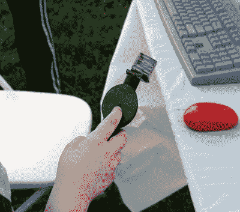
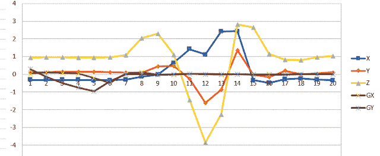

# 纽约制造者集会:与《我的世界》进行身体接触

> 原文：<https://hackaday.com/2018/09/30/maker-faire-ny-getting-physical-with-minecraft/>

如果你已经在 Hackaday 呆了一段时间，你可能会看到一些试图将真实世界与虚拟天堂《我的世界》联系起来的尝试。在过去，项目已经将物理交换机连接到游戏中的虚拟设备，或者从游戏的块状景观中提取大块并将其转化为 3D 可打印文件。这些都是足够有趣的努力，但在他们的范围相当有限。他们认为你在*《我的世界》*有一个现存的世界或创造，你想以一种更自然的方式摆弄它，但实际上并没有玩游戏。

 但是[【物理《我的世界》】在 2018 年纽约](http://physicalminecraft.blogspot.com/)世界创客大会上展示，提供了一种独特的方式让玩家更接近他们的立方对手。由[Manav Gagvani]创建的物理界面让玩家使用运动检测棒结合一系列微型*《我的世界》*积木来构建虚拟世界。

魔杖甚至检测各种手势来激活一系列“咒语”，这是有效的自动化构建命令。例如，向前推棒，同时做扭转运动，将自动创建一个所选块类型的隧道。这不仅使游戏中的建筑速度更快，而且鼓励玩家尝试不同的手势和动作。

一个 Raspberry Pi 3 运行游戏，并使用其机载蓝牙与 3D 打印棒进行通信，3D 打印棒本身包含一个 MetaWear 可穿戴传感器板。通过捕捉自己的动作并用电子表格绘制结果数据，[Manav]能够将复杂的手势归结为一组整数值，并将其插入 Python 代码中。当脚本看到它识别的一系列值时，相关的命令被传递给正在运行的*《我的世界》*的实例。

 你可能会认为魔杖本身是在探测附着在它上面的物质块，但这一点魔法实际上是发生在块所在的底座上。Manav 没有试图用 RFID 或类似的东西来唯一地识别每个区块，而是在基座中嵌入了一系列簧片开关，这些开关由隐藏在每个区块中的磁铁触发。

这些开关直接连接到 Raspberry Pi 的 GPIO 引脚，可以非常容易地确定哪个模块已被移除并安装在棒的顶端。如果积木被放在错误的位置或者一次移除多个积木，事情会变得棘手，但在大多数情况下，这是一种解决问题的有效方法，不会使一切变得过于复杂。

我们经常谈到现在孩子们对《我的世界》和 T2 的爱已经被 T4 用来让他们参与 STEM 项目，而“物理《我的世界》”就是一个很好的例子。有一排年轻玩家在等待魔杖的轮到，尽管他们实际上“玩”的是扔石头的数字等效物。[Manav]会把魔杖交给他们，并解释他的界面背后的总体想法，提醒他们游戏中的积木又大又重:仅仅放下魔杖是不够的，还需要以适合他们的数字化身移动的沉重物体的速度和力度来轻弹。

让孩子们对硬件、软件、*和*同时进行身体要求高的活动非常困难。像“物理《我的世界》”这样的项目表明，除了无意识的按键操作，还有更多可以玩的游戏，并代表着我们在日益数字化的世界中如何处理 STEM 教育的范式转变。