# 纽约制造者集会:机器人出来玩耍的地方

> 原文：<https://hackaday.com/2018/09/25/maker-faire-ny-where-robots-come-out-to-play/>

在纽约举行的 2018 年世界创客博览会上展出了令人难以置信的大量东西。说真的，来自黑客和创客世界各个角落的不真实数量的非常酷的创作:从纯粹的艺术创作到一年左右不会在世界其他地方的雷达上出现的尖端硬件，以及介于两者之间的一切。如果你有创造力，这就是适合你的地方。

但是如果有一种类型的创造在所有其他创造中脱颖而出，如果你愿意的话，那就是机器人技术。小机器人，大机器人，飞行机器人，战斗机器人，甚至音乐机器人。机器人取悦所有年龄的孩子，机器人跟踪他们噩梦中最黑暗的角落。各种场合都有机器人。对于一个以红色机器人作为吉祥物的活动来说，这可能并不令人惊讶，但仍然如此。

机器人太多了，无法一一展示，但以下是我们在展会上看到的一些更有趣的机器人作品。如果你是我们在法拉盛梅多斯科罗纳公园的旋风式旅行中没有机会近距离接触的一个机器人的创造者，我们只要求你请不要把它送到这里来实施你的报复。我们非常抱歉。(开个玩笑，如果你有机器人可以炫耀，在评论里掉个链接吧！)

## 人类之手

“人类之手”并不是一个新的创造，它多年来一直是创客大会的主题，我们甚至在 2009 年就报道过它。但是，你仍然不能在 Maker Faire 上开始一个机器人展览的纲要，而不提到液压爪，它像玩具一样随意地把汽车扔来扔去。除此之外，还有来自集会的随机的孩子们在拉着液压蛮力的绳子，这是一个令人难以置信的吸引力！

 [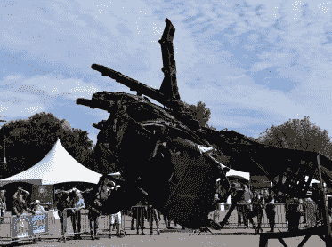](https://hackaday.com/2018/09/25/maker-faire-ny-where-robots-come-out-to-play/robots_h2/)  [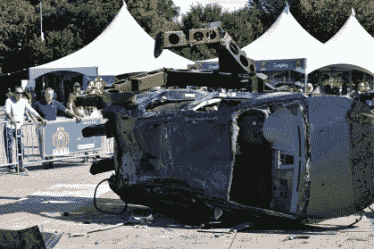](https://hackaday.com/2018/09/25/maker-faire-ny-where-robots-come-out-to-play/robots_h1/) 

## 托博尔大帝

像“人类之手”一样，托博尔最初是一只可以拿起东西的无实体手臂。然后，在这个过程中的某个地方，北安普顿社区大学 Fab 实验室的人决定把它变成一只移动的恐龙。对我们来说听起来很合理。它由一个安装在手臂上的设备控制，看起来[可疑地像一个被黑掉的任天堂动力手套](https://hackaday.com/2018/09/09/now-finally-we-can-play-with-power/)，它能够进行大范围的运动，绝对是年轻的 Maker Faire 参与者的一大热门。

 [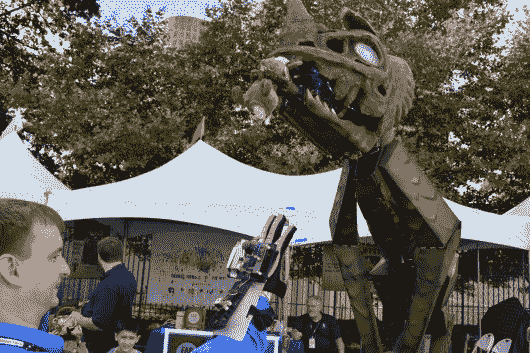](https://hackaday.com/2018/09/25/maker-faire-ny-where-robots-come-out-to-play/robots_tobor1/)  [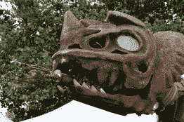](https://hackaday.com/2018/09/25/maker-faire-ny-where-robots-come-out-to-play/robots_tobor3/)  [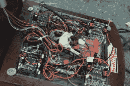](https://hackaday.com/2018/09/25/maker-faire-ny-where-robots-come-out-to-play/robots_tobor2/) 

我们特别喜欢暴露的电子设备与有机外观的身体和细致的头部的有趣并列。如果这听起来像是我们对这件作品的艺术意图有一些深刻的理解，我们没有。我们只是这些部件周围的可见电线和 PCB 的粉丝。

## 战斗机器人名人

当整个活动中最拥挤的人群聚集在展出的几个战斗机器人周围时，你知道你在一个好公司，这些机器人刚从探索网络的节目中拍摄新集。出席的车手发誓在最近的比赛中对发生的事情保密，直到这集真正播出，但鉴于现场至少有一个机器人的电子设备烧焦，我们可以很好地猜测谁没有赢得比赛。

 [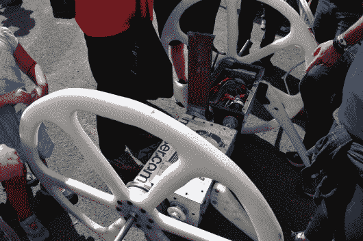](https://hackaday.com/2018/09/25/maker-faire-ny-where-robots-come-out-to-play/robots_bb4/) Huge [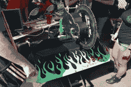](https://hackaday.com/2018/09/25/maker-faire-ny-where-robots-come-out-to-play/robots_bb3/) SawBlaze [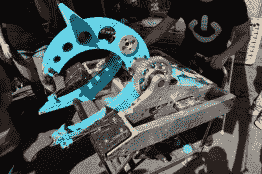](https://hackaday.com/2018/09/25/maker-faire-ny-where-robots-come-out-to-play/robots_bb2/) Overhaul [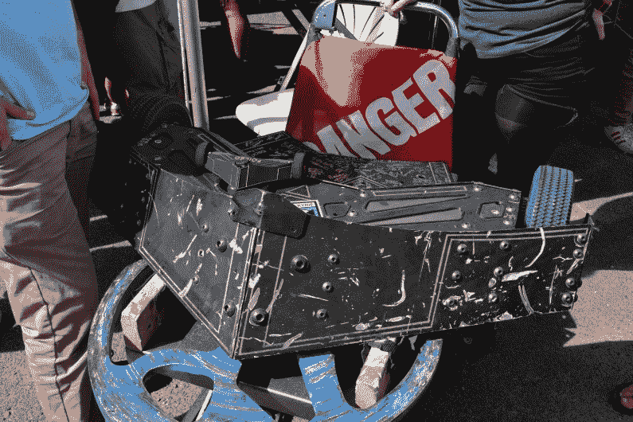](https://hackaday.com/2018/09/25/maker-faire-ny-where-robots-come-out-to-play/robots_bb1/) Valkyrie

但是，虽然这些真正的电视明星周围的人群很紧张，但聚集在大规模破坏竞技场周围的与会者几乎无法进入。这些来自新英格兰的黑客有他们自己的战斗机器人“小联盟”，从 1 磅重的小塑料机器人到割草机大小的机器。他们的一些更小的机器人在他们的移动竞技场上全天进行预定的比赛，如果说这是一个受欢迎的吸引力，那是一种轻描淡写的说法。

## 仿生机器人走向学校

我们有机会与 FESTO 的一些代表交谈，他们正在展示他们针对教育市场的仿生机器人套件。FESTO 说，这是德国和美国有史以来第一个教育仿生学套件，允许高中生构建各种受动物启发的机制。这些套件是定制零件和一些家用部件的混合物，学生可以通过 Wi-Fi 从智能手机上控制它们的电子设备。

特别令人感兴趣的是机器鱼，它使用密封的“身体”和防水伺服系统来实际游泳。代表们很清楚它并不打算潜水，但是如果你把它放在水池或水箱里，它会很高兴地在你的指挥下在水面上来回游动。

 [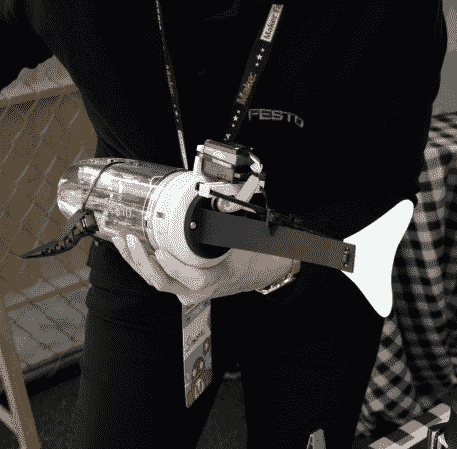](https://hackaday.com/2018/09/25/maker-faire-ny-where-robots-come-out-to-play/robots_festo3/)  [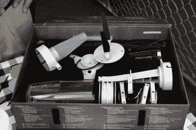](https://hackaday.com/2018/09/25/maker-faire-ny-where-robots-come-out-to-play/robots_festo2/)  [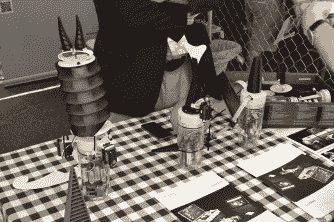](https://hackaday.com/2018/09/25/maker-faire-ny-where-robots-come-out-to-play/robots_festo1/) 

如果 FESTO 这个名字听起来很熟悉，那是因为他们的灵感来自自然的设计对 Hackaday 的页面来说并不陌生。教育工具包比我们过去看到的工作更加简单，但考虑到目标年龄组，这可能是一件好事。

## 伏特比大多数人都酷

毫无疑问，作为我们在 Maker Faire 上看到的最好看的机器人，Ray Rumore 在设计 Volt 时从 CHAPPiE 和 Johnny 5 等标志性的机器人演员那里获得灵感并不奇怪。Volt 旨在成为一个“社交”机器人，它可以四处行驶，将所看到的内容反馈给操作员。我们被告知，在去年的 Maker Faire 的一次驱动中，它参与了一些人类表演者的即兴音乐表演。听起来像是一个人能得到的“社会”程度，机器人或者其他。

 [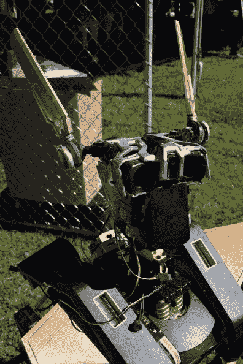](https://hackaday.com/2018/09/25/maker-faire-ny-where-robots-come-out-to-play/robots_volt1/)  [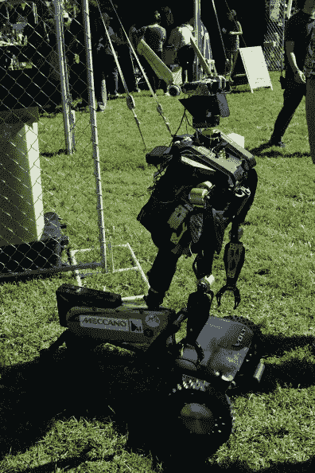](https://hackaday.com/2018/09/25/maker-faire-ny-where-robots-come-out-to-play/robots_volt2/) 

## 机器人乐队从未停止

正如你可能从名字中猜到的那样，机器人乐队是一群人形机器人，他们用各种乐器如铃铛和鼓来表演歌曲。更确切地说，它们是“耳朵虫”概念的机械化版本:一首在你听完之后就一直留在你脑子里的歌。在我们离开创作者胜田哲二让他的剧团在纽约科学大厅表演的地方很久以后，我们仍然哼着他们叮当作响的旋律。有时当我们闭上眼睛时，我们甚至还能看到它们。

[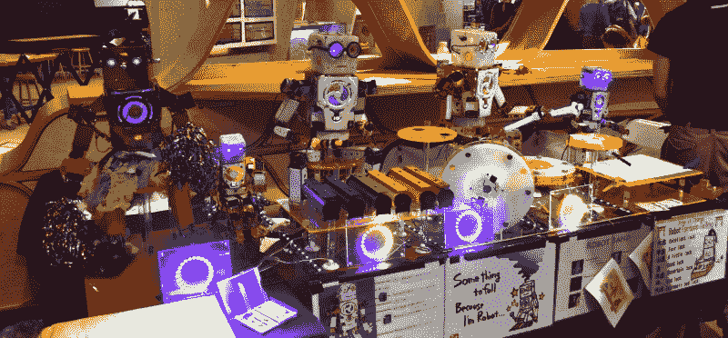](https://hackaday.com/wp-content/uploads/2018/09/robots_band.jpg)

## 直到下次

众所周知，机器人无法被像我们这样的凡人所阻止，所以我们毫不怀疑下次 Maker Faire 举办时会有更令人印象深刻的机械标本。有这么一群不可思议的有创造力的人，他们都有不同的目标和灵感，怎么可能是其他方式呢？

与此同时，为了帮助你激发灵感，为明年做点什么，你应该去看看[即将到来的黑客日超级会议](https://www.eventbrite.com/e/hackaday-superconference-2018-tickets-47386813234?aff=0924com)。