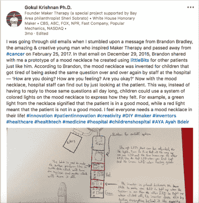

# 制造者疗法加入了对抗新冠肺炎的战斗

> 原文：<https://hackaday.com/2020/04/21/maker-therapy-joins-the-fight-against-covid-19/>

我们喜欢在 Hackaday 谈论创客空间。我们喜欢听到同志情谊、黑客、拓展、创新等等。更重要的是，我们喜欢看到创客空间采取的各种形式，无论是他们创造的黑客，他们接触的社区，还是他们独特的环境。

最近，我们遇到了[创客疗法，一个就在儿童医院里面的创客空间。](http://www.makertherapy.com/)[在](https://hackaday.com/2015/10/21/nurses-create-in-a-medical-makerspace/)之前，我们已经在 Hackaday 上听说过医院创客空间，但创客疗法的特别之处在于，它是第一个让患者有机会在儿科环境中创新的医院创客空间。

由 Gokul Krishnan 博士创立的 Maker Therapy 受到患者的启发，已经存在了几年，但最近因为其在新冠肺炎疫情前线的独特位置而突然进入我们的视线。作为一个位于医院内的创客空间，创客疗法在成为医院自己的快速原型单位方面处于独特的地位。使用 3D 打印和其他工具，Maker Therapy 能够[在最需要的地方制作面罩和其他重要的个人防护装备](https://www.linkedin.com/posts/gokulck_3dprinting-makerspace-healthcare-activity-6654829026240266240-zd9k)。

在 Hackaday，我们向所有为我们的社区而战的医疗保健专业人员致敬，并致以永恒的谢意。[也许你的一些技巧和其他设计可以被创客疗法](https://hackaday.com/2020/04/06/brainstorming-covid-19-hack-chat/)这样的项目所利用？在那之前，呆在家里，安全度过每一天。我们一起度过难关的唯一方法就是。