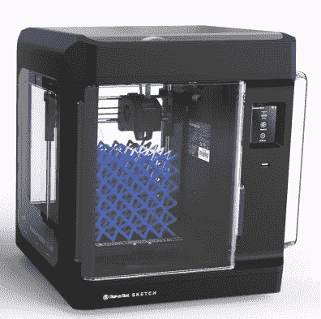
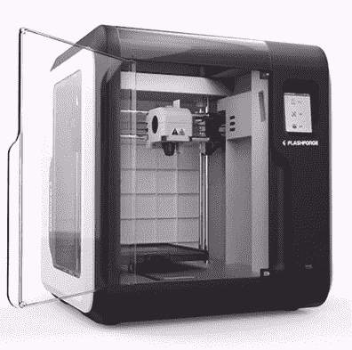

# MakerBot 用品牌打印机瞄准学校

> 原文：<https://hackaday.com/2020/02/19/makerbot-targets-schools-with-rebranded-printers/>

MakerBot 有望成为开源硬件运动中最成功的故事之一。基于 RepRap 社区的共享知识，他们在十多年前创建了第一台面向消费者的实用桌面 3D 打印机。但是今天，在被 Stratasys 收购并放弃其开源根基后，该公司几乎完全消失在他们帮助创建的市场中。更便宜和更好的打印机，其中一些建立在相同的 RepRap 血统，已经完全接管了消费者空间；迫使 MakerBot 重新将精力集中在专业和教育客户上。

该公司的这一根本性重组也许在最近推出的“素描教室”中表现得最为明显:一个 1800 美元的套餐，包括课程计划、教师认证计划、几卷细丝和公司的两台新素描打印机。它甚至包括访问 MakerBot Cloud，这是一种新的在线服务，旨在帮助教师在多台草图打印机之间处理学生的打印工作。

当然，对于普通黑客读者来说，从这份声明中最大的收获是 MakerBot 正在发布新的硬件。他们的最后一台打印机[显然不是为制造商](https://hackaday.com/2018/12/11/makerbot-moves-away-from-makers-with-new-printer/)设计(或定价)的，甚至一台当代复制器的成本也超过了整个素描教室的包装。从表面上看，这似乎是对 MakeBot 产品更合理定价模式的回归；这甚至可以帮助他们夺回多年来失去的部分市场份额。

只有一个问题，MakerBot 实际上并没有制作草图。这家曾经行业领先的公司现在又回到了原点，并且正在使用一个重新命名的打印机作为他们进入教育市场的基石。无论他们是无法制造出对学校有吸引力的廉价打印机，还是根本不想制造，信息都很明确:如果你打不过他们，就加入他们。

## 熟悉的面孔

虽然 MakerBot 没有正式承认草图的设计是从另一家制造商那里借来的，但那些关注行业最新最棒产品的人很快就认识到了这款机器的本质。在草图发布后的几天里，我们收到了来自社区成员的一些提示，他们注意到 MakerBot 的这款“全新”3D 打印机与他们工作台上的一件硬件有着惊人的相似性。

  MakerBot SKETCH  Flash Forge Adventurer 3

显然，打印机的外壳做了表面上的改变，但当并排放置时，很明显 MakerBot 草图是 Flash Forge Adventurer 3 的修改版本。从可拆卸的印刷床到独特的封闭式挤出机组件，两台机器的机械配置几乎完全相同。Adventure 3 甚至提供了自己的基于网络的管理软件，这不禁让人质疑 MakerBot Cloud 本身是否是一个更名产品。

有趣的是，MakerBot 并不是唯一一家喜欢《冒险家 3》的公司。Monoprice 目前正在销售他们自己的版本，名为 Voxel ，除了增加他们的标志外，设计没有明显的变化。功劳归功劳，至少 MakerBot 投入了时间和金钱来使他们的版本与他们现有打印机系列的设计语言更好地匹配。

诚然，如果你打算选择一台 3D 打印机来重塑你的教育产品品牌，你可能会比《冒险家 3》做得更差。完全封闭的设计不仅意味着好奇的孩子不太可能接触到机器，而且印刷过程中产生的任何令人不快的东西都将被包含在内。事实上，MakerBot 甚至走得更远，增加了一个集成的过滤系统来清除建造室中的任何颗粒。触摸屏控制和集成网络连接也大大有助于让教师和学生更容易使用机器。

## 这与打印机无关

冒险家 3 目前可以直接从 Flash Forge 以 449 美元的价格购买，单价体素甚至卖到 400 美元。因此，对于素描教室包的价格，你可以得到四台打印机，如果你通过购买垄断版本节省一些钱，可能还有足够的钱来购买一些灯丝。如果目标只是让一个小的印刷农场运转起来，那么显然这是最有意义的。

但这不是素描教室包的真正目的。虽然 MakerBot 的历史记录会让我们相信硬件本身有健康的加价，但打印机的成本实际上只是等式的一半。你还必须考虑开发和维护课程的成本。

对于教育工作者来说，像这样一个完整的交钥匙解决方案是非常有吸引力的。任何人都可以在亚马逊上买到一对入门级 3D 打印机，但它们不包括课程材料或培训，这些材料或培训将帮助你让一屋子的青春期前的孩子对它们感兴趣。购买硬件却没有一个清晰的计划如何将它转化为一个有用的教育工具，这使得无数的 3D 打印机在世界各地的学校里积满灰尘；如果 MakerBot 的新套件可以解决这个问题，毫无疑问，它的要价是值得的。