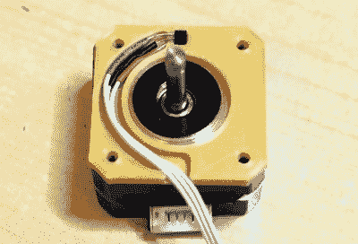

# 让 3D 打印的 DSLR 相机底座更加出色

> 原文：<https://hackaday.com/2020/10/28/making-a-3d-printed-dslr-camera-mount-even-better/>

我们很想说我们所有的项目在第一次尝试时都完美地工作了，但是普通的黑客读者有点太有经验了，不会相信这样的谎言。现实是，DIY 项目很少一开始就把一切都做好。识别问题并解决所有的问题需要一些时间。当然，这也是乐趣的一半。

关于这一过程的完美例子，请查看[isaac879]一直在进行的 3D 打印 DSLR 相机底座的最新更新。当我们上次在夏天检查这个项目时，安装已经令人印象深刻，但随着最新的改进和添加一个全新的运动轴，这个自制相机运动系统对于任何想将他们的项目视频提升到一个新水平的人来说都是一个非常引人注目的项目。

The new Hall effect sensor mounts are a very nice touch.

早在六月，[展示的坐骑【isaac879】只能进行平移和倾斜](https://hackaday.com/2020/06/15/giant-bearing-is-at-the-heart-of-a-camera-mount/)。但是正如你在休息后的视频中看到的，他已经把它安装到一个由 20×40 铝挤压制成的轨道上，并添加了另一个步进电机。这使得平移/倾斜支架可以在轨道上来回移动，以获得当今所有酷孩子在视频中使用的那些流畅的平移镜头。

但是，即使你对滑块方面不感兴趣，核心平移/倾斜安装也在过去几个月中得到了许多改进。也许最明显的是转向更薄更轻的步进电机。对于像这样的移动系统来说，减少质量总是一种改进，对于云台电机来说，更短的外壳可以防止与相机本身的潜在碰撞。显然，较小的马达较弱，但[isaac879]认为这是一个特征；如果事情变得棘手，迷你马达将会开始跳过步骤，而不是潜在地损坏你昂贵的相机。

他改用法兰轴承来帮助将框架固定在一起，改进了布线，增加了电子设备的安装点，在柔性细丝中重新印刷了小齿轮来帮助吸收一些振动，并改用 TMC2208 步进驱动器。新的驱动程序实际上可能是最大的可用性升级之一，因为它们允许整个安装移动得更快更准确。关键的是，[isaac879]还报告说新的驱动程序已经解决了一个棘手的振动问题，他在摄像机缓慢移动时看到了这个问题。

显然，如果你只需要使用一次或两次，你可以将一个简单的云台与几个伺服系统和一些拉链放在一起，但这种口径的项目将理所当然地成为你工作场所的永久固定设备。如果你正在寻找[来提升你的项目摄影游戏](https://hackaday.com/2020/10/09/how-to-shoot-a-great-project-video/)，这是完美的选择。

 [https://www.youtube.com/embed/1FfB7cLkUyQ?version=3&rel=1&showsearch=0&showinfo=1&iv_load_policy=1&fs=1&hl=en-US&autohide=2&wmode=transparent](https://www.youtube.com/embed/1FfB7cLkUyQ?version=3&rel=1&showsearch=0&showinfo=1&iv_load_policy=1&fs=1&hl=en-US&autohide=2&wmode=transparent)

谢谢史蒂文的提示。]