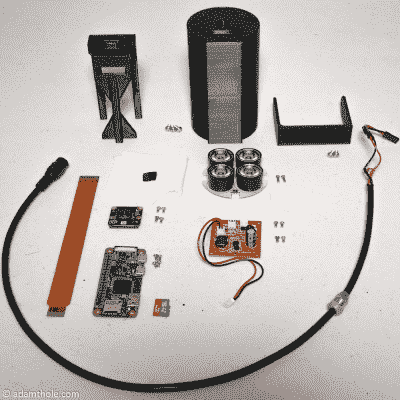
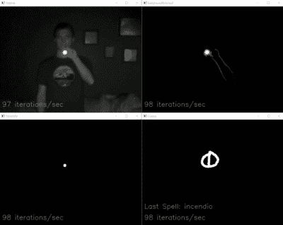

# 用智能魔杖让生日派对变得神奇

> 原文：<https://hackaday.com/2019/04/09/making-a-birthday-party-magical-with-smart-wands/>

参观环球影城哈利波特魔法世界的游客可以通过在空中挥舞特殊的互动魔杖来施展“魔法”。像我们这样的黑客明白，一定有一些未知的阴谋在幕后发生，以检测魔杖是如何移动的，但对于挥舞魔杖的孩子来说，这可能是真正的魔法。所以当他的儿子要求举办一个*哈利波特*主题的生日派对时，[【亚当·索尔】决定尝试在他自己的家里重现环球影城使用的系统](https://www.adamthole.com/control-smart-home-with-magic-wand-video/)。

Components used in the IR streaming camera

基本的想法是，每根魔杖的顶端都有一个反射器，加上强烈的红外照明，使它们在相机上发光。这允许使用计算机视觉技术进行简单的手势识别，所有这些都不需要棒本身中的任何有源组件。

[Adam]指出，你实际上可以从环球影城在线商店购买官方互动魔杖，它们甚至可以与他的系统一起工作，但每根 50 美元太贵了，无法在生日派对上分发给客人。他的解决方案是简单地 3D 打印魔杖，并在末端贴上一点白色棱镜反光胶带。

随着魔杖的消失，他将注意力转向了系统的红外成像方面。他的最终设计是一个非常令人印象深刻的 3D 打印单元，包括四个红外照明器，一个带有黑色相机模块的 Raspberry Pi Zero。[Adam]指出，他的软件设置特别将相机锁定在 41 FPS，因为这将触发它使用缩小的视野，实质上是“放大”图像。如果你不要求高于 40 的 FPS，相机将提供更宽的图像，这在这个特定的项目中没有任何优势。

 该项目的最后一部分是从他的红外摄像机中获取视频流，并对其进行处理，以检测魔杖尖端的明亮光芒。对于视频的每一帧，背景首先被移除，然后任何不超过设定亮度水平的剩余像素被忽略。最终结果是一个代表魔杖尖端的孤立光点，它可以被馈入 Open CV 的光流函数，以向[Adam]显示用户试图做出的形状。从那里，他的软件只需要将形状与其中一个股票“咒语”匹配，并用 Home Assistant 执行适当的功能(如改变房间内灯光的颜色)。

总的来说，这是一个设计得非常好的系统，考虑到它的目标仅仅是娱乐一群孩子几个小时。我们几乎为邻居中的其他父母感到难过；当亚当在他儿子的派对上让这些孩子施展黑魔法后，要给他们留下深刻印象可不仅仅是皮纳塔。

事实证明，黑客类型和那些想要拥有魔力的人之间有相当大的重叠。[【Jennifer Wang】在 2018 Hackaday 超级大会](https://hackaday.com/2018/12/07/magic-wand-learns-spells-through-machine-learning-and-an-imu/)上展示了她基于 IMU 的魔杖研究，过去[我们甚至见过其他魔杖控制的灯光系统](https://hackaday.com/2011/11/07/hacking-a-magic-wand-to-remotely-control-light-displays/)。如果你一直追溯到 2009 年，我们甚至看到一些[迪士尼资助的研究，为他们的公园](https://hackaday.com/2009/05/17/magic-wands-for-disney/)开发互动魔杖景点，这在今天看来特别有先见之明。

 [https://www.youtube.com/embed/bhldhoncPsA?version=3&rel=1&showsearch=0&showinfo=1&iv_load_policy=1&fs=1&hl=en-US&autohide=2&wmode=transparent](https://www.youtube.com/embed/bhldhoncPsA?version=3&rel=1&showsearch=0&showinfo=1&iv_load_policy=1&fs=1&hl=en-US&autohide=2&wmode=transparent)

