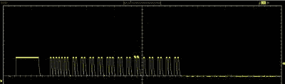

# 让机器人清洁工更加智能

> 原文：<https://hackaday.com/2019/10/20/making-a-robot-cleaner-even-smarter/>

有些电动吸尘器很有效，而有些似乎没什么作用。ILIFE V7s 可能是一个机器人清洁器，但即使有了清洁模式和防碰撞系统，它仍然需要红外信号来完成任何任务。厌倦了和他的机器人清洁工呆在同一个地方，[皮穆佐]决定自己动手，制造一个宁静的遥控器，从远处发送红外信号。

该程序使用 [ESP8266WebServer](https://github.com/esp8266/Arduino/tree/master/libraries/ESP8266WebServer) 和[非远程 ESP8266](https://github.com/crankyoldgit/IRremoteESP8266) 库来处理 HTTP 请求和发送接收红外信号。遥控器还会响应谷歌上的[动作，通过谷歌助手控制机器人。](https://github.com/pimuzzo/actions-on-google)

红外信号有点奇怪——正如一位用户强调的，找到红外协议是一项艰巨的任务，可以通过用红外接收器记录来自原始遥控器的红外信号，并将标记、空格和载波频率与已知协议代码进行匹配来完成。[Oitzu]能够将时序与 NEC 32 位协议匹配，并在示波器上找到准确的代码，这简化了遥控器代码的翻译。

有时候生活给了你一个机器人清洁工，你的工作就是让它变得更聪明。