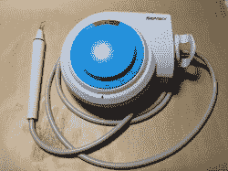
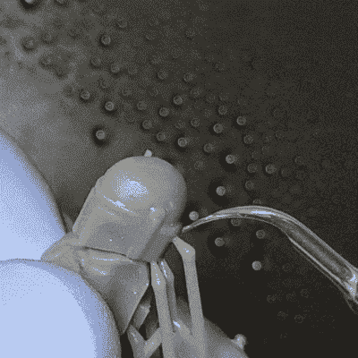
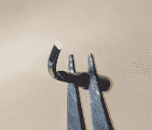
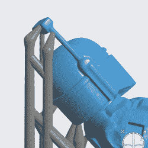

# 制作用于微小 3D 打印后处理的超声波切割机

> 原文：<https://hackaday.com/2019/01/07/making-an-ultrasonic-cutter-for-post-processing-tiny-3d-prints/>

超声刀是一种以高频率轻微振动的刀片，赋予刀刃轻微的超能力。它的使用与其他刀片非常相似，但它变得更容易切割橡胶或硬塑料等棘手的材料。我一直对它们很好奇，最近通过修改另一个工具制作了自己的工具。原来，一个用于牙科的超声波洁牙工具可以很容易地变成一个灵活的小超声波刀具，用于精细的工作。

Cheap ultrasonic scaler. The blue disk is for adjusting power. Foot switch not shown.

我最初开始考虑用超声刀来更容易地从 SLA 3D 打印中移除支架。SLA 树脂印刷由光滑的硬塑料制成，有时可能需要大量的支撑。这些支撑物通常用平切刀移除，或者如果不在乎外观的话就撕掉，但是有时候支撑物的密度使得这个过程很尴尬，尤其是在小物体上。

我想象着一把超声刀可以迅速解决这些讨厌的支撑物，在很大程度上，我是对的！它不会像热刀切黄油一样毫不费力地切穿支撑底座的森林，但它肯定会更容易地从模型本身移除棘手的支撑。具体来说，它擅长在保留精细特征的同时切割精细区域。

## 看看它的实际效果

模特由【印执念】在 [MyMiniFactory](https://www.myminifactory.com/object/3d-print-50538) 主持。在 [Formlabs](https://formlabs.com/3d-printers/) Form 2 SLA 打印机上以 25%的比例打印。在这里的动画中，你可以看到它切开了一个小模型上的一些小支撑。切割产生一股薄雾和颗粒，喷水有助于控制。所示工具的切削刃形状像凿子，因为尖端非常可控，所以更容易进行平滑和干净的切割。

移除支架的常用方法是一对高质量的平切刀具，但是在非常小的模型上和密集的支架区域，它们既不可操作，也不容易看到正在做什么。

此外，当用普通工具切割支架时，总会有一些应力施加在被切割的工件上。一把刀强行穿过一个物体，而剪刀把刀片之间的任何东西都推开，这可能会使碎片破裂或粉碎。无论多么小心，易碎的零件都可能因这些工具的力量而断裂。

用超声刀切割的优点是只有很小的力传递给被切割的部分。此外，小工具提示意味着它是高度可操作的，很容易看到一个人在做什么。

## 它是如何制作的

我们曾经报道过一次尝试[通过从超声波清洗机](https://hackaday.com/2018/02/27/fail-of-the-week-the-little-ultrasonic-knife-that-couldnt/)上收集零件来制作一把超声刀。该项目将定制附件和 x-acto 刀片连接到传感器。结果喜忧参半，看来超声工具的一个关键方面是使头部的形状和质量与换能器本身相匹配，以便它们协调工作。通过使用现有的超声波工具作为我的出发点，我希望避免在这方面的问题。

Sharpening into a chisel tip preserves the original shape and orientation of the tool as much as possible.

我改装了一个超声波洁牙器，这是我花了 125 美元从中国易贝买的，另外花了 10 美元买了一套设计上很钝的钢尖。洁牙器通常用于打碎牙齿上的硬牙垢，而不会损坏牙齿本身。它们不是为切割而设计的，但我认为它至少可以用来测试这个概念。该单位有一个螺丝连接系统，是手持的，并有可调功率。

我做的第一件事是忽略水系统。通常情况下，水通过电线从工具上的一个孔流出，以帮助在长期使用期间冷却尖端并冲走颗粒，但我不想弄得一团糟，而是用一个小喷雾瓶来凑合。

为了把这个工具变成一个刀具，我选择了几个尖端，在一个非常精细的砂轮上小心地把它们磨尖，做成一个刀刃。效果最好的是这里显示的:最重的一个，顶端最宽，我像凿子一样把它削尖。

## 从 3D 打印中移除精致的支架

This would be a challenging piece from which to remove supports cleanly, and therefore a good test.

我使用的 3D 模型有小而复杂的部分，有几个微妙的区域，用其他工具从这些区域移除支撑是一个挑战。我的超声波切割器的薄尖端可以很容易地以奇怪的角度到达这些尴尬的区域，并且小的切割边缘可以很容易地看到一个人正在做什么。

有一个特别的地方，我打算用它来决定这个工具是否成功:头盔上类似天线的测距仪。这是一个块状组件，通过一根长杆连接到头盔的侧面。[Printed 执念]的原始模型将它作为一个单独的部分，但我将它连接到头盔的其余部分作为测试。我知道它需要支撑才能正确打印，我也知道它很脆弱，不太可能承受住用其他方法移除支撑的压力。

我的新超声波切割机可以用来切割这些锚点，而不会对脆弱的部分本身产生明显的压力吗？答案是肯定的！下面嵌入的是一个视频，从成功移除提到的支撑开始，继续从作品的其余部分移除支撑。

[https://videopress.com/embed/b7HEfWKi?hd=1&cover=1&loop=0&autoPlay=0&permalink=1&muted=0&controls=1&playsinline=0&useAverageColor=0](https://videopress.com/embed/b7HEfWKi?hd=1&cover=1&loop=0&autoPlay=0&permalink=1&muted=0&controls=1&playsinline=0&useAverageColor=0)