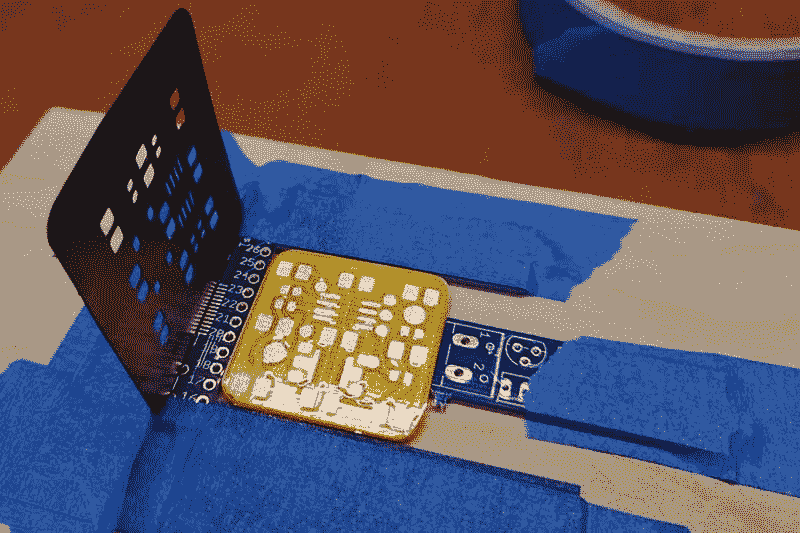

# 用乙烯切割器制作印刷电路板

> 原文：<https://hackaday.com/2020/04/01/making-pcbs-with-a-vinyl-cutter/>

你可能会认为你需要很多昂贵的材料来制作自己的 PCB，但事实并非如此:你可以用乙烯切割器和一些普通的化学品和工具来制作。【埃米利亚诺·巴伦西亚】已经[安排好了整个过程](https://www.instructables.com/id/TinyDice-Professional-PCBs-at-Home-With-Vinyl-Cutt/)。虽然我们之前已经看过很多自制 PCB 指南，但这份指南更进了一步，它涵盖了使用乙烯基切割机制作阻焊膜，因此您可以将其用于表面贴装设计。

[Emilano]设计的过程的最终结果是 tinyDice，一个可以安装在钥匙圈上的可爱的小电子骰子。整个过程写得非常好，即使是有经验的 PCB 制造商也可能会在这里找到一些有用的技巧。

对我们来说，真正有趣的部分是使用乙烯基切割机制作工艺的三个部分:蚀刻掩模、保护走线的焊料掩模和将焊料应用于表面安装焊盘的焊料模板。

这是可能的，因为阻焊膜使用的是 Kapton 胶带，这种胶带足够坚韧，可以承受回流过程的热量，而且比通常使用的 UV 树脂更容易使用。蚀刻和焊接模板由这些刀具中最常用的乙烯基材料制成，但焊接掩模由薄 Kapton 胶带制成，该胶带附着在乙烯基背衬上，然后转移到 PCB 上。这在某些地方听起来确实有点复杂，但是有大量的照片可以展示这是如何做到的。

向[Emiliano]致敬，他还想出了一个用乙烯树脂制作焊接模板的巧妙方法，将四个乙烯树脂剪切板叠放在一起。这使得应用的焊料具有足够的厚度，它应该没有问题地熔化和流动，而且还提供了漂亮干净的焊盘。现在，如果他能研究出如何用粘性塑料和冰棒棍做一个拾放器，我们就会被分类了…

我们已经介绍了很多制作 PCB 的其他方法，从[昂贵的工厂](https://hackaday.com/2020/02/29/desktop-pcb-mill-review/)到使用相同的乙烯切割机[在玻璃上制作 PCB](https://hackaday.com/2019/12/01/creating-easy-glass-circuit-boards-at-home/)。用普通家居材料制作 PCB 有什么小技巧？