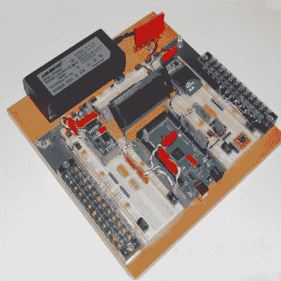

# 让你的试验板项目更持久一点

> 原文：<https://hackaday.com/2019/01/06/making-your-breadboard-projects-a-little-more-permanent/>

许多崭露头角的电子产品制造商不是从烙铁开始的，而是从不起眼的试验板开始的。凭借其推动连接，试验板无需焊接专业技能或任何危险的高温工具即可进行电子实验。它所缺乏的是一定的健壮性，这使得除了最简单的项目之外的所有项目都很难执行。然而，[Runtime Micro]分享了一些让事情变得更健壮的小技巧。

Applied correctly, these techniques have the added bonus of making a project neat, tidy, and easy to troubleshoot.

这一过程背后的基本原理是[用定制电缆](https://runtimemicro.com/construction/custom-cables-solderless-projects)替换点对点跳线，定制电缆使用 0.1”节距接头和绕线技术制成。其他技术包括用 Blu-tack 固定元件，选择具有适当线径的元件，以避免它们从试验板的弹簧夹触点中掉出。还有一些关于使用泡沫胶带来适当消除应力的有用提示。

虽然试验板并不真正适合处理高频率的项目，并且会很快变得难以管理，但这些基本技术应该会提高项目成功的机会。这些提高连接质量和降低事情失败可能性的简单方法可能会极大地减少挫折感。

然而，一旦制造商喜欢收集电子来完成他们的命令，焊接就应该是议事日程上的第一课。

【感谢 stockvu 的提示！]