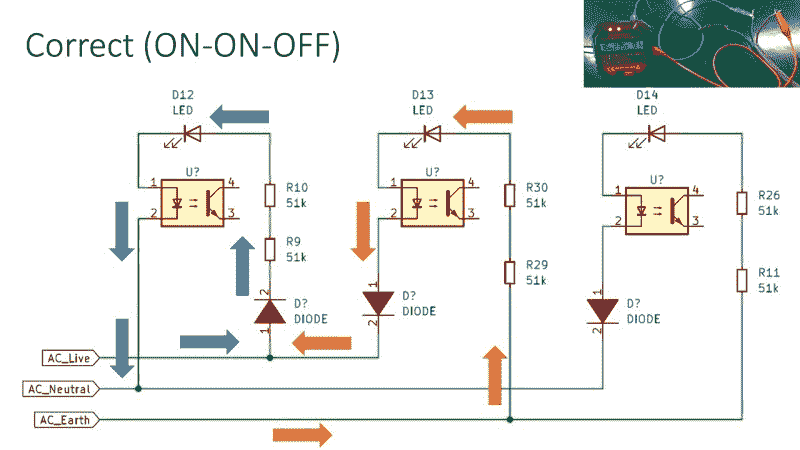

# 绘制插座测试仪上的发光二极管

> 原文：<https://hackaday.com/2022/08/09/mapping-out-the-leds-on-an-outlet-tester/>

插座测试仪的概念非常简单:将这个小工具插入一个可疑的墙上插座，一排发光二极管以各种模式亮起，提醒用户任何线路故障。它们便宜、可靠、即时。大多数人不会给他们更多的考虑，但是像任何优秀的黑客一样，[【Yeo Kheng Meng】想知道这些设备是如何工作的](https://yeokhengmeng.com/2022/08/teardown-of-habotest-ht107e-socket-tester/)。

在挑选了一款相对先进的型号后，他开始使用一些测试引线来模拟各种故障条件，以了解其操作背后的基本原理，该型号的特点是除了标准的三个 led 之外，还具有能够显示检测电压等各种统计数据的 LCD 显示器。下一步是拆卸该装置，这是事情发生短暂变化的地方——直到[Yeo Kheng Meng]和一个朋友差点切开外壳，他们才意识到它并不像他们想象的那样是超声波焊接的，而将它固定在一起的螺钉实际上藏在一张贴纸下面。哎呀。

 该报道包括一些优秀的 PCB 照片，【Yeo Kheng Meng】能够识别几个组件并确定其功能。他甚至能够找到一些数据表，对于这些低成本的设备来说，这并不总是一件容易的事情。不幸的是，控制该设备更高级功能的 MCU 被一个黑色环氧树脂块锁定，但他能够提出一个原理图，解释 LED 显示屏背后相当优雅的逻辑。

这不是【杨肯孟】第一次为了我们的观赏乐趣而拆开一个有趣的硬件，鉴于他的出色工作，我们希望这也不是最后一次。