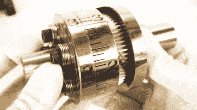

# 神奇的加工离合器大师音乐大理石机器大混乱

> 原文：<https://hackaday.com/2019/05/01/marvelously-machined-clutch-masters-musical-marble-machine-mayhem/>

就大理石作品而言，很少有人希望能与[Wintergatan]令人惊叹的音乐作品相媲美。在着手制造大理石机器 X 时，时间问题变得很明显。你可以更快或更慢地转动机器来改变速度，但弹珠因重力下落并击中等待的鼓所需的时间保持不变。你无法控制重力，所以你期待一个机械的解决方案来调整大理石的下落。在音乐中，就像在珠宝抢劫中一样，时机就是一切。令人欣慰的是，[机器思维]就在手边合作，一个漂亮的机器可转位离合器形式的解决方案被发现。

 两人一起设计了一个离合器，它允许大理石机器 X 的各个部件之间的定时关系变化。在 7:10 进入[winter gatan 视频下方](https://www.youtube.com/watch?v=CBfd0Tjii9Y)时，他开始触及黄铜音乐计时离合器实际工作原理。在 90 BMP 时，离合器允许以大约 10ms 的增量改变机器的同步。如果没有这个重要的附加物，鼓声将会失去节奏。

这是一个对新手来说具有挑战性的部分，需要切齿和刻上准确的标记才能完成工作。不过对于【机器思维】来说也不麻烦，[分享了一段加工过程](https://www.youtube.com/watch?v=s02m616b5AU)的视频，包括手工雕刻表盘数字的外包。

生产这样一件作品需要大量的工作，然而它只是一个更大的机器的一部分。我们迫不及待地想看到大理石机器 X 的完成，但如果你不熟悉[Wintergatan]的早期作品，你会很高兴的。

 [https://www.youtube.com/embed/CBfd0Tjii9Y?version=3&rel=1&showsearch=0&showinfo=1&iv_load_policy=1&fs=1&hl=en-US&autohide=2&wmode=transparent](https://www.youtube.com/embed/CBfd0Tjii9Y?version=3&rel=1&showsearch=0&showinfo=1&iv_load_policy=1&fs=1&hl=en-US&autohide=2&wmode=transparent)

 [https://www.youtube.com/embed/s02m616b5AU?version=3&rel=1&showsearch=0&showinfo=1&iv_load_policy=1&fs=1&hl=en-US&autohide=2&wmode=transparent](https://www.youtube.com/embed/s02m616b5AU?version=3&rel=1&showsearch=0&showinfo=1&iv_load_policy=1&fs=1&hl=en-US&autohide=2&wmode=transparent)

