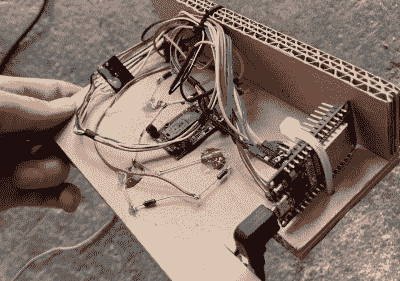

# 大型鼠标游戏模仿经典软件崩溃

> 原文：<https://hackaday.com/2022/12/14/massive-mouse-game-mimics-classic-software-crashes/>

电脑鼠标有各种各样的形状和大小，但通常被设计成适合你的手掌。虽然一些手大的用户可能会觉得标准鼠标小得令人不舒服，但我们认为没有人会抱怨马赛 ENIAROF 艺术节上为一款名为《T2》的游戏制作的巨型外设。它大约有两米长，我们怀疑它可能是现存最大的功能性计算机鼠标。

 巨大的鼠标内部是一个木制托盘，带有四个脚轮，可以向各个方向平稳移动。这种运动可以通过普通的光学鼠标传感器来检测:也许令人惊讶的是，只需在前面放置不同的镜头，就可以在如此巨大的规模上使用这些传感器。

至于鼠标按钮，[Felix]和他的同事发现一个 5 升的空罐子底部有一个漂亮的“砰”声，并在设备的前部安装了一个，连接到通过蓝牙与计算机通信的 ESP32 板。

鼠标连接到一台同样巨大的台式电脑上，由 Raspberry Pi 驱动，用户可以在上面玩游戏，包括点击来自各种新旧操作系统的错误信息。移动鼠标并按下按钮来点击这些对话框是两个人的工作，并且将软件错误的烦恼变成了一场竞争游戏。

光学鼠标传感器是多用途的设备:除了它们显而易见的用途之外，它们还可以用作自动驾驶汽车的运动传感器，甚至可以用作低分辨率摄像机。

[https://player.vimeo.com/video/743901561](https://player.vimeo.com/video/743901561)