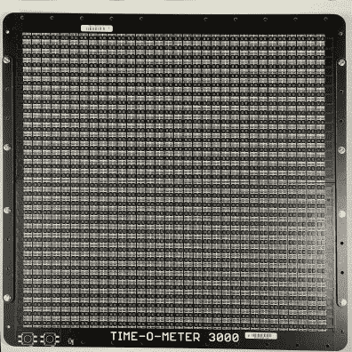
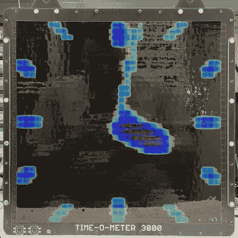

# 电阻矩阵构成了这个热变色模拟时钟背后的热指针

> 原文：<https://hackaday.com/2020/05/24/matrix-of-resistors-forms-the-hot-hands-behind-this-thermochromic-analog-clock/>

如果你要放弃工作，你最好去做大事。一个 1024 像素的热变色模拟时钟可能是大多数人会尝试的高端产品，但显然【丹尼尔·瓦卢奇】那天真的不想去上班。

这里的想法很简单:通过电流加热电阻，在上面铺一层热变色薄膜，你就得到一个像素。下一步就不那么简单了:将单个像素扩展成 32×32 的矩阵。

    

为了使每个像素看起来像正方形，[Daniel]选择将 220 欧姆的 SMD 电阻配对，以构成多达 2048 个元件。更复杂的是，选择用一个由分立 74LVC1G175 触发器制成的 1，024 位移位寄存器来驱动它们。有了 Arduino Nano 和所有其他支持组件，超过 3000 个设备有可能消耗 50 安培的电流，如果有人愚蠢或不幸地一次打开每个像素。幸运的是，[Daniel]选择在这里模拟一个模拟时钟；这导致了额外的问题，比如在制作手部动画时处理热变色薄膜中的冷却滞后，这必须通过软件来解决。

我们以前见过其他的热变色显示器，包括最近的[这个温度和湿度显示器](https://hackaday.com/2020/03/20/thermochromic-display-tells-you-the-temperature-despite-your-current-mood/)。这可能不是最高分辨率的显示器，但它很大，很大胆，有点危险，这使它成为我们书中的一个胜利。