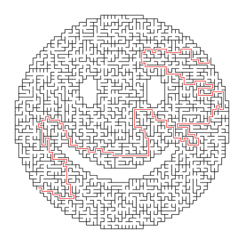

# 迷宫生成器让绘图仪(和孩子们)忙个不停

> 原文：<https://hackaday.com/2018/12/15/maze-generator-keeps-plotter-and-kids-busy/>

我们可以说[乔恩·豪厄尔]是我们喜欢的那种人。在将他的老式 1985 年惠普绘图仪升级为 WiFi 并能够加载 SVG 文件后，他显然需要找到一堆东西来运行它。总得想办法证明那些黑客。所以他加倍努力，决定用另一个黑客来支持另一个黑客，通过[编写一个迷宫生成器来保持他的绘图仪良好运行](https://github.com/jonhnet/maze-harvester)。他很善良，将他的创作作为开源项目发布在一个不为人知的互联网上，现在我们都可以从几个迷宫中受益。

 生成器本身是用 Java 编写的，由于[Jon]提供了*nix 和 Windows 包装脚本，它可以在你的机器运行的任何操作系统上工作。要创建一个基本的迷宫，只需提供具有所需尺寸和纸张大小的脚本。可以用标准尺寸(如`--paper a4`)定义纸张类型，或者在绘图仪中用明确的尺寸(`--paper 36x48in`)定义纸张类型。

如果你不是直角的忠实粉丝，可以使用六边形或三角形网格来改变迷宫的内部几何形状。你甚至可以给程序传递一个黑白的 PNG“面具”,它将用作迷宫本身的边界，允许任何形状的个性化谜题抓住你的想象力。[Jon]甚至在他的软件中运行了扳手，导致了一个迷宫的产生，我们既不能确认也不能否认它将会出现在我们今年的圣诞卡上。

无论你是需要向你的另一半证明你摆弄绘图仪的时间是值得的，还是想用一种简单的方式让 T2 娱乐你生活中的年轻人，你都可以感谢乔恩的解决方案。