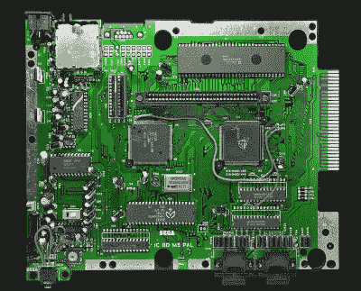

# MD 傅立叶项目寻找 SEGA 16 位声音的起源

> 原文：<https://hackaday.com/2019/08/01/mdfourier-project-seeks-the-genesis-of-sega-16-bit-sound/>

它总是听起来有点脆，但脆在一个好的方面。SEGA 的 16 位控制台，不管你叫它 Genesis 还是 Mega Drive，都有独特的声音，这要归功于它的雅马哈 YM2612 声音芯片。当放在有能力的游戏开发者手中时，芯片再现粉碎吉他和爆破低音鼓的能力是一种享受。像《脚趾夹与伯爵》、《愤怒的街道 2》和《刺猬索尼克 3》这样的游戏提供了一些 90 年代最不可思议的游戏原声；虽然这些游戏的零售保质期可能已经过去，但它们对声音设计的影响应该不会。有一个人正在寻求保存这种典型的 SEGA 声音，他就是阿尔特米奥，他的 MD 傅立叶项目试图捕捉这种声音，让后代听到。

Sega Mega Drive model 1 motherboard. (Bertram, Wikimedia Commons)

MDFourier 是一个众包项目。用户被要求使用两个软件首先通过视频游戏控制台生成普通音频，另一个分析输出以形成该机器的音频签名。当然，SEGA 并不总是以其卓越的制造记录而闻名。在 1 型控制台的十几个版本中，有工厂的 bodge 线，也有 2 型控制台，3 型控制台，Nomad 掌上电脑，Mega Jet，CDX/多 Mega 和 Wondermega 卡拉 ok 机。机器的每一个新版本都创造了一个稍微新的声音场景，没有一个单独的仿真软件把它们都考虑进去。[Artemio]希望汇总所有这些数据，以改进 SEGA Genesis/Mega Drive 仿真器、FPGA 实现或未来可能发生的任何事情。

SEGA 控制台套件的爱好者，甚至是伟大文档的爱好者，可以看看一些初步结果以及为 MDFourier 项目做出贡献的书面程序。对于那些寻求更直观的一步一步方法的人来说，下面有一段来自 YouTube 频道 RetroRGB 的视频:如果你想为你的 MIDI 乐器提供 Sega 声音，看看这个使用 Genesis 声音芯片的 MIDI 合成器。

[https://www.youtube.com/embed/PCP0K7W6vqA?feature=oembed](https://www.youtube.com/embed/PCP0K7W6vqA?feature=oembed)