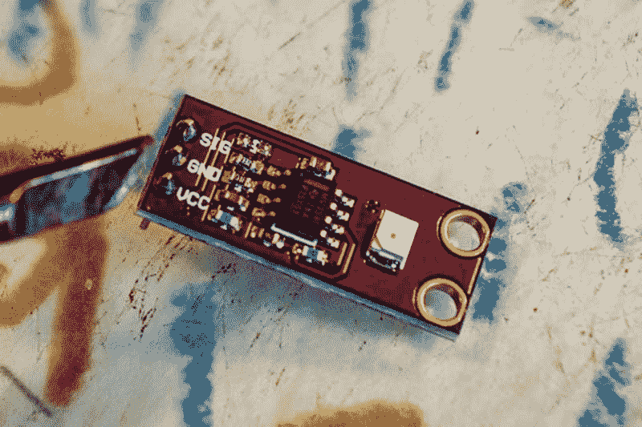

# 测量紫外线-C 大约 5 美元

> 原文：<https://hackaday.com/2020/03/27/measuring-uv-c-for-about-5/>

想消毒什么吗？给它一个旧的 UV-C 的好爆炸。最短波长带的紫外线辐射分解 DNA 和 RNA，所以这是杀死任何潜伏的有害物质的好方法。但是你用了多少 UV-C？Hackerfarm 的 Akiba 公司已经开发出了一种测量紫外线-C 灭菌器 [NukeBox](https://hackerfarm.jp/2020/03/nukebox/) 输出量的仪器[。它是围绕一个 2.50 美元的传感器和一个 3 美元的 Arduino 构建的。](https://hackerfarm.jp/2020/03/nukemeter/)

nuke meter 围绕 GUVA-S12SD 紫外线传感器分线板构建。[该传感器](http://www.geni-uv.com/sub0201_3.php)实际上是为 UV-A 检测而设计的，但快速浏览一下规格表就会发现，它对所有波段的 UV 都很敏感。因此，如果你知道它对这一特定频段有多敏感，它可以用作 UV-C 传感器。

然而，传感器对 UV-C 光并不敏感，所以[Akiba]不得不对传感器周围的电路做了一点小手术来调整输出。该传感器设计用于测量相对较低水平的紫外光(如太阳光)，现在他们正在用大量辐射对其进行破坏，因此他们必须有效地禁用通常放大输出的一个运算放大器，这涉及到更换几个电阻。对于表面贴装元件来说，这有点痛苦，但用一只稳定的手和一个小烙铁就可以做到。

接下来，Arduino 获取传感器的电压输出，并将其转换为亮度。这个工作的数学原理在文章中有详细描述，但是并不复杂，源代码在这里是。

利用这一点，[Akiba]能够测量灯光的表现，它们升温的速度，以及沿着荧光灯管长度的亮度变化。

这里要记住一个警告:[Akiba]设计这个是为了测量他们在 Hackerfarm 使用的低压汞蒸汽灯的输出，这种灯输出非常窄的频带，峰值为 250 nM。这种设计不适用于更宽带的输出，也不适用于 UV-C 与 UV-A 和 UV-B 混合的输出，为此，您需要一种更复杂的设计，成本可能超过 5 美元。

安全提示:不要乱动 UV-C 光源，除非你很清楚自己在做什么，并且确信这种光源是封闭的，例如，在一个密封的盒子里，可能有联锁装置。请记住，你也依赖于 DNA，无意中破坏自己的 DNA 会导致各种不愉快。