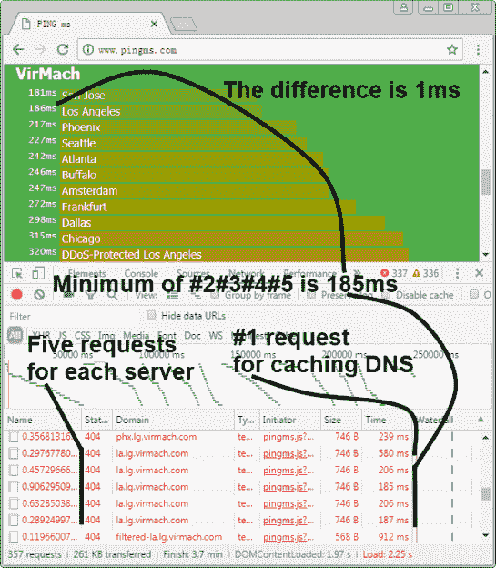

# 在浏览器中测量 Web 延迟

> 原文：<https://hackaday.com/2018/07/21/measuring-web-latency-in-the-browser/>

我们大胆假设，任何读到这些文字的人都可能熟悉经典的`ping`命令。根据您所使用的操作系统，选项可能略有不同，但是这个简单工具的每个变体都做同样的事情:发送 ICMP 回应请求并等待响应。向用户显示从目标获得响应需要多长时间，如果它获得了响应的话。这通常是诊断网络连接问题的第一步；如果这不起作用，很有可能线路不通。

 但在现代以网络为中心的网络观点中，`ping`可能无法给我们提供全貌。但是本质上，它没有考虑诸如 DNS 查找之类的事情，并且它肯定不会帮助您确定目标有什么(如果有的话)服务可供您使用。因此，[刘止庸]想出了一个他称之为[“ping ms”的工具，它允许你直接从浏览器](http://www.pingms.com)检查网络服务器的延迟。

pingms 不依赖 ICMP，而是执行更真实的测试。它从文件“targets.js”中获取目标列表，并通过 HTTP 连接到每个目标。它是如何工作的？[刘]提出的代码将获取每个目标域名，附加一个随机数以创建一个无意义的文件名，然后计算当试图下载该文件时需要多长时间才能得到响应。显然，它将从 web 服务器获得 404 响应，但重要的是它*获得*响应。

有了这些数据，[刘]提出了一个简单但非常巧妙的界面，用易于理解的彩色编码图向用户显示收集的数据。看你最喜欢的网站或服务提供商花多长时间醒来并开始说话是一件有趣的事情，但看着彩色条在列表中上下跳动以进行排序很容易成为我们最喜欢的部分。

[【刘】已经在许可](https://github.com/pingms/pingms)下发布了 pingms，所以如果你想把这个软件用于你自己的目的，你只需要提供一个测试目标的列表。如果你需要执行低级别的诊断，[看看这个你可以用便宜的价格建造的方便的网络测试器](https://hackaday.com/2016/01/22/link-trucker-is-a-tiny-networking-giant/)。