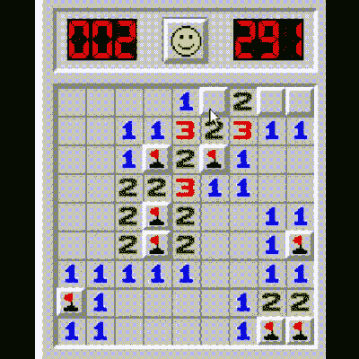

# 肉空间扫雷游戏击中标记

> 原文：<https://hackaday.com/2022/11/24/meat-space-minesweeper-game-hits-the-mark/>

一定年龄的黑客会记得，在互联网可以让我们从工作中分心之前，我们必须找到自己的乐趣。幸运的是，Windows 以“扫雷”的形式来帮助我们，这是一个经典的时代，涉及到通过数字线索计算/偶尔只是猜测一系列地雷隐藏在方格中的位置。对于那些怀念这种简单时光的人来说，[马丁]用他的 3D 打印旅行游戏版本将游戏带入了现实空间。

一些预先确定的游戏领域可以插入(由一个朋友…或敌人，我们假设！)并被瓦片覆盖，扫雷队员可以用他们的塑料铲移除瓦片以揭示线索。游戏的目的是避免发现炸弹，并在炸弹隐藏的地方放置旗帜。

这款游戏的爱好者可能还记得，小小的猜测往往是不可避免的，有时会以灾难告终。在电脑版上，只需要点击新游戏的笑脸按钮，但在这种情况下，需要插入新的一页。空白页模板包括制作你自己的恶魔炸弹网站，所有的碎片整齐地包装成一个方便的蛤壳式设计，这将是长途汽车旅行的理想选择，当孩子们平板电脑上的数据包用完了。

我们想知道还有哪些经典游戏可能会被改编成旅行游戏，并满怀期待地期待着第一套 3D 打印的旅行套装！

如果你想解决自己的扫雷游戏，那么你可以在这里学习如何用 Java 写一个解算器。