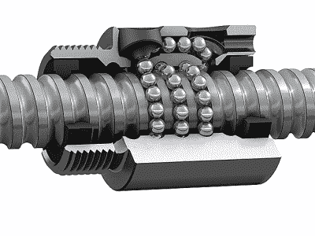

# 机构:丝杠和滚珠丝杠

> 原文：<https://hackaday.com/2018/11/13/mechanisms-lead-screws-and-ball-screws/>

将旋转运动转化为线性运动是机电一体化设计的基本部分。看看最近的 3D 打印机或 CNC 路由器——至少是笛卡尔坐标的——你会看到一些将电机轴的旋转转换成每个轴所需的平滑线性运动的机制。

业余爱好级别的机器很可能不使用滑轮和同步带来实现这种平移，并且这通常满足机器的需要。但在一些机器中，皮带的弹性不足以解决问题，设计者可能会求助于各种各样的螺旋传动来完成这项工作。

## 丝杠

我们都见过在 CNC 项目中，建造者用一段五金店螺纹杆建造了一个线性致动器。用钢锯切割成一定尺寸，用几个轴承固定住，用某种联轴器连接到步进器上，这些螺旋驱动器在产生线性运动方面做得很好。但从机械角度来说，这远远不是一个完美的解决方案。

这种布置的主要问题是螺纹轮廓。正如我们在关于螺纹的[帖子中提到的，螺纹紧固件上的 V 形螺纹轮廓经过优化，可提供高轴向夹紧力和“不大修”特性，或紧固件自锁的趋势。这需要高摩擦布置，这对于螺旋驱动不是最佳的。](http://hackaday.com/2018/02/01/mechanisms-the-screw-thread/)

Lead screw and nut. Note the Acme thread profile and the split nut design. Bronze nuts on carbon steel screws are a common arrangement. Source: [ABSSAC
Ltd.](https://www.abssac.co.uk/)

另一方面，导螺杆具有为减少摩擦而优化的螺纹。丝杠通常使用不同的螺纹轮廓，例如梯形 Acme 轮廓。此外，螺纹的导程，或者螺纹一整圈所覆盖的沿螺钉长度的距离，在导螺杆中比在螺纹紧固件中变化更大。用较短的引线可以获得精确的定位和免检修；较长的导程将允许导螺杆将较少的旋转转化为较长的线性行程。丝杠与螺纹紧固件的不同之处还在于，丝杠通常有多个螺纹头。每一个单独的螺纹被称为一个开始，丝杠通常有两个或更多的螺纹沿着螺钉的表面嵌套在一起。

每个螺丝都需要一个螺母，丝杠也不例外。丝杠螺母是一个具有内螺纹的零件，该内螺纹与丝杠的外螺纹相配合，并提供了一些方法来将螺母固定到机器上，并传递丝杠旋转产生的力。因为导螺杆和螺母的配合面往往比螺纹紧固件的配合面长得多，所以导螺母往往由尽可能减少摩擦的材料制成。通常选择青铜是因为其天然的润滑性；烧结青铜也经常使用，因为它可以浸渍润滑剂。塑料并不罕见，尽管它们会限制丝杠所能承受的负荷。

## 滚珠丝杠

虽然丝杠为许多应用提供了很好的性能，但是它们也不是没有缺点。它们的主要缺点是机械效率低。丝杠通常将施加的扭矩的 20%到 80%转换成线性推力，其余的作为摩擦热浪费掉了。这种加热会导致另一个缺点:占空比有限。如果你曾经通过在钻孔机中旋转螺杆来转动螺母，你就会知道丝杠可以产生多少热量。热量很容易损坏铅螺母，尤其是塑料或复合材料螺母。因此，大多数丝杠有一个有限的占空比，以允许热量消散的时间。

Ball screw and nut. Note circular thread profile and internal ball return. Source: [SKF USA Inc.](http://www.skf.com/us/index.html)

滚珠丝杠是一种不同的动物。它们看起来类似于丝杠——一根带螺母的螺杆——但功能完全不同。在导螺杆螺纹轮廓通常为梯形的情况下，滚珠螺杆螺纹更圆。滚珠丝杠螺母也不直接与滚珠丝杠配合。取而代之的是，切入滚珠螺母的螺纹形成了环形通道，其中充满了一排小滚珠。滚珠在滚珠丝杠和滚珠螺母之间传递力，并被迫沿着螺纹通道到达返回通道，在那里它们被输送回到螺纹通道用于另一次行程。

循环球的返回路径可以是内部的，也可以是外部的。外回程螺母有一个或多个小管，将滚珠导回螺母内部，而内回程螺母有加工在螺母主体上的通道。因此，内部回流螺母往往比外部回流螺母大。像丝杠一样，滚珠丝杠可以有多个起点，在这种情况下，将有多个球链和多个返回通道。

这种循环滚珠机构是滚珠丝杠效率高于丝杠的关键。当导螺杆在螺母和螺杆之间具有长的滑动摩擦路径时，滚珠螺杆仅经历螺母和螺杆之间的滚动摩擦。更高的效率意味着更低的功率需求，而更低的摩擦意味着有限的占空比对于滚珠丝杠来说不太常见，一些滚珠丝杠甚至被额定为连续工作。

 [https://www.youtube.com/embed/kl6qNn9-nkk?version=3&rel=1&showsearch=0&showinfo=1&iv_load_policy=1&fs=1&hl=en-US&autohide=2&wmode=transparent](https://www.youtube.com/embed/kl6qNn9-nkk?version=3&rel=1&showsearch=0&showinfo=1&iv_load_policy=1&fs=1&hl=en-US&autohide=2&wmode=transparent)

## 一颗螺丝钉就能统治所有人？

至于精度，由于减少了反冲，滚珠丝杠通常比丝杠有优势。球形螺母可以通过将它分成两个单独的部分来预加载，这两个部分由弹簧推开；这迫使球卡在通道中，并从系统中清除污水。丝杠也可以采用类似的方法，但是滚珠丝杠的固有摩擦力较低，因此与丝杠相比，由于预加载而导致的摩擦力增加问题较小。

虽然滚珠丝杠比同样大小的丝杠具有更高的额定载荷、更好的定位精度和更高的效率，但它们远非完美。滚珠丝杠的制造成本比丝杠高得多，这主要是因为丝杠和螺母都需要精密加工。无论螺钉的导程如何，它们也往往不会自锁，这可能意味着一些应用将需要机械制动器。滚珠丝杠的平移速度也受到滚珠在造成损坏之前在螺母中循环速度的限制。此外，如果滚珠丝杠螺母具有对开螺母或半螺母，则其不能像丝杠那样从滚珠丝杠上脱离，这在车床上的螺纹操作中是重要的。

滚珠丝杠和导螺杆之间的设计选择是复杂的。滚珠丝杠的前期成本更高，但从长远来看，它们往往会提供更好的精度和更低的维护成本。此外，滚珠丝杠的位置精度和增加的载荷处理对于某些应用来说可能是过度的；在这种情况下，丝杠可能是好的。此外，丝杠的摩擦增加可能意味着驱动它的电机需要增大尺寸，并且丝杠的较低占空比可能是一个问题。

【专题图片:[absac 有限公司](https://www.abssac.co.uk/)和 [Helix Linear 技术有限公司](https://www.helixlinear.com/)