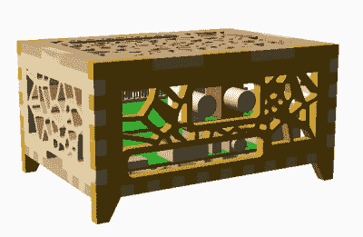

# 媒体流与 E-Ink 显示保持它的经典

> 原文：<https://hackaday.com/2020/02/29/media-streamer-with-e-ink-display-keeps-it-classy/>

罗技 SqueezeBox 是一种连接到立体声音响上的设备，这样你就可以通过网络从网络附加存储(NAS)盒或台式电脑上播放音乐。这在现在听起来可能不是很令人兴奋，但当(Aaron Ciuffo)在 2006 年买下它时，这是一笔相当大的交易。这个小玩意这些年来一直在突突作响，但裂缝开始形成了。在它最终前往天空中那个伟大的电子产品回收中心之前，[他决定开始着手它的替代品](https://hackaday.io/project/170051-slimpi)。

多亏了 Raspberry Pi，如今构建一个小型设备来从 NAS 传输数字音频变得很容易。但是连接到 USB 扬声器的 Pi 不一定非常适合放在客厅。[Aaron]不一定希望他的替代玩家看起来像 SqueezeBox，但他希望它看起来像。虽然我们大多数人可能会尝试制作一些看起来像传统音频设备的东西，但他的设计是一个更加家庭化的方向。

An OpenSCAD render of the enclosure.

树莓 Pi 4 和 HiFiBerry DAC+ Pro 生活在一个木制的激光切割盒中，该盒是[Aaron]用 OpenSCAD 设计的。我们通常将这个工具与 3D 打印联系在一起，但在这里，他将每个单独的面板导出为 SVG 文件，以便可以剪切它们。我们尤其喜欢他花时间将所有内部组件添加到渲染中，这样他就可以在将设计带入物质世界之前确保一切都合适。

虽然这个案子无疑是朝着正确方向迈出的一步，但[亚伦]还没有完成。他添加了一个 wave share 5.83 英寸的电子纸显示器，并将其安装在一个相框中。他为 Raspberry Pi 编写的软件在音乐播放时在显示屏上显示专辑信息和封面艺术，空闲时显示当前时间和天气预报。他编写了插入罗技媒体播放器后端的软件，以保持与尚未完全死亡的 SqueezeBox 的兼容性，但我们认为代码可以适用于你正在使用的任何数字媒体方案。

这些年来，[我们已经看到了许多 SqueezeBox 的替代品](https://hackaday.com/2013/04/13/squeezeberry-a-raspberri-pi-powered-squeezebox-appliance/)。其中许多[已经由树莓 Pi](https://hackaday.com/2015/05/01/a-custom-workshop-squeezebox/) 驱动，但即使是[的 ESP8266 和 ESP32 最近也加入了行动](https://hackaday.com/2019/03/31/squeezebox-comes-to-the-esp/)。