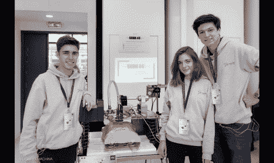
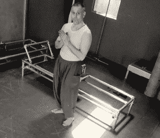

# 认识一下 2019 年 Hackaday 奖的 Bootstrap 获奖者

> 原文：<https://hackaday.com/2019/06/14/meet-the-bootstrap-winners-of-the-2019-hackaday-prize/>

赢得今年 Hackaday 奖 bootstrap 竞赛的 20 个项目刚刚获得认证。这样做的目的是帮助早期参赛作品的优秀范例抵消他们整个夏天在项目中的原型制作成本。

我们知道这在过去对参赛作品有很大的影响。当在艰难的项目中工作时，很容易怀疑自己，但是你通常可以通过一点外界的认可来克服这一点。亚历克斯·威廉姆斯第一次将他的[开源水下滑翔机](https://hackaday.io/project/20458-open-source-underwater-glider)加入 2017 年 Hackaday 奖时就遇到了这种情况。他想炫耀他的工作，但认为不会有太多的兴趣，也不确定他是否会继续开发。令他震惊的是，有那么多人对此感到兴奋，继续狂热地工作，[继续赢得大奖](https://hackaday.com/2017/11/20/an-interview-with-alex-williams-grand-prize-winner/)。

你会发现下面列出了所有 20 个 bootstrap 获奖者，但我们希望通过几个例子来展示在 Hackady Prize 期间发生的工作。bootstrap 竞赛的结果与最高奖项没有任何关系:它们仍然有待争夺，所以[今天就加入你的项目吧](https://prize.supplyframe.com/)！

  SierrOS team at the Olympics of Engineering in May  Joseph demonstrating assembly of the Pilates Reformer

SierrOS 团队正在努力建造一台自动心肺复苏机。来自法国里昂的四名学生正在研究一种可以提供胸部按压和换气的一体化设备。就在两周前，他们还参加了巴黎的工程奥林匹克运动会，在 1500 支参赛队伍中排名第 20。看到[先睹为快的最新版本](https://hackaday.io/project/164865/log/164282-olympics-of-engineering-paris-review)令人兴奋，他们承诺很快会分享更多细节。SierrOS 在 bootstrap 回合中获得了 500 美元。

普拉提感觉像是个人健身的新发展，但这种练习要追溯到它的创始人，他出生于 1883 年。约瑟夫·普拉提斯发明了一种叫做普拉提改革器的设备，这种设备一直沿用至今。但是另一个提交这个项目的来自康涅狄格州的黑客 Joseph 试图设计一个更实惠的普拉提改革者版本。我们特别喜欢看他测试这种设备的运输和组装计划的视频。他想到用混凝土成型管运输所有部件是一个聪明的主意，测试组装过程是证明你的产品适合你的市场的一个重要部分。普拉提改革项目在 bootstrap 回合中获得了 408 美元。

## 认证 Bootstrap 竞赛获奖者:

Bootstrap 竞赛由 6 月 1 日之前每个 Hackaday 奖项条目的“赞”数决定。前二十名完成者获得每张 5 美元，上限为 500 美元。祝贺每一个项目:

*   [公理:100+kW 电机控制器](https://hackaday.io/project/164932)
*   [ULX3S 面向开源 FPGA 的强大 ECP5 板](https://hackaday.io/project/159108)
*   [EAG rar–数字农业](https://hackaday.io/project/165235)
*   SmallKat:一只可爱的动态导向机器猫
*   [比肯](https://hackaday.io/project/165754)
*   [SierrOS–心肺复苏设备](https://hackaday.io/project/164865)
*   [发酵细胞](https://hackaday.io/project/164233)
*   [开源旋风吸尘器 DIY son](https://hackaday.io/project/165537)
*   [Odinub](https://hackaday.io/project/165824)
*   [零模 F(n)](https://hackaday.io/project/165704)
*   [pcbtc (GaN 版)](https://hackaday.io/project/165112)
*   [停车场资产和状态监视器](https://hackaday.io/project/165120)
*   [BikePin](https://hackaday.io/project/165459)
*   [视觉持续烦躁旋转器](https://hackaday.io/project/165210)
*   [带 7.9 英寸显示屏的便携式复古游戏机](https://hackaday.io/project/164930)
*   [闪电探测器](https://hackaday.io/project/165742)
*   [用于树莓 Pi zero 的 PiSugar 电池](https://hackaday.io/project/164733)
*   [普拉提改革家](https://hackaday.io/project/165674)
*   DLT 一号——一个该死的 Linux 平板电脑！
*   [LED cade–街机游戏柜–8×8 LED 矩阵](https://hackaday.io/project/165207)

The [HackadayPrize2019](https://prize.supplyframe.com) is Sponsored by:     