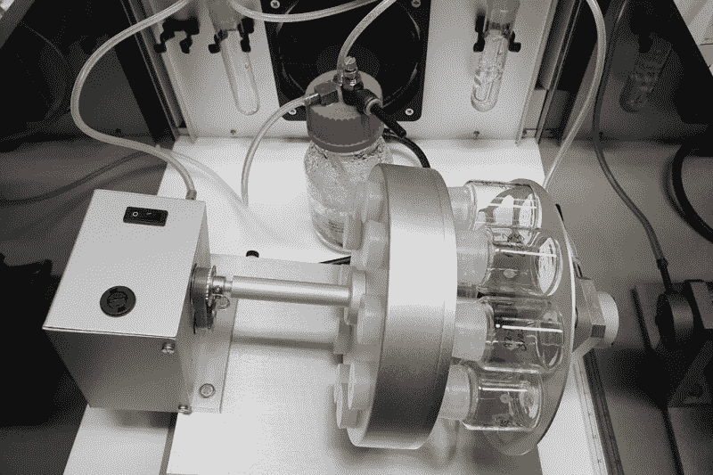

# 老鼠在人造子宫内发育

> 原文：<https://hackaday.com/2021/04/30/mice-develop-inside-an-artificial-womb/>

嗯，看起来《黑客帝国》(1999)中的那些胎儿场变得更有可能了。尽管人类的成长可能还有很长的路要走，[小鼠现在大多可以在人造子宫](https://www.nytimes.com/2021/03/17/health/mice-artificial-uterus.html)(如果你遇到付费墙，可以试试私人窗口)内发育，这要归功于发育生物学的突破。到目前为止，这些老鼠只能在妊娠中期存活。在某一点上，提供给它们的营养配方是不够的，它们需要血液供应来继续生长。这是下一个目标。现在，让我们谈谈机械子宫设置。

## 关怀旋转木马

开发机械子宫是为了更好地了解各种因素，如基因突变，营养物质和环境条件如何影响发育中的小鼠胚胎。为什么会出现流产，为什么受精卵一开始就无法着床？当事情进展顺利时，一个卵子是如何爆炸成 40 万亿个细胞的？这个透明的子宫应该能揭示更多大自然的怀孕秘密。

以色列魏茨曼研究所的 Jacob Hanna 博士花了 7 年时间建立了一个由两部分组成的系统，即培养箱、营养物和通风设备。每个老鼠胚胎漂浮在一个玻璃罐中，悬浮在液体营养物的混合物中。一个旋转的罐子昼夜不停地慢慢旋转，以防止胚胎附着在罐子的侧面而死亡。除了营养液，老鼠还从呼吸机中接受了精心控制的氧气和二氧化碳混合物。汉娜博士和他的团队已经用这种方法培育了 1000 多个胚胎。

老鼠的完全怀孕大约需要 20 天。正如发表在《自然》杂志上的论文所概述的，汉娜博士和他的团队在怀孕第五天时移除了小鼠胚胎，并能够在人造子宫中再培养六天。当在第 11 天与子宫中生长的小鼠比较时，它们的大小和重量是相同的。根据论文发表后的一次采访，该团队已经走得更远，在受精后第一天取出胚胎，并在机械子宫内培养 11 天。下一步是找出如何提供人工血液供应，或更先进的营养系统，让胚胎生长，直到它们成为小鼠。

## 胚胎伦理学

这是最有趣的部分:该团队不一定要破坏活的妊娠来获得他们的胚胎。新技术允许不需要受精卵就可以从被称为成纤维细胞的鼠结缔组织细胞中制造胚胎。在这一发展和汉纳博士的旋转木马之间，将不再需要仅仅为了以后毁掉卵子而使其受精。

很容易说任何和所有的动物试验都是不道德的，因为我们不能完全得到他们的同意(不是说我们一定会要求)。与此同时，我们确实首先从动物实验中学到了很多东西。我们对提高存活率的渴望与我们普遍的同理心不一致，而存活往往会在足够长的时间线上胜出。每年都有很多人在等待器官移植的过程中死去，科学家们已经在为这个明确的目的培育猪了。解开更多怀孕过程的秘密使得在[冰冻动物园](https://hackaday.com/2021/03/04/were-cloning-animals-from-the-frozen-zoo-like-a-seed-bank-but-for-animals/)的更多动物代孕成为可能。

更令人不安的消息是，出于同样的原因，一些人最近创造了部分是人部分是猴的胚胎。也许这就是我们到达人猿星球的方式。