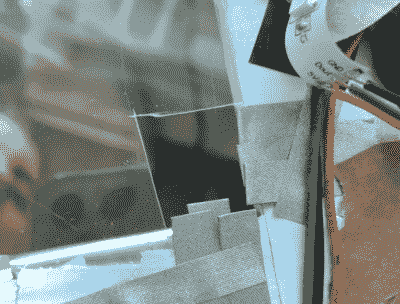

# 微:位使纸板弹球更合法

> 原文：<https://hackaday.com/2021/02/24/microbit-makes-cardboard-pinball-more-legit/>

你一直在做什么来抵御冬天的忧郁？[TechnoChic]决定向 winter 倾斜，[通过将令人敬畏的 PinBox 3000 纸板弹球沙盒与几个处理和显示玩家分数的 Micro:bits 结合起来，制作一个真正有趣的游戏。休息后看看视频中的构建和游戏。](https://www.youtube.com/watch?v=N-xYRhL5_3o)

 冬季星球的故事是一个苦乐参半的故事:基本上，一群企鹅厌倦了气候变化，集体离开地球，前往一个企鹅天堂，那里一年四季都是冬季仙境。有一个聚会冰屋，有迪斯科灯光和一切。

[TechnoChic]使用一个插入棕色狗小工具板上的微型钻头来跟踪得分，控制将球踢出冰屋的伺服系统，并运行闪光灯。它通过蓝牙将比分更新发送到位于弹球发射器对面的第二个 Micro:bit 和 Pimoroni Scrollbit 显示器。她经历了几次开关迭代，然后决定使用导电标记带并隔离球，使其只接触磁带轨道。

在冬季星球上有两种得分方式——球发射器路径尽头的暴风雪为你赢得 10 分，在聚会冰屋中获得球可以获得 30 分。在操场中央的冰湖上要小心，因为如果球掉进冰里，它就永远消失了，你的分数也消失了。不过，没关系，因为聚会冰屋和冰洞都会引发雪崩，释放出另一个球。

说真的，这些 PinBox 3000 套件可能是你可以用纸板得到的最有趣的东西，即使是刚从盒子里拿出来的。它们非常有趣，即使你只是建造工具包，做一堆临时目标来测试游戏性，但永远不要确定一个主题(问我们怎么知道的)。不服气？ [Hackaday 主编【Mike Szczys】在 2018 年的 Maker Faire](https://hackaday.com/2018/09/23/this-pinball-game-doesnt-come-in-a-box-it-is-the-box/)上深入探讨了它们。

 [https://www.youtube.com/embed/N-xYRhL5_3o?version=3&rel=1&showsearch=0&showinfo=1&iv_load_policy=1&fs=1&hl=en-US&autohide=2&wmode=transparent](https://www.youtube.com/embed/N-xYRhL5_3o?version=3&rel=1&showsearch=0&showinfo=1&iv_load_policy=1&fs=1&hl=en-US&autohide=2&wmode=transparent)

