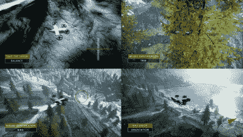
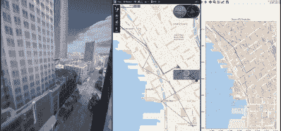

# 微软新模拟器帮助训练无人机人工智能

> 原文：<https://hackaday.com/2022/08/11/microsofts-new-simulator-helps-train-drone-ais/>

在现实世界中测试任何类型的项目都是昂贵的。你必须四处搬运人员和设备，这要花钱，如果你打碎了什么东西，你也必须为此付出代价！模拟往往是第一位的。在模拟中犯错误要便宜得多，学到的教训以后可以在现实世界中得到验证。如果你想学习驾驶四轴飞行器，最好的办法是在你购买任何带有物理旋转叶片的东西之前，先在模拟器的操纵杆后面呆上一段时间。

奇怪的是，人工智能也是如此。微软建立了一个模拟产品来帮助开发无人机的人工智能系统[，名为 Project AirSim](https://www.bbc.com/news/technology-62202118) 。它旨在为无人机人工智能系统的测试提供一个全面的环境，使开发更快、更便宜、更实用。

## 犯错误的更便宜的方式

许多公司正在开发无人机，以承担历史上由人类手动执行的任务。例如，让一架无人机飞起来观察风力涡轮机机舱或输电线上的绝缘体，远比让人爬上去安全。然而，对于一架基本的无人机，这需要一名熟练的飞行员来避免撞上昂贵的硬件，特别是在条件变得危险的情况下。自动化将允许无人机自己处理任务，只需按下按钮。

AI models can quickly learn through trial and error in a simulator. Credit: *Microsoft*

然而，在实地测试无人机人工智能很困难，其中涉及大量风险。比方说，你正在建造一架人工智能控制的无人机来检查电力线。如果无人机的导航算法不太正确，你可能会看到它在海洋上航行，永远不会回来。与此同时，如果你没有很好地避开物体，它可能会直接撞上它应该检查的电力线。如果在这一过程中碰巧当地断电，后果就更糟了。

模拟提供了一种在各种条件下测试无人机 ai 的方法，而不会对生命、肢体和财产造成风险。无人机的行为可以很快通过健全检查，愚蠢的错误可以很容易地被发现。如果无人机在模拟器中坠毁，您只需点击重置，进行一些更改，然后重新开始。在现实生活中，你必须先收拾残局，重建无人机，向刚刚被它击中的东西的主人道歉。

## 微软的产品

Project AirSim 是微软为无人机开发提供的新模拟产品。它使无人机人工智能能够在现实的 3D 世界中进行测试和开发。像风、雨和雪这样的条件都可以模拟，还有不同的环境，从城市风景到茂密的森林。

包括纽约市和伦敦等地的再现，以及虚拟机场等更普通的产品。Bing 地图的数据也可以用来创建世界其他地方的详细 3D 环境。

拥有这样一个测试环境不仅对于开发人工智能来控制无人机，而且对于这些系统所依赖的传感器来说，都是非常宝贵的。例如，在开发机器视觉系统时，人们可能希望测试它在白天、晚上和浓雾条件下的工作情况。在现实中实现这一点需要等待天气变化，但这可以随意模拟。

Project AirSim 还希望帮助设计师量化他们无人机的性能。一个特别多风的测试环境可以显示电池寿命在这种条件下是如何受到影响的。像爬升率和待机时间这样的事情也可以在模拟器中量化，以便在真实世界测试之前收集大概的数字。

Recreations of real-world locations will serve as proving grounds for drones in the simulator. Credit: Microsoft

Project AirSim 是一个新产品，由微软早期的同名开源项目开发而来。该代码库仍然可供社区使用，但要求用户在编码和机器学习学科方面具有丰富的经验。

为了向更广泛的受众开放开发，AirSim 项目将包括用于常见控制任务的人工智能构建模块。用户将能够将自动着陆或避障等任务的现有人工智能系统集成到他们的无人机中。包含这些模块是有意义的，因为大多数无人机可以受益于适用于许多任务的类似模块的使用。

一些重要的合作者也在这个项目上与微软合作。Ansys 帮助开发了基于物理的传感器模拟，为模拟的无人机控制系统提供真实的传感器输出。与此同时，MathWorks 正在开发一个系统，让用户通过其 Simulink 软件将自己的物理模型导入模拟器。

从环境监测到投递邮件，无人机将彻底改变所有领域。模拟将大大有助于尽可能快速和经济地开发自主无人机。微软的新产品可能会找到大量渴望测试的客户。