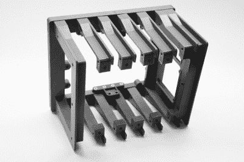

# 军用规格看起来没有国防部预算

> 原文：<https://hackaday.com/2020/08/27/mil-spec-looks-without-defense-department-budget/>

虽然黑客和制造商倾向于将功能放在首位，但这并不意味着没有一些视觉天赋的空间。一个工作良好*和*看起来不错的设备总是比最简单的方法更令人印象深刻，但是它通常需要额外的时间和金钱来润色构建的视觉组件，这意味着它经常被忽视。这正是[【杰伊·多舍尔】想要通过他的军用塑料项目](https://back7.co/home/back7co-mil-plastic)解决的问题。

从表面上看，Mil-Plastic 是快速增长且往往定义不清的 cyberdecks 世界的又一个入口:定制计算设备放弃了标准的笔记本电脑和台式机二分法，转而探索主流消费电子产品没有选择的道路。最后，这是一个非常值得称赞的坚实建筑。但更重要的是，这也是一个教训，说明 3D 打印和一些巧妙的设计可以创造出一个真正令人印象深刻的视觉效果，而成本只比一卷 PLA 高不了多少。

The modular design allows parts to be printed in parallel.

顾名思义，这种军用塑料看起来像是从悍马或艾布拉姆斯坦克上拉下来的。虽然[杰伊]偶然发现的华丽的橄榄绿 PETG 灯丝肯定有所帮助，但他对细节和设计的眼光也不可低估。他给了这个箱子一个坚固的装甲外观，简单地尖叫着“你的纳税款在工作”，背面有人造散热片，并大量应用了低调的不锈钢紧固件。我们已经仔细观察了过去军事工程的[颓废](https://hackaday.com/2018/04/30/milspec-teardown-ah-64a-apache-data-entry-panel/)，军用塑料可以和他们最好的挂在一起。

最重要的是，[Jay]给了我们所有的工具和信息，让我们按照自己的方式重新设计。你不必在市场上再买一个树莓派小玩意来欣赏 Mil-Plastic；这个设计可以作为你正在构建的任何东西的主干。印刷的外壳不仅看起来令人印象深刻，而且可以根据需要轻松修改和扩展。

[Jay]去年年底用他的 Raspberry Pi 恢复工具包开启了一场小革命[，并继续](https://hackaday.com/2019/11/11/a-mobile-terminal-for-the-end-of-the-world/)[生产有据可查的设计](https://hackaday.com/2020/01/24/a-raspberry-pi-terminal-thats-always-within-reach/)，这些设计展示了桌面 3D 打印令人难以置信的力量。如果你能翻看他的作品集却没有灵感，你可能想和医生谈谈。