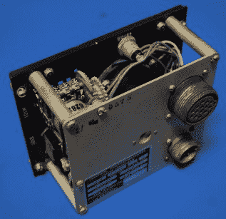
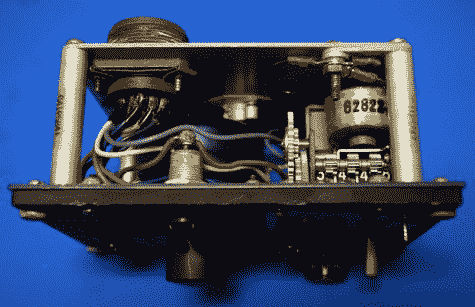
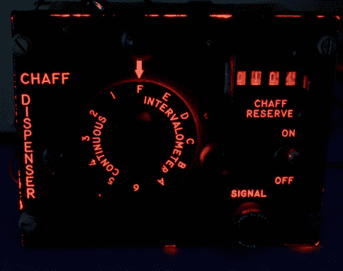
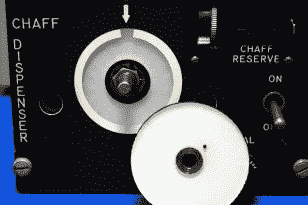
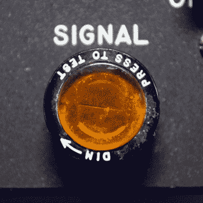
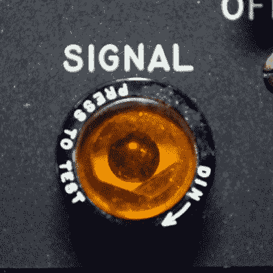
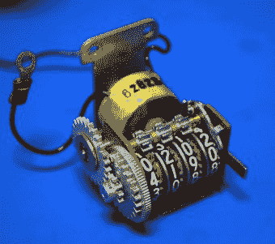
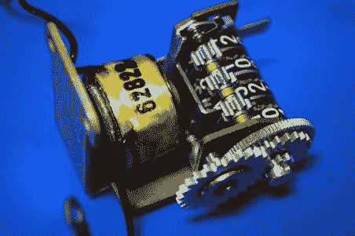
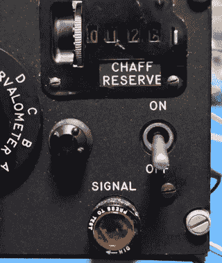

# Milspec 拆卸:C-1282 干扰控制器

> 原文：<https://hackaday.com/2018/07/24/milspec-teardown-c-1282-chaff-controller/>

一架 B-52 轰炸机正在接近它的主要目标:列宁格勒 Beloostrov 区的铁路站场。英特尔报告称，该地区可能由 S-25 Berkut 和 S-75 Dvinia 地对空导弹(SAMs)防御，但如此接近目标，巨型轰炸机无法进行规避机动，即所谓的战斗转弯，这将有助于摆脱敌人的防空。电子战军官(EWO)从副驾驶后面的位置伸出手来，设置 C-1282 连续发射箔条。B-52 投弃了数百条薄金属片，迷惑了跟踪雷达，让轰炸机和机组人员躲过苏联的防空系统，直接向目标投放 50，000 磅弹药。

对我们所有人来说幸运的是，这件事从未真正发生过。但是美国和苏联已经为这种可能性做了充分的准备。双方都发展了更强大的武器，而且每一种新武器都会产生新的对策。C-1282 是这样一种对抗措施的组成部分，这种设备允许 B-52 的 EWO 配置和监控轰炸机的自动箔条撒布器。随着 C-1282 处理反雷达对抗措施，轰炸机机组人员可以集中精力完成他们的任务。

当然，正如技术(军事或其他)的情况一样，C-1282 最终被淘汰，用于新的东西。这些旧的设备，现在大部分都不值钱了，要么被销毁，要么被判终生在储藏室的架子上积灰。但是通过互联网的魔力，这些设备中的一个现在已经准备好暴露出来供你观赏。掸掉你的约瑟夫·麦卡锡少年警探徽章，和我们一起来看看大约 1960 年的反罗斯基技术的艺术作品。

## 操作理论

需要澄清的是，易贝拍卖的 C-1282 并不包括实际的箔条撒布器，更不用说安装它的 B-52 了。这只是撒布器的控制单元，给操作者一种设置操作模式和监控机载箔条供应的方法。所以正如你所料，里面并没有什么东西，但它仍然是那个时代硬件的一个有趣例子。

C-1282 包括一个计数器来记录有多少干扰可用，以及一个大的选择器开关，就像你在万用表上看到的一样。还有一个信号灯来指示箔条何时被释放，还有一个开关来启动系统。有趣的是，该设备没有提供手动发射干扰物的方法；据推测，这种功能肯定存在，但显然是从飞机的其他地方控制的。

在设备的背面，我们有两个连接器，在这两个连接器之间有数量惊人的引脚。鉴于这一点和前面开关的风格，我们可以猜测，里面可能没有多少实际的电子线路:开关只是连接不同的引脚，以实现各种模式。据推测，至少有一个插脚也将用于发送箔条已经发射的信号。

## 容易接近

C-1282 的后盖上只有一个螺丝，拆下后，我们可以看到它采用了非常开放的设计。鉴于该设备的年龄，我们没有看到任何电路板也就不足为奇了；相反，一切都是点对点连接的。在这些老式齿轮上也很常见，大多数连接都是焊接的，而不是使用连接器。这可能被认为更可靠，但肯定会使维修单位更麻烦。

    

## 照明设备

我们认为微小的 PWM 控制的 led 是理所当然的。在过去，当涉及到像点亮 C-1282 这样简单的面板时，工程师们必须变得更有创造力。该设备的前面板具有内部扩散器，该扩散器从三个红色白炽灯泡获取光线并均匀分布。这可以通过拆除设备前面的主旋钮得到最好的演示，因为您可以在旋钮背面和面板上看到扩散器的内部。

      

“信号”灯特别有意思，它会指示每次投放干扰弹的时间。这种灯应该足够亮以引起注意，但不能亮到在轰炸机的黑暗范围内分散注意力甚至致盲。因此，EWO 能够通过转动指示器的滚花顶部来调节光线的亮度。

    

转动指示器打开和关闭内部“百叶窗”，从内部 GE-313 灯泡几乎完全闭塞到完全打开。没有电子调光器，没有电路，只有卓越的工程设计。

## 最后的倒计时

C-1282 上的计数器可能是该设备最有趣的功能。这种被标记为“箔条储备”的武器，让 EWO 可以在任何给定的时间内精确地看到还有多少对抗手段。有趣的是，每次轰炸机装上箔条撒布器时，一定是有人用左边的轮子手动重置这个计数器。一旦手动设置，电磁体的每个脉冲将使计数器递减 1。

    

计数器右侧的按钮允许数字自由转动，结合调节轮上使用的齿轮，允许计数器快速旋转。考虑到它上升到 9999，我们不得不假设 B-52 能够携带相当数量的对策。当一些可怜的灵魂在与敌人交战后不得不重置这个计数器时，这个“倒带”按钮肯定会派上用场。

人们不禁要问，如果这个计数器没有被手动复位，或者设置错误，会发生什么。据推测，地面支持团队有某种清单，以确保 EWO 在他的面板上看到的内容与 B-52 离开基地前装载的内容相匹配，但事故确实会发生。用现代人的眼光来看，这个系统似乎简单得近乎滑稽；很难相信这在一个失败可以改变历史进程的应用程序中被认为是可以接受的。

在我们从计数器开始之前，有必要指出位于后部连接器的电源引脚和计数器的电磁体之间的巨大过滤器。大概是为了保护飞机系统免受每次计数器启动时线圈磁场崩溃引起的潜在电压尖峰的影响。除了开关、灯和计数器之外，这实际上是设备内部唯一的电气组件。

## B-52 的主场比赛

 既然我们已经看到了 C-1282 的内部工作原理，给它通电并使其正常工作应该是相当容易的。铭牌给了我们一个安全电压范围的概念，一旦你从计数器的电磁铁开始反向工作，布线并不难理解。当然，我们真的不能对选择开关做任何事情，但这并不需要闪烁一些灯和移动计数器。

由于该设备的底盘有明显的公共接地连接，一半的工作已经完成。剩下的就是通过电路跟踪电磁铁线圈的另一侧，并输出到后部连接器。这显示了哪个引脚用于发送干扰物释放信号。拼图的最后一块是找到较小连接器中的哪个引脚为 C-1282 本身提供电源，我们就开始工作了。

最终结果是，C-1282 无疑是我们迄今为止见过的最容易重新利用的军事硬件。你可以很容易地用继电器启动计数器和指示灯，利用选择器开关就像直接把电线接到微控制器的数字引脚上一样简单。像往常一样，这里唯一的限制是你的想象力。如果你能用一个看起来很时髦的倒计时器想出一些可以改进的东西，你很幸运。

## 旧的遇见新的

对我来说，拆卸这些 Milspec 最有趣的部分之一是看到这些不同时代顶级技术的缩影。在拆开这台 20 世纪 60 年代的 C-1282 时，我看到了与我们在本系列开始时看到的二战/朝鲜战争时期的 CP-142 系列计算机以及直到 2012 年才服役的 [AH-64 阿帕奇数据输入面板](https://hackaday.com/2018/04/30/milspec-teardown-ah-64a-apache-data-entry-panel/)的共同特征。显然，有一些久经沙场的设计元素真正经受住了时间的考验。

追踪这些战时遗物并不总是容易的，但是如果你想看到任何特殊的军事技术被调查，让我们知道，我们会看看我们能做什么。

 [https://www.youtube.com/embed/qzCjVEUsk7c?version=3&rel=1&showsearch=0&showinfo=1&iv_load_policy=1&fs=1&hl=en-US&autohide=2&wmode=transparent](https://www.youtube.com/embed/qzCjVEUsk7c?version=3&rel=1&showsearch=0&showinfo=1&iv_load_policy=1&fs=1&hl=en-US&autohide=2&wmode=transparent)

