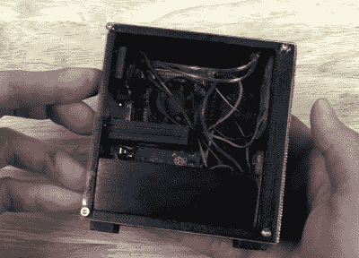

# 迷你“游戏电脑”外观精美，游戏流畅

> 原文：<https://hackaday.com/2020/06/29/mini-gaming-pc-nails-the-look-streams-the-games/>

要拥有一个合适的游戏“装备”，你需要的不仅仅是强大的 GPU 和大量的 RAM。你还必须安装一个透明的侧面板，以便较少的人可以盯着你的布线，以及大量的彩色 led，以确保当你凌晨 2 点起床玩游戏时，它永远不会真正黑暗。或者至少，这是互联网让我们相信的。

来自[迈克尔·皮克] [的最新项目当然不会消除这种刻板印象。事实上，它绝对陶醉于其中。目标是在小得多的规模上重建高端定制游戏 PC 的外观，用树莓派代替“主板”。假设你可以从网络上一台更强大的机器上下载，这个小系统甚至可以播放现代歌曲。](https://www.youtube.com/watch?v=3GeOVe5aDW8)

 但是真的，这个案子是这里的重头戏。从一个 3D 打印的框架开始，[迈克尔]真的把所有细节都考虑进去了。我们特别喜欢一些小细节，比如用于将 Pi 状态和电源 led 灯置于外壳顶部的光纤，以及微小且完全不必要的电源按钮。里面甚至还有一个假的显卡，自带功能风扇。

即使你对为你的 Raspberry Pi 构建自定义外壳不感兴趣，休息后的视频中仍有大量的提示和技巧，值得存档以备将来使用。例如，[Michael]展示了他如何通过自由应用 Bondo 和直尺来修复他的 3D 打印外壳上相当明显的翘曲。

这不是我们第一次看到树莓派伪装成高端电脑，但这肯定是我们见过的最大的努力。

 [https://www.youtube.com/embed/3GeOVe5aDW8?version=3&rel=1&showsearch=0&showinfo=1&iv_load_policy=1&fs=1&hl=en-US&autohide=2&wmode=transparent](https://www.youtube.com/embed/3GeOVe5aDW8?version=3&rel=1&showsearch=0&showinfo=1&iv_load_policy=1&fs=1&hl=en-US&autohide=2&wmode=transparent)

