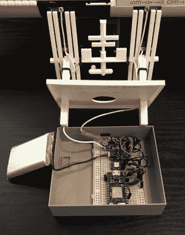

# 迷你空间站密切关注真实的空间站

> 原文：<https://hackaday.com/2020/01/09/mini-space-station-keeps-tabs-on-the-real-one/>

多年来，我们已经看到了许多项目，当国际空间站在头顶上时，它们可以闪烁 LED 或以其他方式通知你。这是一个巧妙的技巧，让太空离家更近一点，但在 2020 年并不是一个突破性的成就。也就是说，我们认为这个由[Lance]建造的版本值得一些特殊的认可[，因为他在](https://hackaday.io/project/169266-3d-printed-iss-desktop-beacon-and-ifttt-notifier)左右设计了令人难以忍受的可爱的微型 ISS。

 尤其是当你意识到它那小小的太阳能电池板其实是有功能的时候。差不多吧。[Lance]表示，电池板实际为内部电池充电的条件必须非常理想，因此如果需要，可以选择用 USB 电缆来充电。为了尽可能地降低功耗，他使用了一些相当激进的节能技巧，这些技巧本身就很有趣。

由于国际空间站每天都会几次悄无声息地掠过你的头顶，所以通知者不能花太多时间在工作上睡觉。鉴于当前的地理位置，粒子光子需要定期醒来，以降低下一次通过的时间，然后回到睡眠状态，直到演出开始前。当该站在附近时，它会使位于一个小型 3D 打印地球模型下的 Adafruit 智能 NeoPixel 闪烁，最后回到睡眠状态，直到该过程重新开始。

如果你在寻找不那么复杂的东西，这个空间站的二维展示可能更适合你。话说回来，[一个甚至*更加*复杂的想法](https://hackaday.com/2019/12/10/globe-lamp-tracks-the-iss-for-you/)使用激光听起来也不错。