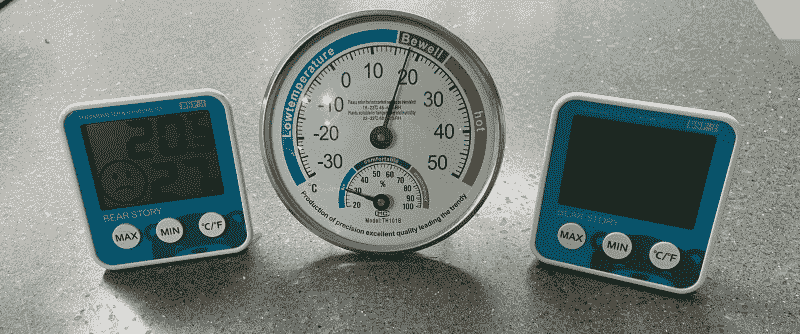
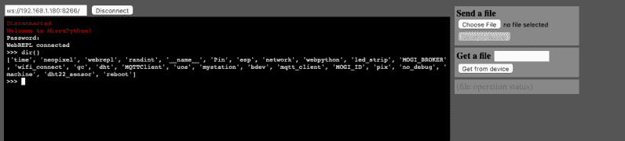

# 带有 Micropython 的最小 MQTT

> 原文：<https://hackaday.com/2021/02/17/minimal-mqtt-with-micropython/>

我已经打算玩 MQTT 一段时间了，最后在上周的一个晚上决定冒险一试。我有三个便宜的家用温度和湿度传感器，并为它们经常不一致而烦恼。令人惊讶的是，虽然模拟的一个在后面有一个校准调整，我不知道如何校准两个数字的。我认为这是一个信号，表明是时候学习 MQTT 并能够安装自己的精确传感器了。当然，我从订购我能找到的最便宜的传感器开始，但是我总是可以在以后升级。

Three Cheap Sensors

虽然我们已经在 Hackaday 上写了很多关于 MQTT 的文章，但我不得不一直追溯到 2016 年，才能找到埃利奥特·威廉姆斯的这个介绍性的四部分系列。在科技界，五年是一段很长的时间，但无论如何，我决定试一试。

## 打造经纪人

第一篇文章非常完美，尽管我用的不是树莓派，而是我妻子准备扔掉的旧台式机。在擦干净窗户、增加一倍内存、安装 Debian 之后，我有了一台新的实验室机器并开始运行。我从标准库安装了`mosquitto`包，并在本文中顺利地使用了它们(我也在 Ubuntu 和 Mac 机器上进行了简单的测试)。安装非常简单，因为:

*   Debian 和 Ubuntu
    *   `sudo apt install mosquitto`
    *   `sudo apt install mosquitto-clients`
*   马科斯
    *   `brew install mosquitto`

## 网络节点

麻烦从[第二条](https://hackaday.com/2016/05/17/minimal-mqtt-networked-nodes)开始。Elliot 使用了一个 ESP-8266 模块和 NodeMCU。我一直想给 NodeMCU 一个尝试，所以我一头扎了进去。虽然我手头没有任何 8266 模块，但我有一个 ESP32 DevKitC 模块。过去，我提到过这些和类似的运行 GRBL、Micropython 和裸机的模块——“这能有多难？”，我心想。

嗯，事实证明这相当困难。我继续在线构建 NodeMCU 定制映像，能够让`esptool.py`与我的开发板对话并对其编程。但是我尽我所能，试了几个小时，我不能让我的主板启动没有错误。主板编程和哈希正确，但总是在启动时出错。我在网上看了很多用户类似的报道，所以至少我在沮丧中不是一个人在我的问题上。

我联系了几个专业程序员，得到的建议是继续前进。他们认为 NodeMCU 已经过时了，并且对我遇到的困难并不感到惊讶。我相信我最终可以让 NodeMCU 工作起来——证据指向硬件启动问题(I/O pin 或设置),在线映像被加载到不正确的地址，或者它就是错误的。但是在浪费了这么多时间之后，我想尝试 MQTT，而不是成为 NodeMCU 专家。

以前使用过 Micropython，看到有一个 MQTT 模块可以导入，我决定采用这种方法。工具链的设置有点复杂，但是 Micropython Github 库中的[指令](https://github.com/micropython/micropython/tree/master/ports/esp32)很容易理解。

关于 Micropython 中 MQTT 服务器的信息可以在[这里](https://github.com/micropython/micropython-lib/tree/master/umqtt.simple)找到，我发现[boneskull]的这个由两部分组成的教程也很有帮助:

*   [脚踏实地，第一部分](https://boneskull.com/micropython-on-esp32-part-1/)
*   [脚踏实地，第二部分](https://boneskull.com/micropython-on-esp32-part-2/)

一旦一切都安装好了，我就可以打开 REPL 开始编程了。在嵌入式系统上使用 Micropython 时，我通常使用 [`rshell`](https://github.com/dhylands/rshell) :

`pip install rshell`

如果你喜欢无线连接，还有一个我测试过的 WebREPL 方法，看起来效果不错。当然，你可以用终端模拟器连接，但是文件保存和编辑就成了一个问题。

我按照原始文章中的思路制作了演示传感器节点。参见[这个 Github 存储库](https://github.com/thestumbler/mqtt-demo.git)，其中包含最终的 Micropython 闪存驱动器。将此复制到您的板上，编辑 MQTT 和 WiFi 详细信息:

`MOGI_ID = 'esp32a-mogi'`
`MOGI_BROKER = 'underdog.lan'`
`WIFI_SSID = 'Covid-19-Laboratory'`

使用`rshell`或您喜欢的任何方法输入 REPL，并通过运行`mystation()`启动节点。一旦它被测试出来，你可以做一个`main.py`文件，如果需要的话，它会自动启动。(*注:`MOGI`是韩语中蚊子的意思。)*

## 控件和客户端

系列的[第三篇](https://hackaday.com/2016/05/27/minimal-mqtt-control-and-clients)我没有太深入。我确实发现了几个在我的服务器上开箱即用的 iOS 应用程序。

*   [EasyMQTT](https://www.easymqtt.app)
*   [MQTTool](https://github.com/bjpetit/MQTTool)

## 权力和隐私

我觉得[最后一条](https://hackaday.com/2016/06/02/minimal-mqtt-power-and-privacy/)的肉还是有效的。我还没有把我的测试传感器节点放在电池上，所以我不能确认这些数字。那将是另一天的项目。

总而言之，埃利奥特最初系列中的基本材料在今天仍然是相关的。不足为奇的是，这些年来，软件细节发生了一些变化。我没有用 NodeMCU 让自己陷入更深的困境，而是改用 Micropython 运行了一个类似的演示。既然我已经迷上了 MQTT，不久我将会更深入地研究电池供电的节点和漂亮的数据图形显示。我最终的计划是入侵我家的自动化网络。