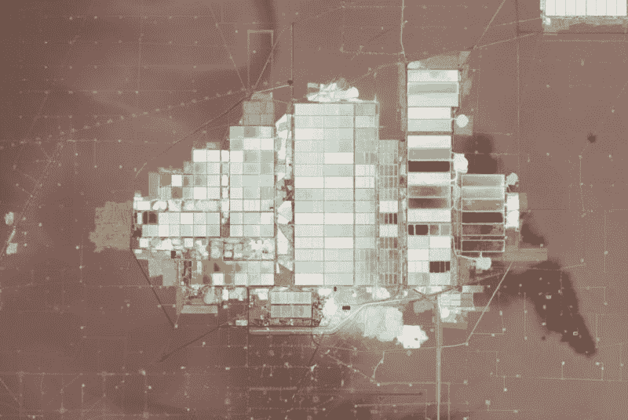

# 采矿和提炼:锂，用盐水驱动未来

> 原文：<https://hackaday.com/2022/02/09/mining-and-refining-lithium-powering-the-future-with-brine/>

很多年前，我读到一篇关于新热点:锂电池的文章。作者以他无疑认为是一个聪明的流行文化参考开始，说仅仅提到锂就会“在克林贡人的心中引起恐惧。”这是对《星际迷航》中虚构的“二锂晶体”的一个微弱的引用，尽管如此，我还是觉得它有点俗气，但我想他必须有所作为。

几十年后，对这一传说的深入了解表明，克林贡人唯一的恐惧是耻辱的死亡，但地球上还有一个物种生活在对锂的恐惧中:电动汽车制造公司的首席执行官。对他们来说，引起恐惧的不是锂的存在，而是相对缺乏锂；虽然锂是地壳中含量第 25 丰富的元素，数十亿吨溶解在世界的海洋中，但锂非常活泼，因此容易扩散，很难获得其业务所依赖的浓缩量。

随着电动汽车和可再生能源市场的持续增长，制造电池的锂需求也将随之增长，有可能达到需求超过采矿业生产能力的地步。为了理解这种不平衡是如何可能的，我们将看看锂目前是如何开采的，以及检查一些可能有助于填补未来锂缺口的新开采技术。

## 艰难的开始

虽然化学家们自 19 世纪初就知道锂并对其进行了充分的表征，但直到上个世纪中叶才发现锂化合物的商业用途。飞机工业对稳定的润滑剂的需求导致了锂皂润滑脂的发展，而对高性能轻质金属的需求导致了铝工业采用锂来改进霍尔-赫罗熔炼工艺。大约在同一时间，医生发现锂盐可以治疗双相情感障碍患者。

A large crystal of spodumene (lithium aluminum inosilicate, LiAl(SiO[3])[2]) found in Massachusetts. Source: by Rob Lavinsky, [iRocks.com](http://www.irocks.com/) – CC-BY-SA-3.0

即使 20 世纪 40 年代新兴核工业的额外需求，几乎所有需要的锂都可以由小型硬岩采矿作业提供，这些作业开采含有锂矿物大晶体的岩石矿床，如锂辉石、透锂长石和锂云母。直到今天，这三种矿物对氢氧化锂的生产仍有很高的需求，氢氧化锂是工业上使用的两种主要锂化合物之一。

从硬岩矿中生产锂与我们在本系列中讨论的其他开采和提炼方法有许多共同之处。含矿石的岩石从露天矿中被炸出来，被巨大的装载机铲起，然后用卡车运到精炼厂。在那里，岩石被一系列的粉碎机和碾磨机粉碎，直到变成细粉。将水加入粉末中，形成一种称为纸浆的浆料，其中还含有表面活性剂和分散剂，使含锂矿物具有疏水性。在一个浅槽中，空气从底部泵入，轻的锂形成泡沫浮到顶部，而较重的岩石颗粒下沉。

锂泡沫从浮选槽撇去后，多余的液体被过滤掉，形成浓缩但不纯的锂粉，需要精炼。精炼过程在很大程度上取决于源矿物和所需的最终产品，但对于浓缩锂辉石矿，通常使用硫酸和氢氧化钠的组合来浸出锂。虽然这是一条高产率的直接路线，但是所涉及的酸和碱会使其成为环境问题。其他[无酸沥滤工艺](https://www.mogroup.com/insights/blog/mining-and-metals/the-outotec-lithium-hydroxide-process--a-novel-direct-leach-process-for-producing-battery-grade-lithium-hydroxide-from-spodumene/)也因此得以发展，据说这是特斯拉在[他们的新氢氧化锂工厂](https://www.teslarati.com/tesla-lithium-hydroxide-facility-cybertruck-gigafactory-texas/)正在使用的工艺，该工厂建在他们的德克萨斯 Gigafactory 旁边。

 [https://www.youtube.com/embed/Ldmw6njETRg?version=3&rel=1&showsearch=0&showinfo=1&iv_load_policy=1&fs=1&hl=en-US&autohide=2&wmode=transparent](https://www.youtube.com/embed/Ldmw6njETRg?version=3&rel=1&showsearch=0&showinfo=1&iv_load_policy=1&fs=1&hl=en-US&autohide=2&wmode=transparent)

## 在盐矿里

如前所述，海水中含有大约 2300 亿吨锂，主要以锂盐的形式溶解。虽然这构成了地球上锂的大部分，但它太分散了——只有 25 微摩尔——如果不花费大量能源来提取和浓缩它，就无法作为可行的商业来源。但是海水并不是唯一含有锂的盐水，从地下盐水中提取有价值的金属已经成为 20 世纪 90 年代以来的主要生产方法。

迄今为止，最大的含锂卤水是在南美洲的“锂三角”发现的。该地区占据了智利、玻利维亚和阿根廷的部分地区，是大型盐滩或盐湖的所在地，这些地方的古代湖泊或池塘蒸发后留下了盐和其他沉淀的矿物质。这些盐滩已经形成了数百万年，在其表面下留下了丰富的矿物层。正如我们将看到的，地表平坦的地形和恶劣的干旱条件也在采矿过程中发挥了作用。

Brine ponds at the Salar de Atacama in Chile, as seen from space. For scale, each of the long, skinny ponds in the center is nearly a kilometer long. Source: , by Lauren Dauphin

开采锂卤水与我们之前讨论过的任何其他开采方法都不一样，而且再简单不过了。卤水开采不是挖出岩石，费力地分离出感兴趣的物质，而是通过深钻孔将水注入盐层。水溶解盐沉积物，产生丰富的盐水，可以泵送到地表。盐水被泵入浅池，放在阳光下蒸发。

当池塘中大部分的水蒸发后——两年后——现在浓缩的盐水就被收获了。除了锂之外，精矿还含有多种元素，包括钠、镁、磷酸盐和硼。精矿可以在现场进一步加工，也可以通过管道运到港口，运往国外的锂加工厂，这种做法越来越普遍。

从表面上看，锂卤水开采的蒸发法似乎是赢家。它超级简单，几乎完全由太阳能提供动力，而且没有大型露天采矿作业的一些影响。但是蒸发浓缩仍然存在巨大的问题。首先，它首先需要大量的水来制造卤水，因为蒸发池只在雨水不多的地方实用，所以水已经短缺了。用于开采卤水的水也流失到大气中，回到远离蒸发池的地表。此外，蒸发池占据了令人难以置信的大量土地——一些池塘综合体覆盖了曼哈顿的面积——这使得扩大运营规模变得困难。并且太阳工作所花费的时间在生产灵活性方面是一个问题。

## 更好的方法

为了充分利用卤水开采，同时减少其缺点，直接提取锂的方法越来越受欢迎。在 DLE，盐水是从地下水源抽取的，但不是通过露天蒸发来浓缩盐水，而是使用许多化学和物理方法从盐水中去除锂。一种方法是离子交换吸附，其中盐水与吸收材料混合，该吸收材料优先结合盐水中的锂化合物而不是其他化合物。DLE 使用的一类吸附剂被称为[层状双氢氧化物(LDH)](https://www.ornl.gov/news/ornl-develops-sorbent-recover-lithium-geothermal-brines) ，这种材料具有层状结构，允许盐水中的氯化锂适合层间，同时排除钾、镁和其他盐。盐水返回地面，同时高纯度氯化锂从吸附剂上洗去。

其他 DLE 方法包括反渗透等膜分离技术，在这种技术中，盐水在高压下被泵送通过有孔的膜，这些孔可以保留锂盐，或者通过溶剂提取技术，使用有机溶剂提取锂。然而，DLE 方法的共同主题是，它们是闭环过程——用于制造盐水的水返回到含有锂的地下地层。DLE 工厂所占的物理空间也只是单个蒸发池所占空间的一小部分，而且它们不依赖于极端的环境，如 salars。

 [https://www.youtube.com/embed/QEGBc2znFdw?version=3&rel=1&showsearch=0&showinfo=1&iv_load_policy=1&fs=1&hl=en-US&autohide=2&wmode=transparent](https://www.youtube.com/embed/QEGBc2znFdw?version=3&rel=1&showsearch=0&showinfo=1&iv_load_policy=1&fs=1&hl=en-US&autohide=2&wmode=transparent)

## 两全其美

尽管 DLE 的技术很有吸引力，但在商业上可行的规模下，DLE 的工厂仍然需要相当多的能源来运转。但是在一些地方，地质上的奇怪现象使得丰富的锂矿藏靠近丰富的可再生能源。索尔顿海(Salton Sea)位于加利福尼亚帝国谷，这是一个内陆咸水湖，位于一系列活跃的地质断层之上，包括著名的圣安地列斯断层。该地区非常适合地热发电，目前有 11 个发电厂，发电量为 2250 兆瓦。其中一些地热发电厂与 DLE 发电厂位于同一地点，这些发电厂泵出富含锂的热卤水，这些卤水利用现场产生的地热能进行净化。从环境角度来说，这样的工厂是锂生产的低影响工厂，澳大利亚公司[控制热资源](https://www.cthermal.com/projects)正在建设的 DLE 地热工厂预计到 2027 年将生产 68，000 吨电池级锂。

随着对锂的需求激增，从有限的可用资源中尽可能以最低的能量提取锂的能力确实成为了一个挑战。DLE 地热似乎是一个良好的开端，但世界上拥有正确的地球化学和地质构造来支持这种操作的地方是有限的。至少以我们目前拥有的技术和能源来说，需要一些聪明的工程技术来获得剩余的锂。

[PABLO cozza glio/法新社通过 Getty Images 拍摄的横幅照片]