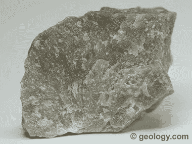
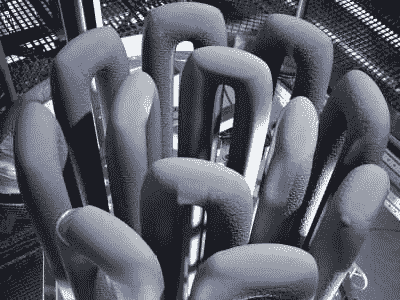
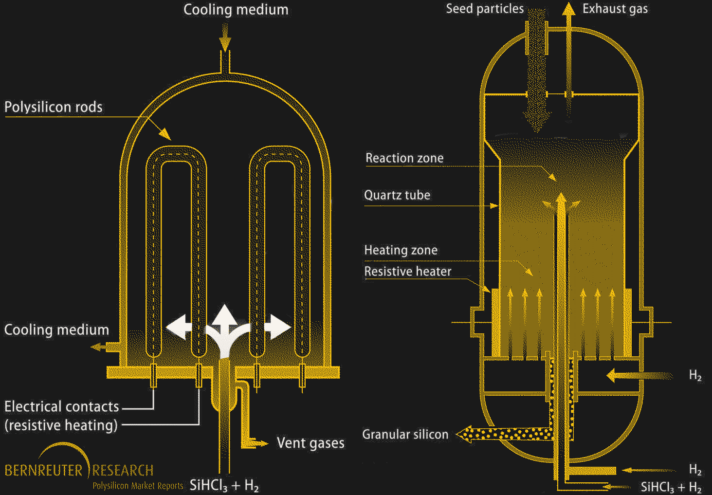

# 采矿和精炼:纯硅和达到这一目标的巨大努力

> 原文：<https://hackaday.com/2021/11/15/mining-and-refining-pure-silicon-and-the-incredible-effort-it-takes-to-get-there/>

如果不是薄薄的水和碳基生命覆盖着它，我们的地球可能会以“硅世界”而闻名。超过四分之一的地壳质量是硅，与氧一起，硅酸盐矿物形成了大约 90%的漂浮在地球地幔上的岩石薄壳。硅是我们这个世界的基石，它就像泥土一样普通。

但是仅仅因为我们有很多它并不意味着我们有很多它的纯形式。只有在最纯净的状态下，硅才能成为将我们的世界带入信息时代的材料。不过，元素硅非常稀有，因此要获得数量可观、纯度足够有用的准金属，需要一些相当耗费能源和资源的采矿和提炼作业。这些操作使用一些非常有趣的化学和一些巧妙的技巧，当扩大到工业水平时，它们提出了独特的挑战，需要一些非常聪明的工程来处理。

## 像岩石一样坚硬

大多数硅生产的原料是矿物石英岩。石英岩来自古代沉积的石英砂。随着时间的推移，在热和压力的作用下，这些石英砂岩转化为变质岩石英岩，其至少 80%的体积是石英。

Quartzite. Source: [Geology.com](https://geology.com/rocks/quartzite.shtml)

石英岩是一种非常坚硬的岩石，在它突出地表的地方，它形成了强烈抵抗风化的山脊。石英岩的重要地层散布在世界各地，但相对而言，开采石英岩生产硅具有经济意义的地方相对较少，因为这些地层需要易于获取，并且相对靠近所需的其他原材料和能源供应。

原始石英岩主要是二氧化硅(SiO [2] )，提炼过程从还原反应开始，以去除氧气。压碎的石英岩以焦炭的形式与碳混合(在无氧条件下加热的煤)。木屑也被加入到炸药中；它们既作为碳源，又作为物理膨胀剂，使气体和热量在炉内更好地循环。

用于硅熔炼的电弧炉是带有巨大碳电极的大型设备。电极在熔炼过程中会被消耗掉，所以新电极会被拧到现有电极的顶部，以确保熔炼过程不会中断。电弧炉需要大量的电力来维持所需的 2000 摄氏度的温度，因此硅精炼厂通常位于电力便宜且充足的地方。

熔融区内的还原反应实际上相当复杂，但可以归纳为两个主要反应:

在这两个反应中，二氧化硅中的氧与碳结合形成主要的废产物一氧化碳。发生在熔炉内部的一部分熔化区中的副反应产生碳化硅(SiC ),这是不希望的副产物(至少当目的是提纯硅时；碳化硅本身是一种有用的工业磨料)。通过确保炉中的二氧化硅远远过量，有利于 SiC 作为碳源还原二氧化硅的第二反应，并且可以从炉底部放出纯度高达 99%的硅。

通过这种方法生产的硅被称为冶金硅。对于几乎所有的工业用途，这种高纯度的硅已经足够好了。大约 70%的冶金硅用于制造金属合金，如硅铁和铝硅合金，这种合金在冷却时收缩最小，因此用于铸造铝发动机缸体和类似物品。

 [https://www.youtube.com/embed/D1ALNg3z2gk?version=3&rel=1&showsearch=0&showinfo=1&iv_load_policy=1&fs=1&hl=en-US&autohide=2&wmode=transparent](https://www.youtube.com/embed/D1ALNg3z2gk?version=3&rel=1&showsearch=0&showinfo=1&iv_load_policy=1&fs=1&hl=en-US&autohide=2&wmode=transparent)

## 更多九分

Monosilane is the silicon equivalent of methane. In trichlorosilane, three of the hydrogens are substituted for chlorines. Source: [WebElements](https://www.webelements.com/compounds/silicon/silane.html)

尽管冶金硅非常有用，但即使纯度达到 99%,也远远达不到半导体和光伏应用所需的纯度。提纯的下一步是将硅提纯到半导体制造所需的纯度水平。提纯从将粉末状冶金硅与热的气态盐酸混合开始。这种反应产生硅烷，硅烷是一种化合物，其中心硅原子被四个附件包围，在这种情况下，三个氯原子和一个氢原子。这种三氯硅烷在反应室内的温度下是气体，这使得通过分馏更容易处理和纯化。

当三氯硅烷气体被充分纯化后，多晶硅生产就可以开始了。西门子工艺是这里的主要方法，是化学气相沉积的一种形式。一个巨大的钟形反应室包含几根高纯度硅细线，通过电流将它们加热到 1150 摄氏度。气态三氯硅烷和氢气的混合物流入腔室；气体在热电极上分解，留下硅，硅增生成直径约 15 厘米的棒。由西门子工艺制造的多晶硅可以具有 99.99999%(“七个九”，或 7N)或更高的纯度。7N 至 10N 多晶硅主要用于光伏电池，尽管这一纯度范围内的一些多晶硅也可用于 MOSFET 和 CMOS 半导体。

Polysilicon rods from a Siemens process chamber. Source: [Silicon Products Group GmbH](https://silicon-products-gmbh.com/silicon/)

尽管西门子工艺是多晶硅的主力，但它也有自己的缺点。主要问题是这是一个能量猪——保持生长的多晶棒足够热以分解原料需要大量的电力。为了解决这个问题，有时使用流化床反应器(FBR)工艺。FBR 反应堆的形状像一座高塔，塔壁衬有石英管。硅烷气体，要么是熟悉的三氯硅烷，要么是甲硅烷，这只是一个被四个氢原子包围的硅原子，被注入到腔室中。粉状硅从顶部滴入反应室，而加热的氢气通过一系列喷嘴注入反应室底部。气流使热硅粉末保持流化，使其与硅烷气体混合并分解。与西门子工艺一样，硅会附着在晶种粒子上，晶种粒子最终会变得太大，流化床无法支撑。多晶硅珠落到室的底部，在那里它们可以被收集。

除了节省能源(使用甲硅烷作为原料时最多可节省 90%)之外，FBR 法的主要优势在于它是一个连续的过程，因为成品珠子可以直接从反应室中泵出。西门子工艺更像是一个批处理过程，因为当多晶硅棒完成后，必须打开反应室取出多晶硅棒。也就是说，FBR 多晶硅还没有真正起飞，部分原因是管理反应室内的流体动力学可能很困难。但主要原因是，西门子的方法太简单了，只要工厂能设在廉价电力来源附近，使用蛮力方法就更容易了。

Polysilicon production by the Siemens process and fluidized bed reactor. Source: [Bernreuter Research](https://www.bernreuter.com/polysilicon/production-processes/)

## 请只给我一个水晶

使用这两种方法中的任何一种，多晶硅都可以达到极高的纯度，高达 11N。但是纯度并不是衡量硅的唯一标准；有时，最终产品的晶体结构性质与纯度一样重要。硅生产的下一步是制造单晶硅，其中整个硅锭是单晶。

将超纯硅单晶生长到具有工业用途的尺寸绝非易事，这依赖于波兰化学家扬·查克劳斯基(Jan Czochralski)在 1916 年发现的一些技巧。我们之前已经深入讨论过直拉法,但简单来说，多晶硅是在惰性气氛中的石英坩埚中熔化的。承载非常精确定向的单个超纯硅晶体的提拉棒被降低到熔融硅中。籽晶使硅凝结，当提拉棒在旋转的同时从熔炉中缓慢拉出时，继续晶体结构。用直拉法可以得到直径达 450 毫米的单晶锭。

生产单晶硅的另一种方法是浮区法，它使用多晶硅棒作为起始材料。在具有惰性气体气氛的反应室内，射频信号通过围绕棒的线圈。射频信号加热多晶硅，形成一个封闭的熔化区。将超纯硅的单晶添加到熔融区，这使得熔融硅在其周围结晶。RF 线圈缓慢地沿着棒向上移动，移动加热区域，直到整个棒成为硅单晶。浮区单晶硅具有从不与直拉法坩埚的石英壁接触的优点，因此具有较少的氧和其他杂质污染。

 [https://www.youtube.com/embed/jPijg8NIamo?version=3&rel=1&showsearch=0&showinfo=1&iv_load_policy=1&fs=1&hl=en-US&autohide=2&wmode=transparent](https://www.youtube.com/embed/jPijg8NIamo?version=3&rel=1&showsearch=0&showinfo=1&iv_load_policy=1&fs=1&hl=en-US&autohide=2&wmode=transparent)

