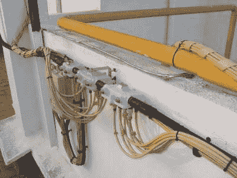
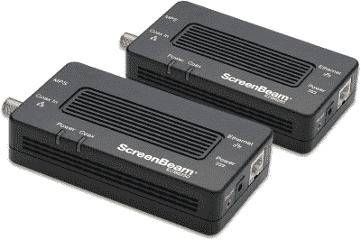
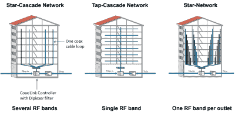

# MoCA 网络是哄爱好者的利基解决方案

> 原文：<https://hackaday.com/2022/11/03/moca-networking-is-a-niche-solution-for-coax-lovers/>

如今，当谈到网络时，我们的绝大多数设备都是无线连接的。除此之外，我们都熟悉 5 类和 6 类电缆，它们构成了我们家庭、学校和办公室中的高容量以太网。

只有当你回到以太网的黎明，同轴电缆才是相关的…对吗？不对！MoCA 网络是关于同轴电缆的，旨在连接有线电视基础设施上的设备！

## 带什么跑什么

MoCA hardware can be used to create networks on traditional cable TV infrastructure, such as that often laid in apartment buildings and hotels. *Credit: [Quique251, CC-BY-SA-3.0](https://commons.wikimedia.org/wiki/File:Cable_company_installation.jpg)*

美国是有线电视的圣地。到 1968 年，只有 6.4%的美国人拥有有线电视，但是到 1994 年，这个数字达到了 62.4%。在那些神圣的日子里，有线电视通过同轴电缆传输模拟信号。

这些电缆在国家的邻近地区工作，经常被分开或分接以向更多的用户提供有线电视服务。公寓和酒店通常会有一个配电箱，电缆“分支”通向建筑中的每一个单独的住所。每个家庭通常都有同轴电缆，以便在休息室和卧室中提供多台电视。

因此，在美国，有大量的建筑物的墙壁中有同轴电缆。今天，它们仍然经常被使用，提供有线电视和有线互联网服务。然而，在这个时代，许多同轴插座被闲置。有时，这是因为向数字有线电视的过渡意味着每台电视都需要一个单独的机顶盒，增加了费用。其他时候，这只是因为有线电视在某些方面已经被流媒体服务的崛起所取代。

MoCA adapters, which hook up a typical RJ45 Ethernet connection to a coaxial cable.

安装同轴电缆的广泛基础导致了 MoCA 的发展，MoCA 是一种旨在使用这些电缆的网络标准。1.0 版设备于 2006 年首次推出。MoCA 代表同轴电缆多媒体联盟，该技术最初被开发用于通过现有的同轴电缆线路在 IP 上发送视频。那个用例没有真正实现，但是底层技术是可靠的。

相反，MoCA 标准发展成为一种网络技术，通过同轴电缆传输以太网。如今，它主要被吹捧为家庭网络问题的解决方案。常见的场景包括 [WiFi 信号可能无法覆盖整个家庭](https://mocalliance.org/technology/Field-Tests-Demonstrate-That-WI-FI-Mesh-in-the-Home-Still-Requires-a-Wire.php)，或者需要有线网络连接到某个房间。在这些情况下，如果有同轴电缆连接，MoCA 可能会有所帮助。通常，它涉及到在室内的一个同轴插座上连接一个路由器到一个 MoCA 适配器。然后，在另一端连接一个 MoCA WiFI 扩展器或网络适配器，以在远程插座上提供连接。

MoCA Access is designed to work with a variety of coax network topologies. This is important to the product, as the whole value of MoCA is that it provides networking without requiring end users to recable their buildings. *Credit*: *MoCA Alliance*

MoCA 的概念听起来可能很奇怪，因为以太网最初是通过同轴电缆传输的。那时，根据所用同轴电缆的直径，同轴以太网的各种标准俗称为*粗网*和*细网*。然而，MoCA 有所不同，因为它是为不同的用例开发的。MoCA 网络必须能够在同轴电缆上运行，这些电缆可能仍在用于有线电视或有线互联网传输。

从功能上讲，这意味着 MoCA 信号必须避免占用有线电视带宽，或者干扰 DOCSIS 有线互联网信号。MoCA 通过在有线电视传统上不使用的频率上运行来实现这一点。然而，在 DOCSIS internet 的情况下，必须采取特殊的措施使标准具有互操作性。还经常使用特殊的滤波器来防止 MoCA 信号到达预期住宅或建筑物之外的其他有线网络用户。

该标准的第一个 1.0 版本允许以高达 100 Mbit/s 的速度进行半双工操作，并且可以处理多达 8 个节点。MoCA 1.1 于 2007 年发布，将速度提高到 175 Mbit/s，并增加了处理 16 个节点的能力。

MoCA 2.0 进一步将速度提高到 500 Mbit/s，即绑定模式下的 1 Gbit/s，同时实现了 3.6 毫秒的延迟。MoCA 2.1 后来添加了网桥检测，以避免邻居意外形成网络，同时还添加了节能功能。MoCA 2.5 包括 [MoCA 接入开发](https://mocalliance.org/access/access-overview.php)，旨在为酒店、医院或其他具有现有杂乱同轴电缆网络的设施提供服务。它提供了高达 2.5 Gbit/s 的网络连接，2.0 Gbit/s 的网络连接，并提供了多达 32 个节点。

后来在 2021 年发布了 MoCA 3.0，能够实现高达 10 Gbit/s 的操作。然而，实现这些速度需要使用同轴电缆上的全部可用带宽。因此，只有较低的速度才能在同一线路上与有线电视或有线互联网配合使用。