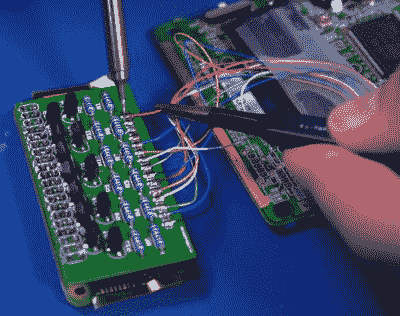

# 改装的 GBA SP 表现最佳

> 原文：<https://hackaday.com/2021/11/01/modded-gba-sp-does-its-best-switch-impression/>

任天堂 Switch 背后的整个想法是，该系统不仅仅是一个手持设备，而是可以在放入坞站时转换成一个更传统的家庭游戏控制台。无线控制器甚至可以从侧面弹出，这样你就可以在沙发上休息，从远处享受你的大屏幕游戏。从任天堂最新系统的销量来看，这显然是一个成功的组合。

这可能就是为什么《猛男玉米片》的提托和他的朋友凯尔·布林克霍夫决定用任天堂的一款老式掌机 Game Boy Advance SP 来重现《T2》的一些核心功能。市场上已经有了 GBA SP 的视频输出 mod 套件，可以让他们在电视上玩游戏，但该团队仍然必须找出如何为 18 岁的掌上电脑制作一个坞站，并让它与官方的 Switch Joy-Cons 一起工作。

Wiring the custom PCB into the GBA SP

幸运的是，这个团队对开发令人印象深刻的 GBA SP 插件并不陌生。上个月，他们揭开了该系统的扩展 3D 打印后面板，其中包含许多升级，如扩展的电池组和对蓝牙音频的支持。

这个 mod 为 GBA 使用了一个类似的扩展“主干”,但这一次是为了容纳 Joy-Cons 安装的轨道，以及让现代控制器与游戏男孩对话所需的电子设备。也就是说，一个 Raspberry Pi Zero 和一个由[Kyle]设计的定制 PCB，当 Pi 的 GPIO 引脚变高时，它使用十几个晶体管来拉低系统的控制输入。

[Tito]在下面的视频中似乎没有提到它，但我们假设这个项目的 dock 组件只是一个 3D 打印盒，带有一个用于 GBA SP 的 link cable 端口的连接器，因为这是 TV-out 修改输出视频的地方。顺便说一句，这意味着你并不真的需要 dock 本身，但它看起来确实很酷。

在视频的最后，[Tito]回顾了当前构建的一些粗糙的边缘，包括让欢乐反对者与树莓派对话的相当漫长的配对过程。但最终，他说不仅系统在他手中感觉良好，而且在大屏幕上玩这些经典游戏也是一种不错的改变。

 [https://www.youtube.com/embed/zHOGTgf6qlk?version=3&rel=1&showsearch=0&showinfo=1&iv_load_policy=1&fs=1&hl=en-US&autohide=2&wmode=transparent](https://www.youtube.com/embed/zHOGTgf6qlk?version=3&rel=1&showsearch=0&showinfo=1&iv_load_policy=1&fs=1&hl=en-US&autohide=2&wmode=transparent)

