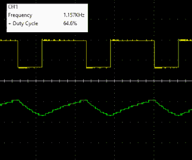

# 在试验板上模拟经典的 555 定时器

> 原文：<https://hackaday.com/2019/06/17/modeling-the-classic-555-timer-on-a-breadboard/>

多年来，读者经常评论说，微控制器(或者更具体地说，Arduino)对于他们使用的许多项目来说都是多余的。创造者“应该使用 555”的告诫已经成为那些认为现代电子爱好者正在走捷径的人的战斗口号。

 但是如果你觉得即使是低贱的 555 定时器也是大材小用呢？在这种情况下，[也许你会对【TheMagicSmoke】](https://themagicsmoke1.wordpress.com/2019/06/14/building-your-own-555-timer-ic/)最近的一篇博客文章感兴趣，这篇文章向读者展示了在更大规模上创建经典集成电路模拟的过程。最后，我们可以用大量的电线和元件来代替便宜又方便的集成电路。

好吧，所以你可能已经猜到没有实际的理由这样做。无论如何，除了一些理论上的情况之外，在这些情况下，你需要使用从周围设备中回收的部件来产生方波。相反，该项目是作为一种对电子电路的低水平操作变得更加自信的好方法来介绍的，我们认为每个人都同意这是一件好事。

使用的元件包括一个 74S00 四通道与非门、一个 LM358 双通道运算放大器、一个 2N2222A 晶体管和一些无源元件。[TheMagicSmoke]不仅解释了电路是如何构建的，还展示了其工作原理背后的数学原理。最后，使用示波器来验证它是否按预期运行。

我们尊重肩负使命的黑客，就在上个月[TheMagicSmoke]发表了一篇类似的“回归基础”的帖子，讲述如何与 I2C EEPROM 接口。