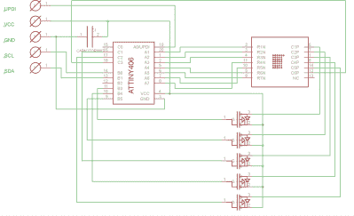

# 现代化苏联时代的 LED 矩阵

> 原文：<https://hackaday.com/2019/02/05/modernizing-a-soviet-era-led-matrix/>

3LS363A 用于从计算器到军事硬件的所有领域，是一款有趣的老式硬件。分辨率为 5 x 7(加上一个小数点)，苏联制造的显示器不包含电子设备，只是 36 个绿色发光二极管的阵列。在紧要关头驾驶其中一辆并不难，[但是【Dmitry Grinberg】认为这款经典设备应该比最低的](http://dmitry.gr/?r=05.Projects&proj=27.%203LS363A)好一点。

 他开发了一个位于 3LS363A 后面的小电路板，让你在 I2C 上空控制它，在处理这些复古显示器时获得更加现代的体验。由 ATtiny406 供电，他的适配器板可以轻松地将模块链接在一起，甚至可以处理一些细节，如翻转显示的图像以适应不同的安装位置。虽然我们大多数人可能没有机会玩这些相对罕见的显示器，但如果你想创造自己的 I2C 小工具，这里仍有大量有用的信息。

在他的文章中，[Dmitry]解释了他设计背后的基本原理以及使用显示器的一些怪癖。例如，他解释了他如何为显示器的每一列指定自己的 FET，但为了节省电路板上的空间，最终直接从一个备用 GPIO 引脚运行单个小数点(技术上是它自己的列)。凭借低占空比，他甚至将限流电阻排除在设计之外。最终结果是一个小电路板，保持 3LS363A 本身的尺寸不变。

[Dmitry]全力以赴为他的新“智能”3LS363A 显示器开发固件，并为他实施的不同命令编写了文档。从重新配置 I2C 地址到更新固件，他确保为这个项目不遗余力。我们不是那种回避快速而肮脏的代码的人，但是看到有人真的在一个项目的软件方面投入了一些思考总是很好的。

在 Hackaday 上，我们已经看到了相当多的古怪的苏联展示，从重型白炽灯泡到非常小的“智能”发光二极管。虽然他们中的任何一个都不太可能取代[谢妮成为复古显示设备之王](https://hackaday.com/tag/nixie/)，但看到不寻常的硬件在野外使用总是很有趣的。