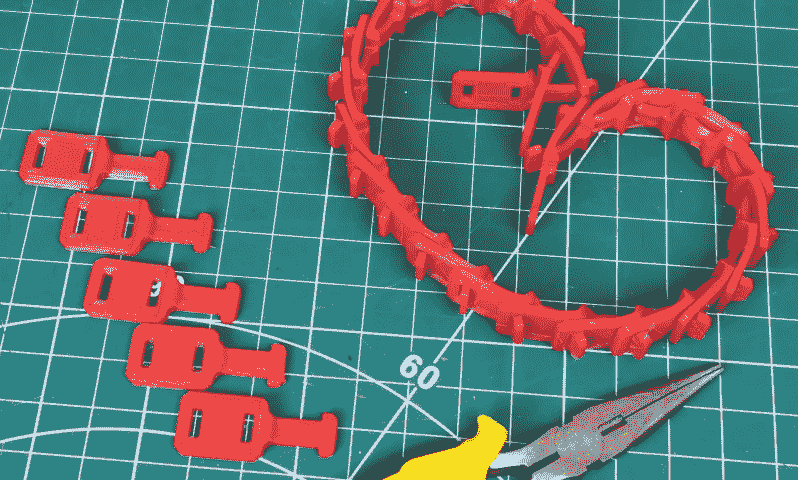

# 模块化漫游平台在 3D 打印的柔性坦克履带上滚动

> 原文：<https://hackaday.com/2020/10/11/modular-rover-platform-rolls-on-3d-printed-flexible-tank-tracks/>

3D 打印机器人的大师[James Bruton]计划在未来做一些自主漫游车项目，但首先，[他需要一个模块化的漫游车平台](https://www.youtube.com/watch?v=Cw-T7vKJ7w4)。有了坦克履带，一切都变得更酷，所以他建造了一辆有灵活互锁履带部分的漫游车。

轨道部分印有柔性 Ninjaflex 细丝。每个部分都有一个突出部，用于穿过两个相邻的部分。凸耳的末端穿过履带内侧，像齿轮齿一样嵌入驱动轮上的槽中。这可以防止履带在负载下打滑。Ninjaflex 几乎太灵活了，允许轨道伸展，几乎爬离车轮，所以[詹姆斯]计划在未来试验一些其他材料。底盘由两个 2020 T 型槽挤压件组成，便于安装车轮转向架和其他部件。

The interlocking track pieces

在最初的驾驶测试中，[James]安装了他手头上的两台功率完全超过 1500 W 的无刷电机，他计划在稍后阶段用更小的齿轮传动 DC 电机替换。

标准的 RC 系统用于控制，但是它不提供控制滑移转向车辆的简单方法。为了解决这个问题，[James]在 RC 接收器和电机 ESC 之间添加了一个 Arduino。它转换来自发射器的脉宽调制节气门和转向信号，并将其合并为两个电子悬架控制系统的差分脉宽调制输出。

我们期待着看到[詹姆斯]用漫游者做什么。这似乎是新的 Nvidia Jetson Nano 2GB 的完美平台。前阵子[rctestflight]build 还建造了一个有趣的[追踪器 3D 打印漫游车](https://hackaday.com/2020/04/02/autonomous3d-rover-with-tank-tracks-rules-the-fields-almost/)，它可以和 Ardurover 一起自主运行，有时会住在他的飞行场中。

 [https://www.youtube.com/embed/Cw-T7vKJ7w4?version=3&rel=1&showsearch=0&showinfo=1&iv_load_policy=1&fs=1&hl=en-US&autohide=2&wmode=transparent](https://www.youtube.com/embed/Cw-T7vKJ7w4?version=3&rel=1&showsearch=0&showinfo=1&iv_load_policy=1&fs=1&hl=en-US&autohide=2&wmode=transparent)

