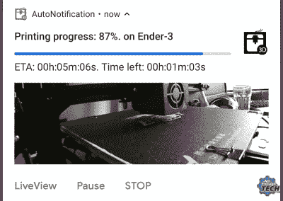

# 用 Node-RED 和 Tasker 监控您的 3D 打印机

> 原文：<https://hackaday.com/2019/03/27/monitor-your-3d-printer-with-node-red-and-tasker/>

任何一个拥有台式 3D 打印机的人都知道，长时间不动这台机器可能会有点伤脑筋。不幸的是，考虑到更复杂的打印需要多长时间，这通常是不可避免的。由于大打印很容易超过 20 小时，在某些时候你需要离开家或者去睡觉。不管怎样，我们希望如此。

 为了让他离开打印机的时间不那么紧张，NotEnoughTECH 的[【Mat】为监控他的移动机器建立了一个全面的框架](https://notenoughtech.com/3dprint/mobile-notifications-for-3d-printers/)。在查看了现有的远程监控解决方案后，他发现没有一个解决方案能提供他想要的信息级别。他的系统收集了大量关于打印机当前状态的数据点，并将其作为丰富的通知全部推送到他的 Android 手机上。最重要的是，他为任何想追随他脚步的人详细记录了整个系统。

这个系统涉及大量的硬件和软件，安装和运行起来不会像使用一些交钥匙解决方案那样简单。Octoprint 负责控制和监控打印机，[Mat]使用 Node-RED 从其 API 中提取数据。这些数据被格式化，最终作为 Tasker 的通知发送到他的 Android 设备上。在硬件方面，他有一个 Sonoff POW R2，不仅可以打开和关闭打印机，还可以测量其能耗，一个 USB 摄像头，提供打印机的实时视图，以及几个 Raspberry Pis 来运行这一切。

即使你没有 3D 打印机，或者可能只是不离开房子，视频[Mat]在休息后放在一起，显示了这个系统的所有元素是如何在 Node-RED 中整合在一起的，这是一个基于流程的可视化编程工具的迷人外观。同样，这是一个很好的演示，展示了如何使用 Tasker 为您的项目添加一些非常巧妙的 Android 通知，而不必致力于为该平台开发原生应用程序。

如果你喜欢远程监控打印机的想法，但不准备像[Mat]那样一头扎进去，还有更简单的选择。[在你的 3D 打印机](http://hackaday.com/2018/01/03/upgrading-a-3d-printer-with-octoprint/)和[上安装一个现有的移动监控前端](http://hackaday.com/2018/03/05/controlling-octoprint-on-the-go/)后，你就可以在去[的路上处理那些大打印，而不必在实验室里搭帐篷](https://hackaday.com/2018/09/15/adding-3d-printer-power-and-light-control-to-octoprint/)。

 [https://www.youtube.com/embed/WGLFafOCVEg?version=3&rel=1&showsearch=0&showinfo=1&iv_load_policy=1&fs=1&hl=en-US&autohide=2&wmode=transparent](https://www.youtube.com/embed/WGLFafOCVEg?version=3&rel=1&showsearch=0&showinfo=1&iv_load_policy=1&fs=1&hl=en-US&autohide=2&wmode=transparent)

