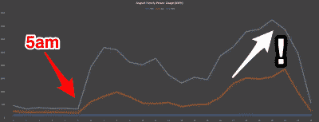

# 通过计算闪烁次数来监控电源

> 原文：<https://hackaday.com/2018/09/05/monitoring-power-by-counting-blinks/>

当你想给一些电子产品增加一个新的功能，但你不能或不想去尝试的时候，你会怎么做？你寻找一些你能与之交流的外部事物。我们喜欢这些黑客，因为它们从字面上和象征性上打破了常规，并且经常包含啊哈！瞬间。

[西蒙·奥布里的]大的家庭负荷是电加热，他的古老的加热器没有提供任何方法来监控它们的使用。他的电表不是智能电表，他不想打开它们。但是功率表有一个外部 LED，每当消耗 1 瓦时就会闪烁。啊哈！他可以监控眨眼。

Maximum is white, average is orange, and minimum is blue.

这样做很简单。只需将光敏电阻指向两个仪表的 led，并将它们和电容器连接到 Raspberry Pi 的 GPIO 引脚。每次检测到一个脉冲，他的 Python 代码就会增加 LED 的计数器，每隔 15 分钟，他就会将计数器写入一个 SQL 数据库。通过分析他的数据，他发现在早上 5 点之前没什么事情发生，中午前后是白天使用率最低的时候。记录的最大值是由于一个加热器意外开着，最小值是由于一个小假期。很好的信息，因为他所能做的只是一个闪烁的灯。

你还能在哪里找到 LED 指示灯？这里有一个稍微更具侵入性的用法，一个[洗衣机的“循环结束”LED 被移除](https://hackaday.com/2011/08/05/lan-connected-washing-machine-lets-you-know-when-your-clothes-are-done/)，它的电源被重新路由到 Arduino 进行远程监控。