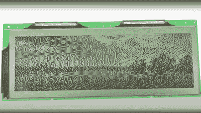
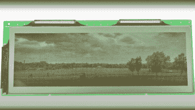
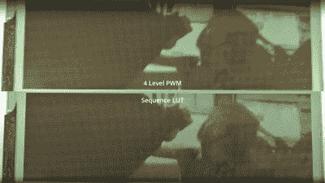

# 单色液晶视频黑客丰富！

> 原文：<https://hackaday.com/2022/05/12/monochrome-lcd-video-hacks-galore/>

[张文婷]显然是老式 STN 液晶显示器的粉丝，并且想知道各种老式便携式设备是如何驱动具有多种灰度级的单色液晶面板的。如果显示控制器支持每像素多位，它可以使用各种技术，例如 PWM，以便产生伪灰度图像。但是，如果你有一个单色显示控制器呢？有了足够高的像素时钟，您能否在应用程序端使用软件来翻转这些像素，以产生看起来合理的灰度图像？

Simple dithering – don’t look too close!

PDM greyscale approximation in a 1-bit display

[文婷]通过多种技术，以清晰、系统的方式展示最终的图像质量。第一个想法是使用传统的抖动技术。对于每个像素，如果灰度值低于某个阈值，则将其设置为黑色。产生的误差值然后被传播到相邻像素。这个误差扩散过程在整个显示器上消除了误差，所以从空间上来说，平均起来，像素值大致对应于原始灰度值。但是，像素本身仍然是开或关的。这还不够。下一个想法是在多个帧上对单个像素进行 PWM 调制，以逼近不同的灰度级。但最差情况下，有效刷新率为 8 Hz，PWM 周期为 15 帧，每秒 120 帧，并且会闪烁。很糟糕。减轻这种情况的一种方法是切换到 PDM(脉冲密度调制),它选择不同长度的序列来给出相同的占空比，但频率更高，至少对于一些灰度值是如此。稍微好一点，但是还可以做得更多。

Simple PWM vs lookup table mapping

问题是，我们的大脑会用我们感知的视觉信号做奇怪的事情。具有相同灰度值的区域将同时脉动，眼睛将被吸引到该区域并感觉到闪烁。因此，下一个技巧是尝试使用 LFSR 序列对这些区域中的邻近像素进行去耦，这确实带来了明显的改善。真正的目的是尝试通过 LCD 播放视频，因此在研究了空间抖动之后，[文婷]转而想知道他是否也可以在时间上抖动，即时间序列中的误差是否可以以类似的方式消除，以使视频看起来更好？通过使用简单的噪声整形器，视频看起来明显更平滑，几乎没有闪烁。伟大的成果！总而言之，这是一个很长的视频，但充满了有用的技巧，在我们看来绝对值得你花时间。

我们对使用现代硬件驱动复古显示器并不陌生，例如[CRT](https://hackaday.com/2022/05/03/designing-for-the-small-grey-screen/)，当我们想到复古显示器时，这款 80 年代早期的复古(相当令人不安)[触控 CRT 怎么样](https://hackaday.com/2017/04/17/a-touchscreen-from-1982-that-could-kill-with-a-single-finger-press/)？

 [https://www.youtube.com/embed/n7uxEaGB9t0?version=3&rel=1&showsearch=0&showinfo=1&iv_load_policy=1&fs=1&hl=en-US&autohide=2&wmode=transparent](https://www.youtube.com/embed/n7uxEaGB9t0?version=3&rel=1&showsearch=0&showinfo=1&iv_load_policy=1&fs=1&hl=en-US&autohide=2&wmode=transparent)

谢谢[菲利普]的提示！