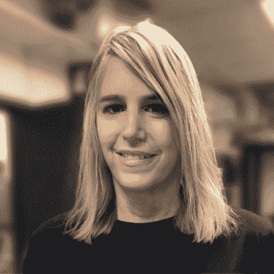
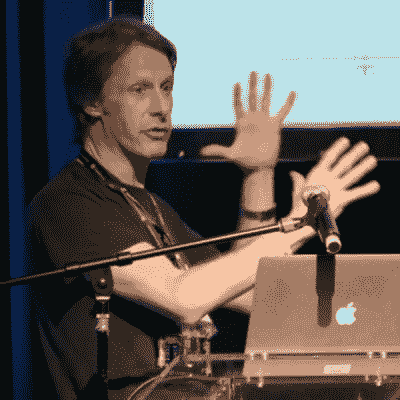
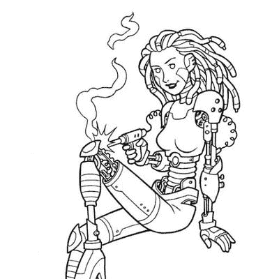
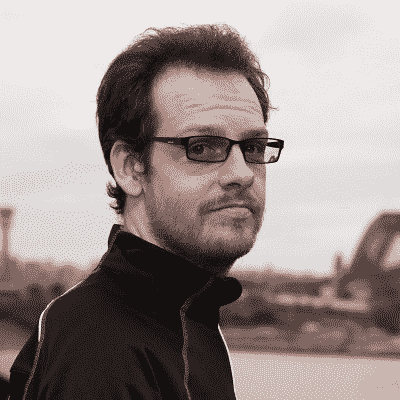
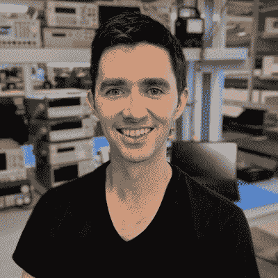
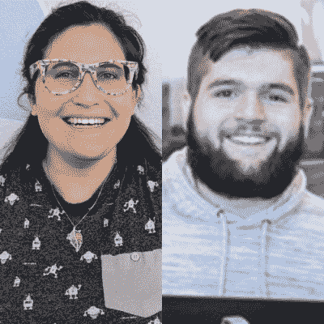
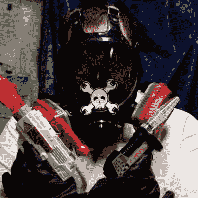

# 更多的超级警察会谈席卷硬件世界

> 原文：<https://hackaday.com/2019/10/04/more-supercon-talks-taking-the-hardware-world-by-storm/>

你会喜欢今年 11 月在超级黑客大会上的演讲。终极硬件大会都是关于硬件创造的。下面的十位演讲者加入了我们上周宣布的演讲，这还不到你在 Supercon 舞台上看到的一半。再加上我们本周早些时候宣布的极好的研讨会，你会开始问自己一个周末到底能容纳多少牛逼的东西。嗯，这是整整三天，我们建议在非正式庆祝活动的前一天到达！

当然，你需要一张票才能乘坐。在写这篇文章的时候，有一些可用的(我们已经离开了青少年，正朝着一位数前进)，但不保证当这篇文章发表时会有任何剩余。不过，我们会维护一个等候名单，所以如果你坐在一张你不能使用的票上，请将其退回，以便其他人可以取代你的位置。

足够的延迟，让我们看看 2019 年 Supercon 上有什么会谈在等着我们！

## 会谈(许多会谈中的第二部分)

*   

    ### 谢莉·格林

    压力连接:压接并不像你想象的那么简单。

    压接通常被定义为通过机械力连接两个导体。起初，这个过程看起来相当简单。然而，更深入的研究揭示了在宏观、微观和纳米尺度上运作的复杂动力学。我将讲述压力连接的基本理论，研究机械性能对电导率和拉伸强度的作用，研究氧化物和表面膜，并考虑工具、测试和压接质量验证的设计挑战。

*   

    ### 迈克·哈里森

    我对 led 的所有了解。

    发光二极管并不都是一样的。我将介绍使用 led 所涉及的各种实用技术，尤其是在大规模安装的情况下，但是其中许多技术同样适用于较小的项目。主题包括合适的 LED 类型，驱动电路，调光技术，伽玛校正。将会有现场演示来说明所涵盖的许多领域。

*   

    ### 凯瑞·沙夫格拉斯

    **满足基本需求的基本设备安全性**

    我们似乎每天都在听说一个令人难以置信的新安全漏洞，它允许攻击者通过连接的灯泡监视您的狗，或者远程编程您的烤箱。其中一些相当复杂，需要研究人员数年才能找到。但是其他人完全不用动脑筋；“为什么厂家不干脆做 X！”。在我们的物联网化世界中，设备安全性比以往任何时候都更加重要，但并不是每个硬件产品都需要像导弹中的 ATM 一样得到保护。我将讨论基本的设计实践和实现技巧，它们很容易集成到您的产品中，并为抵御偶然的对手提供坚实的安全基础。

*   

    ### 索菲·王

    **用机器制造:3D 打印&用于可穿戴电子产品的激光切割**

    为人体制造技术是很棘手的！无论是健身追踪器还是服装，让硬件穿起来足够舒适耐用都是一个迷人的设计挑战。我喜欢在机器的帮助下应对这一挑战！在这次演讲中，我将分享我最近的项目，这些项目使用 3D 打印和激光切割来创建具有精确度和高影响力的可穿戴技术。我将谈论使用 3D 打印和激光切割来创建舒适和完美的可穿戴定制部件的设计过程和构建技术。

*   

    ### 珍·科斯蒂洛

    **未来属于我们:为什么开源和业余爱好者社区将推动高科技消费产品**

    我们 OSHW 和业余爱好者社区来自哪里，我们取得了什么成就？事实是，我们正在推动现代消费电子行业。从原型制作，到工具，再到媒体和培训，我们已经改变了这一切。我将谈谈原因，我们的影响和我们的未来，以及如何避免成为老行业:过时。

*   

    ### 蒂莫西·安塞尔

    **Xilinx 7 系列 FPGAs 现在拥有完全开源的工具链！**

    你应该对 FPGAs 及其如何允许开源项目进行硬件开发感到非常兴奋。在本次演讲中，我将简单介绍 FPGA 是什么以及能做什么，FPGA 工具链是什么，以及当唯一的选择是使用专有工具链时会有多糟糕。SymbiFlow 项目改变了这一点，我将讨论目前支持的内容，包括在 RISC-V 内核上使用廉价的 Xilinx FPGA 开发板演示 Linux。

*   

    ### 克里斯·甘梅尔

    **获取 RF 知识:一名模拟工程师深入研究 RF 电路**

    我的工程生涯始于低电平模拟测量，任何高于 1kHz 的频率都有点像“高频”。事实显然并非如此。我将回顾发现和重新发现更高频率技术的旅程，并将它们与我职业生涯之初学到的低水平测量基础相结合。这将包括对麦克斯韦方程的讨论，以及我们在研究不同类型的电路时所做的一些假设。您会发现这些信息在蜂窝、WiFi、蓝牙和其他常用通信方法的 RF 计算中非常有用。

*   

    ### 珊妮·普鲁奇和杰夫·伍德

    **通过区块链交易构建安全网络的冒险**

    在我们的演讲中，我们将展示我们如何设计和构建一个在 ADANA(异常网络活动的自动检测)和 Hyperledger(区块链的一种“智能合同”形式)上运行的消息认证系统，这两个系统都托管在两个服务器上，这两个服务器不再由伯灵顿县的 Rowan College 使用。该系统是使用 Docker、syslog-ng、Hyperledger Fabric 和 Composer 以及 Splunk 的测试版构建的。该系统可由接入网络的节点访问，这些节点通过网络浏览器与 hyperledger 进行交互。我们将介绍网络的基础设施、hyperledger 的详细信息、系统使用的所有工具的说明、系统如何工作的演练、对该项目的特殊挑战的思考以及我们对该技术未来的展望。

*   

    ### 约翰·麦克马斯特

    **复制安全电话密钥**

    STU-III 保密电话最初是由美国国家安全局在 20 世纪 80 年代为国防用途开发的，但也用于非保密的商业产品，如摩托罗拉 Sectel 9600。然而，它们要求很难找到机电钥匙。我将描述通过对机械和电气设计进行逆向工程并随后进行制造来为 Sectel 9600 创建兼容钥匙的过程。在这个过程中，我将讨论小批量生产的问题和克服策略。

## 我们需要你！

不要错过。作为众多了不起的人之一的一个周末将激励你，并为来年的硬件黑客活动充电。[super co](https://www.eventbrite.com/e/2019-hackaday-superconference-tickets-60129236164?aff=1004com)见！