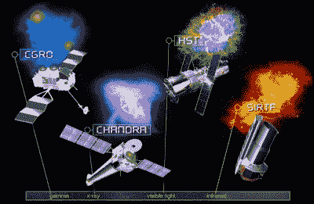
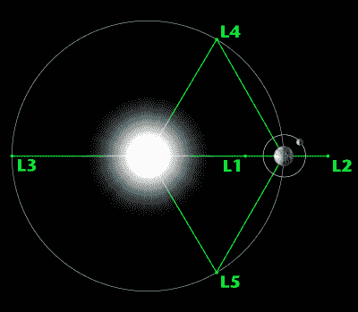
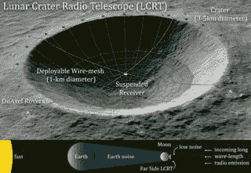

# 不仅仅是哈勃望远镜:充满今天和明天天空的空间天文台

> 原文：<https://hackaday.com/2021/07/28/more-than-just-hubble-the-space-observatories-filling-the-skies-today-and-tomorrow/>

在最近关于哈勃太空望远镜的麻烦(以及[胜利复活](https://hackaday.com/2021/07/16/the-fix-is-in-hubbles-troubles-appear-over-for-now/))的新闻中，人们有时很容易忘记，尽管哈勃是一个非常独特的望远镜，但它只是目前正在头顶上疾驰或位于日心轨道上的许多太空天文台之一。那么是什么让这些天文台比标志性的哈勃望远镜更不为人所知呢？

哈勃是迄今为止寿命最长的太空望远镜之一，也是唯一一架由航天飞机发射和维修的太空望远镜。其他望远镜都没有这个遗产，哈勃的预定继任者詹姆斯·韦伯太空望远镜(JWST)的高调或麻烦的历史。

即便如此，这些无数其他天文台的任务简介也同样有趣，尤其是最近完成的许多首次任务，如长期月基望远镜(嫦娥 3 号的 LUT)以及许多即将到来和拟议中的任务。让我们来看看许多人从未听说过的太空天文台。

## 为什么望远镜不喜欢人

Observing the center of the Milky Way using the laser guide star facility at Yepun, one of the four Unit Telescopes of the Very Large Telescope (VLT). The Laser Guide Star (LGS) is part of the VLT’s adaptive optics system and is used as a reference to correct the blurring effect of the atmosphere on images.

太空望远镜的一个明显问题是“为什么？”。就像，为什么要大费周章地把一包通常相当脆弱的仪器送上太空，而不是在地球上建造一个漂亮的大天文台，用卡车和轮船运输设备和建筑材料，而不是用火箭？部分答案可以在那些基于地球的望远镜所选择的地点中找到。

人的存在意味着[光污染](https://en.wikipedia.org/wiki/Light_pollution)、射频污染(对于射电望远镜)和其他不必要的影响。此外，望远镜和太空之间的大气层越厚，像[大气闪烁](https://arxiv.org/abs/1506.06921)(“闪烁的星星”)这样的影响可能就越严重。虽然像[自适应光学](https://en.wikipedia.org/wiki/Adaptive_optics) (AO)和简单地将天文台放置在远离社会的山顶上这样的策略有助于缓解这些问题，但它们并没有解决地球大气中一些令人讨厌的特征。

虽然地球的大气层对我们生物来说绝对是巨大的，因为它阻挡了大多数紫外线辐射、X 射线，并衰减了红外线和电磁辐射光谱的其他部分，但当试图在 EM 光谱的这些部分中观察宇宙时，这显然是相当不可取的。虽然在飞机上的空中观测站，如美国国家航空和宇宙航行局的“T2”号或气球在这里有所帮助，但是为了更好地观察宇宙提供的一切，人们必须冒险进入太空以获得无阻碍的视野。

## 伟大的天文台

Overview of NASA’s Great Observatories series. (Credit: NASA)

哈勃是美国宇航局[大天文台计划](https://en.wikipedia.org/wiki/Great_Observatories_program)的一部分，该计划包括哈勃、钱德拉、康普顿和斯皮策太空天文台。这个项目的根源可以追溯到 1946 年，当时天文学家莱曼·斯必泽[写了一篇论文](https://history.nasa.gov/SP-4407/vol5/chapter-3/III-1%20(546).pdf) (PDF)，这篇论文于 1946 年 7 月 30 日发表，论述了天基观测相对于地面观测的优势。

如果没有地球大气层的模糊效应和同样的大气层通过紫外线、X 射线和其他类型的测量引起的类似蒙眼的效应，人类对宇宙、我们的银河系和附近行星的知识和了解可以以以前认为不可思议的方式扩展。随着美国宇航局轨道天文台 2 ( [AOA-2](https://en.wikipedia.org/wiki/Orbiting_Astronomical_Observatory_2) ，绰号 [*观星者*](https://www.nasa.gov/feature/goddard/2018/nasa-s-first-stellar-observatory-oao-2-turns-50) )空间天文台于 1968 年发射升空，这种观测平台的可行性得到了证实。

对于天文台来说，最重要的是能够长时间专注于一个目标，这在太空中是通过[恒星跟踪器](https://hackaday.com/2020/04/02/star-trackers-telling-up-from-down-in-any-space/)实现的，它使航天器能够保持相对于恒星的固定方向。这些使得*观星者*能够将它的[光导摄像管衍生的](https://hackaday.com/2020/02/27/recording-video-in-the-era-of-crts-the-video-camera-tube/)紫外线敏感摄像管( *Uvicon* )聚焦在研究目标上，以获得清晰的图像。当 *Stargazer* 的任务在 1973 年结束时，类似的任务如 X 射线天文台 [Uhuru](https://en.wikipedia.org/wiki/Uhuru_(satellite)) 也已经启动，除了 NASA 之外，世界各地的其他太空组织也将启动[他们自己的太空天文台](https://en.wikipedia.org/wiki/List_of_space_telescopes)。

大天文台的独特之处在于，所有四个天文台都被设计成互补的，涵盖了从可见光和近红外(哈勃)，到红外(斯皮策)，X 射线(钱德拉)和伽马辐射(康普顿)的整个光谱。这提供了在 20 世纪 90 年代用地面观测站不可能进行的观测，并且由于上述地球大气层的影响，今天在许多情况下仍然不可能。

今天，只有哈勃和钱德拉仍然活跃。康普顿的任务在 9 年零 2 个月后于 2000 年结束，当时它的三个陀螺仪中的一个出现故障，被有意偏离轨道。16 年零 5 个月后，斯皮策的任务于 2020 年 1 月结束。尽管到 2009 年，它已经耗尽了远红外观测的冷却剂，但有限的任务剖面仍在继续，直到 2020 年发出关闭信号。在这种关闭状态下，斯皮策将继续沿着日心轨道漂移。

## 太空中的交通堵塞

目前，有 20 多个活跃的天基观测站。根据其主要功能粗略划分，它们是:

**伽马射线:**

*   国际伽马射线天体物理实验室([积分](https://en.wikipedia.org/wiki/INTEGRAL)，地心)。
*   [费米伽马射线太空望远镜](https://en.wikipedia.org/wiki/Fermi_Gamma-ray_Space_Telescope)(原名 GLAST，地心狮子座)。
*   光成像伽马天体探测器([敏捷](https://en.wikipedia.org/wiki/AGILE_(satellite))，地心 LEO。
*   尼尔·格里尔斯*斯威夫特*天文台([斯威夫特](https://en.wikipedia.org/wiki/Neil_Gehrels_Swift_Observatory)，地心狮子座)。
*   伽马射线暴偏振仪(GAP，机载 [IKAROS](https://en.wikipedia.org/wiki/IKAROS) ，日心，可能丢失)。

**X 射线:**

*   [钱德拉](https://en.wikipedia.org/wiki/Chandra_X-ray_Observatory) X 射线天文台(原 AXAF，地心高度椭圆形)。
*   x 射线多镜任务( [XMM-Newton](https://en.wikipedia.org/wiki/XMM-Newton) 地心)。
*   核光谱望远镜阵列( [NuSTAR](https://en.wikipedia.org/wiki/NuSTAR) ，地心近赤道)。
*   [Astrosat](https://en.wikipedia.org/wiki/Astrosat) (地心近赤道)。
*   硬 X 射线调制望远镜( [HXMT](https://en.wikipedia.org/wiki/Hard_X-ray_Modulation_Telescope) ，地心 LEO)。
*   [Spektr-RG](https://en.wikipedia.org/wiki/Spektr-RG) (日地 L [2] 拉格朗日点)。

**紫外线&可见光:**

*   [哈勃](https://en.wikipedia.org/wiki/Hubble_Space_Telescope)太空望远镜(地心 LEO)。
*   界面区成像光谱仪( [IRIS](https://en.wikipedia.org/wiki/Interface_Region_Imaging_Spectrograph) ，地心太阳同步)。
*   [Hisaki](https://en.wikipedia.org/wiki/Hisaki_(satellite)) (又名 SPRINT-A，地心狮子座)。
*   月基紫外望远镜( [LUT](https://en.wikipedia.org/wiki/Chang%27e_3#Lunar-based_ultraviolet_telescope_(LUT)) ，月球表面)。
*   亮星目标探测器( [BRITE](https://en.wikipedia.org/wiki/BRITE) ，地心)。
*   近地天体监视卫星( [NEOSSat](https://en.wikipedia.org/wiki/Near_Earth_Object_Surveillance_Satellite) ，地心太阳同步)。
*   [盖亚](https://en.wikipedia.org/wiki/Gaia_(spacecraft))(日地 L [2] 拉格朗日)。
*   过渡系外行星调查卫星( [TESS](https://en.wikipedia.org/wiki/Transiting_Exoplanet_Survey_Satellite) ，高地球椭圆轨道)。
*   表征系外行星卫星( [CHEOPS](https://en.wikipedia.org/wiki/CHEOPS) ，地心太阳同步)。

**红外线:**

*   广域红外巡天探测器( [WISE](https://en.wikipedia.org/wiki/Wide-field_Infrared_Survey_Explorer) ，地心太阳同步)。

**微波:**

*   [奥丁](https://en.wikipedia.org/wiki/Odin_(satellite))(地心狮子座)。

**粒子检测:**

*   星际边界探索者( [IBEX](https://en.wikipedia.org/wiki/Interstellar_Boundary_Explorer) ，地心 HEO)。
*   阿尔法磁谱仪( [AMS-02](https://en.wikipedia.org/wiki/Alpha_Magnetic_Spectrometer) ，附属于 ISS)。
*   暗物质粒子探测器( [DAMPE](https://en.wikipedia.org/wiki/Dark_Matter_Particle_Explorer) ，太阳同步)。

## 还会有更多

虽然现役名单中的一些观测站将很快脱离轨道或停用，因为它们将达到其任务或总寿命的终点，但在未来几年中，我们应该能够欢迎大约 12 个新的任务，从今年开始，至少有三个:

*   成像 X 射线偏振探测器( [IXPE](https://en.wikipedia.org/wiki/IXPE) ，X 射线，地心 LEO)。
*   詹姆斯·韦伯太空望远镜( [JWST](https://en.wikipedia.org/wiki/James_Webb_Space_Telescope) ，紫外/可见光/红外，日地 L [2] 拉格朗日晕轨道)。
*   X 射线偏振仪卫星( [XPoSat](https://en.wikipedia.org/wiki/X-ray_Polarimeter_Satellite) ，X 射线，地心)。

在此之后，将有至少四个新的特派团:

*   X 射线成像和光谱任务( [XRISM](https://en.wikipedia.org/wiki/X-Ray_Imaging_and_Spectroscopy_Mission) ，X 射线，地心 LEO)。
*   [阿迪雅-L1](https://en.wikipedia.org/wiki/Aditya-L1) (太阳观测，日地 L [1] )。
*   国际月球天文台( [ILO-1](https://en.wikipedia.org/wiki/International_Lunar_Observatory) ，可见，月球南极)。
*   [欧几里德](https://en.wikipedia.org/wiki/Euclid_(spacecraft))(可见光/近红外，日地 L [2] )。

Visualization of the Sun-Earth Lagrange points.

在这些任务中，ILO-1 任务可能是最令人兴奋的，因为它将创建继嫦娥三号的 LUT 之后的第二个永久性月球天文台，并增加对 LUT 紫外线的可见观测。虽然细节有些粗略，但看起来 [ILO-X](https://iloa.org/ilo-x-precursor/) 探索任务可能会在由直觉机器设计的 [Nova-C 月球着陆器](https://en.wikipedia.org/wiki/IM-1)上发射。IM-1 任务将于 2022 年初由 SpaceX 猎鹰 9 号火箭发射，ILO-1 将于 2022 年底发射 IM-2。

不管 ILO-1 是否成功，美国国家航空航天局(NASA)也在关注月球上的望远镜。这将是月球环形山射电望远镜( [LCRT](https://en.wikipedia.org/wiki/Lunar_Crater_Radio_Telescope) )，是太阳系中最大的直径为 1 千米的望远镜。 [LCRT](https://www.nasa.gov/directorates/spacetech/niac/2020_Phase_I_Phase_II/lunar_crater_radio_telescope/) 将允许对宇宙进行波长大于 10 米(< 30 MHz 频率)的无线电观测，这些频率被地球电离层阻挡。

这里显而易见的含义是，虽然太空中的卫星很方便，但有时你只想拥有一台比基于太空的天文台实用的仪器更大的仪器。在这种情况下，利用月球作为观测站，无论是遥控的还是载人的，都是一个诱人的选择。随着人类准备重返载人登月，谁知道呢，也许不久之后一个月球殖民地将会拥有一个大望远镜或半打望远镜呢？

## 未来在太空中

Notional view of LCRT on the far-side of the Moon.
Credit: Saptarshi Bandyopadhyay

虽然我们可以从地球生物圈中舒适的地方了解我们的星球和宇宙很多东西，但要真正了解从我们的银河系到物理定律的一切是如何运作的，我们必须放眼更远的地方。无论是通过即将到来的任务，如欧空局的激光干涉仪空间天线( [LISA](https://en.wikipedia.org/wiki/Laser_Interferometer_Space_Antenna) )任务，目前是在 21 世纪 30 年代，寻求测量引力波，还是通过我们自己的冒险。

所有这些基于太空的观测站的目标是超越地球，满足我们对周围世界的好奇心，因为我们寻求增加我们的理解。无论是伽利略、哥白尼、爱因斯坦还是其他任何一位科学家，他们不懈努力，推动人类更接近于掌握整个存在，是他们的努力把我们带到了这里。我们不再局限于地球，而是可以考虑放眼更远的地方。

尽管对今天地球上的许多人来说，传回的许多图像和数据可能看起来像是无聊的科学玩意儿，但其中包含着人类未来的种子。即使今天它主要是我们在像哈勃和金这样的天文台中发送的仪器，使我们能够在地球上超越我们自己的感官看到和体验，也许不久我们就可以加入他们在恒星和宇宙其他奇迹中的旅程。

我们要做的就是睁大眼睛，保持好奇。

[标题图像:艺术家对宽视场红外巡天探测器(WISE)的构想。(鸣谢:美国宇航局/JPL 加州理工大学)]