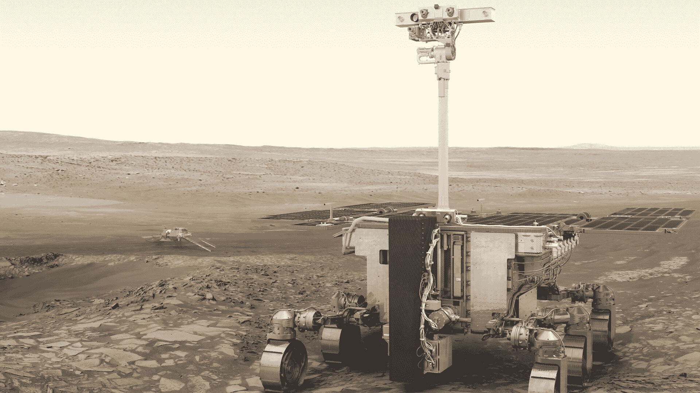
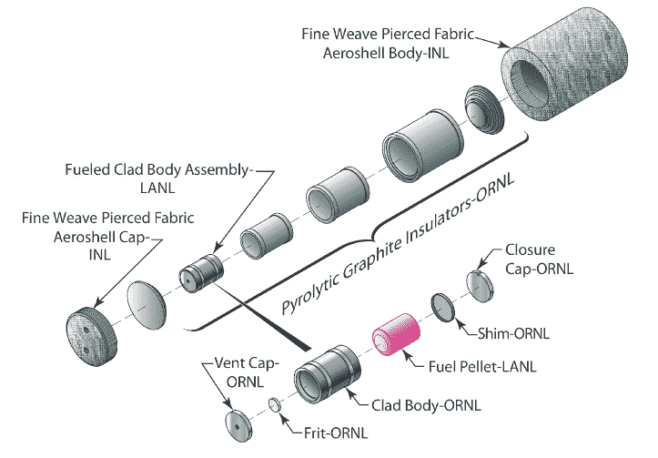
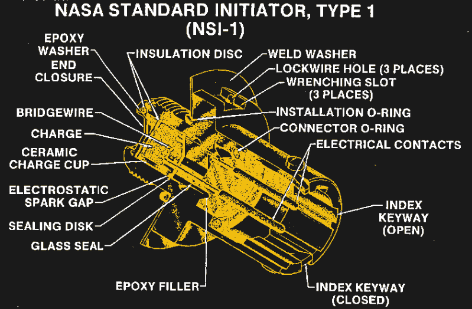
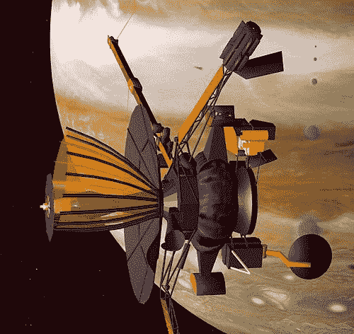

# 封存罗莎琳德:如何将太空任务封存

> 原文：<https://hackaday.com/2022/04/11/mothballing-rosalind-how-to-put-a-space-mission-in-storage/>

在行星探索圈，火星的名声相当不好。这颗红色星球有吃掉被送到那里探索它的宇宙飞船的习惯，以至于我们扔向它的近一半任务都以这样或那样的方式失败了。“火星诅咒”最引人注目的表现是，着陆器未能通过终点下降，新的数十亿美元的陨石坑出现在火星风化层上，而一些任务在前往火星的途中遭遇厄运，少数不幸的任务甚至在发射台上爆炸。

但是，火星诅咒的最新例子，最近取消的第二阶段 ExoMars 任务，代表了一种新的令人沮丧的失败模式:战争——特别是俄罗斯入侵乌克兰。国际社会对这一侵略行为的愤怒导致了俄罗斯的经济制裁和外交孤立，俄罗斯通过终止与欧洲航天局(ESA)的合作伙伴关系进行报复，剥夺了其运载火箭的任务，并注定了将于 2023 年在火星赤道附近的 Oxia Planum 着陆探测器*的任务。*

虽然管理员和外交官仍有机会解决问题，但及时赶上该任务在 2022 年 9 月争取的狭窄发射窗口的可能性很小。这意味着*罗莎琳德·富兰克林*号，以及所有其他几乎准备好发射的飞行硬件，将不得不至少被存放到 2024 年下一次发射窗口打开之前。这就引出了一个问题:如何将一个复杂的航天器存放起来？当它最终飞行时，这种封存会对任务产生意想不到的后果吗？

## 电力和加热器

在人类武装冲突的混乱影响发挥作用之前，ExoMars 任务是非常雄心勃勃和非常复杂的。计划可以追溯到 21 世纪初，当时欧空局和美国宇航局达成了一项联合协议，其中包括轨道飞行器、火星车，甚至样本返回方面。但是在 2012 年，本来要为 ExoMars 漫游者提供运载火箭和下降平台的 NASA[退出了合作](https://www.space.com/14733-nasa-budget-request-2013-astronomers-response.html)，原因是预算紧张，这至少部分是由詹姆斯·韦伯太空望远镜的成本超支造成的。这导致欧空局与 Roscosomos 建立了全面的伙伴关系，利用其质子号运载火箭进行发射，并提供将火星车安全降落到火星所需的下降飞行器。

Artist’s impression of *Rosalind Franklin* on Mars, with *Kazachok* in the background. Source: [ESA](https://www.esa.int/Science_Exploration/Human_and_Robotic_Exploration/Exploration/ExoMars/ESA_s_Mars_rover_has_a_name_Rosalind_Franklin)

在距离发射窗口只有六个月的时候，合作关系破裂了，现在以英国化学家和晶体学家[罗莎琳德·富兰克林](https://hackaday.com/2017/10/24/rosalind-franklin-saw-dna-first/)的名字命名的完成的火星车，以及名为 *Kazachok* 或“小哥萨克”的下降飞行器，必须安全储存至少两年。虽然大多数用于深空任务的航天器在设计时都必须考虑到长达数月的星际穿越期间的存储，但将一台为真空空间设计的精密机器安全存储在地球上则完全是另一回事。

罗莎琳德·富兰克林和 T2·卡扎乔克将如何储存的主要驱动力之一是他们的电力系统。两艘飞船都由太阳能电池板提供动力，这对设计存储计划的工程师来说可能是一个小小的福音。像早期的美国宇航局探测器*勇气号*和*机遇号*、*一样，罗莎琳德·富兰克林*使用太阳能电池板提供电力。漫游者相对较小，只有 300 公斤左右，功率要求适中，可以通过船体顶部的 1200 瓦太阳能电池阵列来满足。这与大得多的*好奇号*和*坚持号*火星车形成了鲜明对比，每辆火星车都有一辆小型汽车那么大，由一对钚动力[放射性同位素热电发电机](https://hackaday.com/2019/02/08/the-deep-space-energy-crisis-could-soon-be-over/)提供动力。虽然 Pu-238 87.7 年的半衰期意味着 RTG 的功率输出在储存两年后不会衰减太多，但这将是任务工程师需要考虑的非零量。

NASA RHU, their take on radioactive heating for deep-space flight. They lose about 10-mW of heat output per year due to the decay of the Pu-238 fuel. Source: [NASA RPS](https://rps.nasa.gov/power-and-thermal-systems/thermal-systems/general-purpose-heat-source/)

仅仅因为 RTG 没有被选为能源并不意味着罗莎琳德·富兰克林仍然没有一些放射性衰变的问题要处理。火星的夜晚非常寒冷，白天也好不到哪里去，所以敏感的电子设备需要预热才能正常工作。为了保持温暖，火星车配备了俄罗斯制造的放射性同位素加热装置(RHUs)，这基本上是没有发电比特的 RTG。NASA 的 RHUs 使用 Pu-238 作为热源；不管*号上 Rosalind Franklin* 号上 Roscosmos 供应的 RHUs 使用的同位素是什么，都必须考虑燃料源在储存期间的良好衰变。

但是，选择太阳能电池板为这些航天器提供动力的幸运突破在某种程度上被电池储存能量的需要所混淆。漫游者使用 1，142 瓦时的锂离子电池组，这将需要在存储中进行一些仔细的管理。[无论是完全充电还是放电，锂离子电池对长期储存的反应都不太好](https://www.dnkpower.com/lithium-ion-battery-storage/)，因此目标可能是将电池保持在大约 50%的充电状态(SOC)。即使有了最佳的存储，在飞行前用新电池替换漫游者的电池可能也是谨慎的，因为风险太大了。例如，在 2005 年日本*隼鸟*号小行星着陆器和样本返回任务中，推进器故障导致航天器的太阳能电池板与太阳不对齐，[号对一些锂离子电池](https://www.nasa.gov/sites/default/files/atoms/files/04_long-term_storage_li-ion_in_space_ysone.pdf)过度放电，这导致样本返回地球时出现一些紧张时刻。火星任务不需要增加这样的戏剧性事件。

## 烟火制造术

自从太空竞赛的早期以来，每一艘宇宙飞船的发射都是一系列精心策划的受控爆炸。从运载火箭上的级分离和打开有效载荷整流罩到抛弃隔热罩和降落伞的展开，烟火装置几乎参与了通往太空的每一步。

NASA Standard Initiator, similar to what’s used for pyrotechnic devices on ESA spacecraft. Source: [NASA](https://ntrs.nasa.gov/citations/19890005798)

航空航天工程师对烟火技术有很多经验，甚至在一定程度上规范了这些“高能装置”。例如，美国国家航空航天局有他们的“美国国家航空航天局标准雷管”，这是一个加工过的不锈钢塞，填充了不到半克的叠氮化铅和高爆 RDX。NSD 有一个配件，另一个烟火装置，即“美国宇航局标准启动器”，被连接到其中。

NSI 中充满了 ZPP，这是一种由锆、高氯酸钾和作为粘合剂的合成橡胶 Viton B 组成的混合物。当电流通过 ZPP 时，嵌入其中的一个小灯丝就会加热，这导致锆燃料在高氯酸钾氧化剂的存在下点燃，产生足够的热量和压力来引爆 NSD 中的炸药。

欧空局建造的*罗莎琳德·富兰克林*很可能有类似的烟火装置，它们将有类似的储存特性。[关于热量和湿度对 ZPP 基起爆器影响的研究](https://www.nature.com/articles/s41598-019-46608-8)表明，虽然总体稳定，但湿度在降低起爆器性能方面起着重要作用，主要是通过降解氟橡胶粘合剂，并允许燃料和氧化剂进入大气中。所有这些的结果是，就像其他东西一样，烟火最好储存在凉爽干燥的地方。

## 润滑剂

大多数航天器，即使是那些永远不会降落在行星上的航天器，都至少有一些机械接头，以部署所有的天线，太阳能电池板和传感器，这些都需要折叠起来，以便机器可以安装在发射整流罩内。漫游者的机械复杂性比轨道飞行器高几个数量级，到处都是各种可以想象的接头。所有这些关节都需要一系列润滑剂，这些润滑剂在长期储存过程中都会变质。

Storage can hurt: *Galileo* with its lube-starved high-gain antenna. Source: NASA

存储中的航天器上的润滑剂造成的性能损失可不是闹着玩的，这几乎让美国宇航局在 20 世纪 90 年代的伽利略号飞越木星任务中付出了代价。*伽利略*号在发射前已经储存了四年半，部分原因是由于*号挑战者*号的灾难。在前往木星的过程中尝试展开天线时，旨在提供天线肋顺利释放的润滑剂已经存在了十多年，并且严重退化。这使得天线部分展开，极大地影响了数据吞吐量。

由于这一事故，飞行前储存对关键润滑剂的影响已被广泛研究，结论是二硫化钼润滑脂最好储存在“干燥氮气”条件下，同时偶尔使用关键机制以确保润滑脂不会分层，或使其基础油与用于增稠润滑脂的肥皂分离。工程师还需要注意与润滑剂接触的密封件和其他非金属部件，这些部件可能会吸收大量基础油，并使润滑脂储层变稠，最终导致接头失效。

虽然这些都是亮点，但像 ExoMars 这样复杂的任务很有可能会有一千个其他细节需要关注，以确保罗莎琳德·富兰克林和 T2 保持良好的状态并准备好飞行，希望在下一次发射窗口到来时。