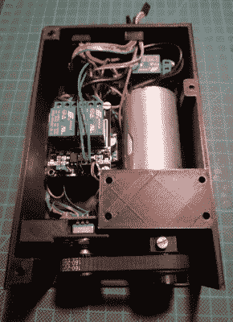

# 将宜家 SKARSTA 斯卡斯塔桌子电动化

> 原文：<https://hackaday.com/2019/01/23/motorizing-an-ikea-skarsta-table/>

我们被告知，站在办公桌前对你有好处，但除非你是某种高度发达的机器人，否则不管那些生活时尚杂志怎么说，你最终还是要坐下来。这就是宜家 SKARSTA 斯卡斯塔书桌的用武之地；他们使用前面的曲柄来升高和降低桌子到你快速老化的身体仍然能够保持的高度。站立式办公桌的所有健康益处，没有当你后来发现你讨厌它时那种刺痛的挫败感。

 但是谁愿意在 2019 年用手转动曲柄呢？当然不是[iLLiac4]，他在过去几个月里与[Martin Mihálek] [一起工作，为宜家的可调节桌子](https://github.com/aenniw/ARDUINO/tree/master/skarsta)增加了一些令人印象深刻的功能。将手摇曲柄替换为可以提升和举起的电动系统只是其中的一部分，该项目还包括一个带数字显示器的光滑控制面板，可以显示当前的桌子高度，甚至允许用户设置和调用特定的位置。该项目仍在积极开发中，还有一些问题需要解决，但如果你想在不破产的情况下获得一个非常强大的可调办公桌，它看起来非常有前途。

该项目的核心是一个 3D 可打印设备，它使用低转速 DC 齿轮马达来转动曲柄通常会去的六角轴。旋转编码器通过印刷 GT2 滑轮和一小段皮带连接到电机轴上，这为系统提供了位置信息，并避免了为工作台本身添加限位开关的复杂性。

为了控制电机，用户可以选择使用继电器或 H 桥 PWM 驱动板，但无论是哪种情况，Arduino Nano 都将发挥作用。除了控制电机和读取旋转编码器的输出，Arduino 还处理前面板控制。这包括一个原本用于时钟的 TM1637 四位 LED 显示屏，以及六个带有 3D 打印帽的瞬时接触式触觉开关。前面板的简单用户界面不仅允许设置和调用三个预设的桌子高度，甚至可以用于执行校准程序，而不必进入并破解源代码来更改最小和最大位置。

我们已经看到了宜家产品的各种各样的改装和改进，从将搁架单元改造成动物饲养室到兼做廉价平板混响器的[桌子。无论你是在寻找肉丸还是黑客灵感，宜家似乎都是你的不二之选。](https://hackaday.com/2018/11/29/build-a-plate-reverb-from-ikea/)