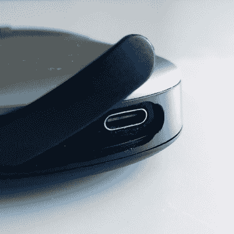

# 鼠标充电模式显示，即使简单的黑客攻击也可能变得复杂

> 原文：<https://hackaday.com/2022/06/09/mouse-charging-mod-shows-even-simple-hacks-can-end-up-complex/>

硬件黑客与拆除一堵墙的翻新有一些共同之处:直到有人真正开始并打开东西，才知道可能潜伏着什么样的复杂情况。[vousoir]有一个项目很好地演示了这一点:[修改可充电鼠标以使用 USB-C 而不是 micro-B](https://voussoir.net/writing/mouse_usbc_mod) 在这个过程中出现了一些小故障。事实上，更换真正的插座是最简单的部分！

一方面，有问题的鼠标似乎是一个容易修改的完美候选。外壳并不太难打开，里面有足够的空间，USB 仅用于给电池充电。那么问题是什么呢？任何修改过现有硬件的人都很熟悉这个问题:现有部件是黑客工作的界限，有些部件比其他部件更不容易修改。

Changing the receptacle was one thing, but making sure of alignment and seating depth was a learning experience.

在[voussoir]的例子中，第一个小故障是承载原始 mini-B 插座的小 PCB 上有一个螺丝孔，用于在反复插拔时保持安全。确保新的 USB-C 插座使用相同的螺丝有点痛苦，但在处理完这个问题后，又出现了另一个问题:[vousoir]已经将新的 USB-C 插座与鼠标的塑料齐平，但这不允许电缆完全就位。插座需要突出一点，否则充电电缆无法插入足够远。回到工作台，这样又进行了几次迭代。

修改最终是成功的，但痛苦的经历表明，必须绕过物理设计约束会带来意想不到的问题。当一个人只是对现有的鼠标做一个小的硬件调整就已经够糟糕了，更不用说为现代电脑完全重现老式苹果鼠标的设计了。